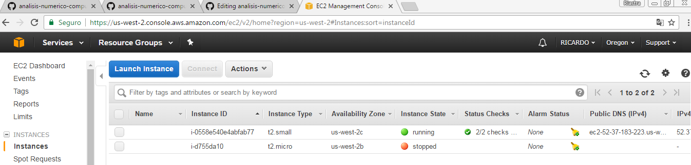

# Avance_07_04_2017

## Integrantes:

* Ricardo Lastra

* Adrián Vázquez

## Trabajo:

### Individual

Adrián Vázquez:

__Arquitectura del Proyecto:__ La arquitectura de referencia para el Proyecto PHPP esta representada en el siguiente diagrama:

 

__Implementación__

Se ejecutaron las siguientes [funciones](code) en CUDA-C para realizar una prueba de ejecucón de programa en CUDA-C con Docker.

Se elaboró y documento un [DOCKER_FILE y un DOCKER_COMPOSE](docker-cuda.md) para ejecución de programa [como sigue.](ambiente)

Se documentara mas MPI para distribución de archivos posteriormente como Erick nos comento.

Ricardo Lastra:

Investigar el coste operativo de la implementación de los siguientes tipos de cluster:  (PONER DOCUMENTACION DE AWS Y VIABILIDAD DE USO)

	-CLUSTER TIPO A. DIRECTO EN PC CON TAREJETA NVIDIA
	-CLUSTER TIPO B. USANDO DOCKER COMPOSE PARA NODOS
	-CLUSTER TIPO C. USANDO MAQUINAS AWS (Contribución al material de MNO para el uso de AWS)

__Selección de Herramientas__

A partir del planteamiento anterior se investigo lo siguiente:

-Se usara el cluster tipo B. Se corrieron pruebas con demo de `suma.cu` y `matrix.cu` lo cual encontramos mas viable su uso por lo siguiente: 
	Sin costo en $
	Con docker se puede documentar muy bien todo el programa y su arquitectura
	Es fácil de compilar

-Se evaluo usar maquinas de AWS con AMI de CUDA 7.5 y se desarrollo lo siguiente:

Ya con una cuenta en Amazon Web Services se desarrollo el prender una maquina de la siguiente forma:

1-Se levanto una maquina EC2 siguiendo las instrucciones de la siguiente referencia:

[referencia](http://docs.aws.amazon.com/AWSEC2/latest/UserGuide/launching-instance.html)

2-Se integro AMI para usar CUDA 7.5 montada en una EC2 usando la siguiente referencia:

[referencia](https://aws.amazon.com/marketplace/fulfillment?fulfillmentOptionId=single-ami&productId=df03e1dc-d2b3-40ae-b975-c223a29ce7c8&ref_=dtl_psb_continue&region=us-east-1)

3-Se levanto la EC2 t2.small de Bitfusion Boost Ubuntu 14 Cuda 7.5, en la siguiente IMAGEN se ve como esta en estatus "running"

 

4-Para configurar el ambiente Amazon-Docker se siguió la siguiente referencia:

[referencia](https://docs.docker.com/machine/drivers/aws/#options)

### Equipo

Se determino usar docker-cuda-c para proyecto dado que existen ventajas como costos reducidos, documentacion a través de una herramienta conocida como lo es Docker, asi como la facilidad para compilar con nvcc matrix.cu -o matrix.out 
Se descarto el uso de AMAZON y sus AMIS con CUDA ya que el costo en DLLS es elevado para pruebas ya que cobran para 2 cores un aproximado mensual de $40 USD. 
Tambien encontramos que para el uso de AMAZON-Docker necesitabamos mas tiempo en la configuración final para ejecutar toda la plataforma, tiempo que decidimos usarlo en el algoritmo elegido.

