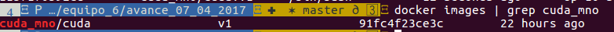
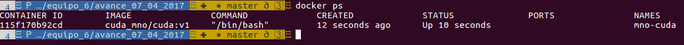
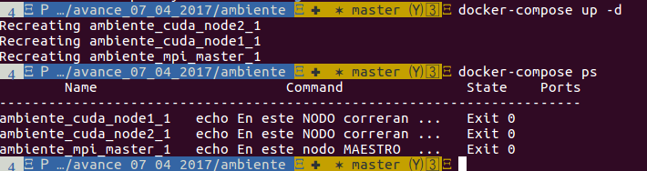

# Docker NVIDIA

## Integrantes:

* Ricardo Lastra

* Adrián Vázquez


## ¿por que Docker y ENVIDIA?
- Facil reproducir el ambiente *cuda ENVIDIA*
- Habilitación de ambiete de desarrollo facilmente
- Instalación de drivers ENVIDIA unicamente


## Implementacación Imagen: MNO-CUDA/CUDA 8.0


The *NVIDIA® CUDA®* Toolkit provides a comprehensive development environment for C and C++ developers building GPU-accelerated applications. The CUDA Toolkit includes a compiler for NVIDIA GPUs, math libraries, and tools for debugging and optimizing the performance of your applications. You’ll also find programming guides, user manuals, API reference, and other documentation to help you get started quickly accelerating your application with GPUs. 

See: [NVIDIA Toolkit](https://developer.nvidia.com/cuda-toolkit)


* __Dockerfile__ 
```
FROM ubuntu:14.04
MAINTAINER Adrián Vázquez <radianstk@gmail.com>

ENV REFRESHED_AT 2017-04-06

## Actualizamos
RUN \
    apt-get -qq update; apt-get upgrade -y -qq; \
    apt-get install -y -qq wget curl git jq nano man openssh-server; \
    apt-get clean && rm -rf /var/lib/apt/lists/* /tmp/* /var/tmp/*

# Arreglamos el LOCALE
RUN echo "es_MX.UTF-8 UTF-8" >> /etc/locale.gen \
    && locale-gen es_MX.utf8 \
    && /usr/sbin/update-locale LANG=es_MX.UTF-8 \
    && dpkg-reconfigure locales

RUN groupadd cuda_user

RUN useradd cuda_user -g cuda_user -m -s /bin/bash

ADD cuda-repo-ubuntu1404-8-0-local-ga2_8.0.61-1_amd64.deb /tmp/

RUN dpkg -i /tmp/cuda-repo-ubuntu1404-8-0-local-ga2_8.0.61-1_amd64.deb

## Instalamos CUDA
RUN \
    apt-get -qq update; apt-get upgrade -y -qq; \
    apt-get install -y -qq cuda; \
    apt-get clean

## Limpiamos tmp
    && rm -fr /tmp/*

RUN echo "cuda_user ALL=(ALL:ALL) NOPASSWD:ALL" | (EDITOR="tee -a" visudo)

RUN echo "cuda_user:cuda" | chpasswd

USER cuda_user

ENV PATH="/usr/local/cuda-8.0/bin:$PATH"

ENV LD_LIBRARY_PATH="/usr/local/cuda-8.0/lib64:LD_LIBRARY_PATH"

CMD ["/bin/bash"]
```
Ver el archivo [Dockerfile](ambiente/docker-images/cuda/Dockerfile)

* __Construimos la Imagen__

- docker build -t cuda_mno/cuda:v1 . 

LLegamos al siguiente resultado: 



* __Construimos el contenedor__

- nvidia-docker run -ti -v /path/to/my/directory/:/CUDA-LOCAL -h mno-cuda --name mno-cuda cuda_mno/cuda:v1

LLegamos al siguiente resultado: 



##Implementación de ambiente Docker-compose


* __Docker Compose File__

```
version: "2"

services:
 cuda_node1:
   image: cuda_mno/cuda:v1
   hostname: cuda_node1
   networks:
      - my-net
   command: echo "hola mundo cuda node 1" 
   environment:
      MASTER_URL: "http://cuda_node1:6003"
   volumes:
    - /etc/localtime:/etc/localtime:ro
    - ./data/cuda_node1:/data/cuda_node1
   ports:
    - "6001:6001"
    - "22"

 cuda_node2:
   image: cuda_mno/cuda:v1
   hostname: cuda_node2
   networks:
      - my-net
   command: echo "hola mundo cuda node 2"
   environment:
      MASTER_URL: "http://cuda_node1:6003"
   volumes:
    - /etc/localtime:/etc/localtime:ro
    - ./data/cuda_node2:/data/cuda_node2
   ports:
    - "6002:6002"
    - "22"

 mpi_master:
   image: openmpi_mno_2017/openmpi:v1
   hostname: mpi_master
   networks:
      - my-net
   command: echo "hola mundo master node 1"
   environment:
      NODE1_URL: "http://cuda_node1:6001"
      NODE2_URL: "http://cuda_node2:6002"
   volumes:
     - /etc/localtime:/etc/localtime:ro
     - ./data/mongo-cfg-1:/data/configdb
   ports:
     - "6003:6003"
     - "22" 

networks:
  my-net:
    driver: bridge
```

* __Ejecutamos los siguientes comandos__

- ingresamos a la carpeta `ambiente/`
- ejecutamos el siguiente comando `docker-compose up -d`
- Validamos resultado con el siguiente comando `docker-compose ps` 



* Notas:

- Necesitamos tener instalado [Docker-compose](https://docs.docker.com/engine/installation/linux/ubuntu/)
- Para ejecutar este docker-compose utilizaremos la imagen construida en clase para [MPI](https://github.com/ITAM-DS/analisis-numerico-computo-cientifico/tree/master/C/extensiones_a_C/MPI/openMPI) 
- El ambiente construido espara ejecutar los procesos como *microservicios*


by ADVP
