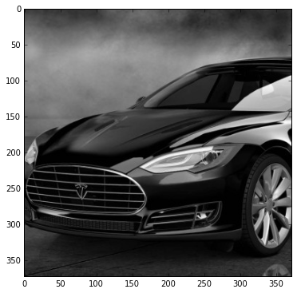

# Implementación final SVD para procesamiento de Imagenes

## Integrantes:

* Ricardo Lastra

* Adrián Vázquez


## ¿Metodos investigados?
- Aplicaremos la libreria [CUBLAS](http://docs.nvidia.com/cuda/cublas/index.html#introduction) via __cuBLAS API__
	
- Se aplicará el calculo de SVD utilizando CUDA vía el metodo [BLAS-3](http://docs.nvidia.com/cuda/cublas/#cublas-level-3-function-reference)

```
cusolverDnDgesvd ( 
  cusolverDnHandle_t handle
 ,signed char jobu
 ,signed char jobvt
 ,int m
 ,int n
 ,double *A
 ,int lda
 ,double *S
 ,double *U
 ,int ldu
 ,double *VT
 ,int ldvt
 ,double *work
 ,int lwork
 ,double *rwork
 ,int *devInfo);

```

- El patron de codificación respnde al siguiente diagrama:


1. Para la demostración de la implementación estaremos utilizando el caso de uso para imagenes haciendo uso de [python](http://pybonacci.github.io/scipy-lecture-notes-ES/advanced/image_processing/auto_examples/plot_display_lena.html)
2. Mediante la utilización de API cuBLAS, nuestra aplicación estará asignando espacio de memoria en el device (GPU), 
3. posteriormente rellenarlos con datos, 
4. El siguiente paso es llamar a la secuencia de funciones cuBLAS deseadas
5. Finalmente se cargan los resultados del espacio de memoria GPU de nuevo en el host. __La API cuBLAS también proporciona funciones auxiliares para escribir y recuperar datos de la GPU__
 


## Implementación SVD con CUDA

* La implementación original fue tomada del [sitio](http://docs.nvidia.com/cuda/) 
* Leer imagen, descomposicion de valores singulares (SVD) y hacer U V y Sigmas(S)


## Python Implementación __Fase I__

* Se importan librerias para graficar, para matrices y para leer imagenes

```
%matplotlib inline
import matplotlib.pyplot as plt
import numpy as np
from PIL import Image
```

* Se le una imagen
```
img = Image.open('tesla.png')
imggray = img.convert('LA')
plt.figure(figsize=(6, 6))
plt.imshow(imggray)

```

* Se guarda en una matriz con Numpy y se grafica la imagen
```
imgmatriz = np.array(list(imggray.getdata(band=0)), float)
imgmatriz.shape = (imggray.size[1], imggray.size[0])
imgmatriz = np.matrix(imgmatriz)
```


* Transponemos la matriz, esto para agilizar la lectura en el codigo CUDA
```
transp_imgmatriz=imgmatriz.transpose()
np.savetxt('transp_imgmatriz.txt', transp_imgmatriz)

```

## __SVD Implementation__ __Fase II__

* Step 0: Inicialización de Variables y prototipo para la función printMatrix()
```
#include <stdio.h>
#include <stdlib.h>
#include <string.h>
#include <assert.h>
#include <cuda_runtime.h>
#include <cublas_v2.h>
#include <cusolverDn.h>
using namespace std;


typedef struct {
  int idx;
  double *el;
} Matrix;


void printMatrix(int m, int n, const double*A, int lda, const char* name)
{
    for(int row = 0 ; row < m ; row++){
        for(int col = 0 ; col < n ; col++){
            double Areg = A[row + col*lda];
            printf("%s(%d,%d) = %f\n", name, row+1, col+1, Areg);
        }
    }
}

int main(int argc, char*argv[])
{
    cusolverDnHandle_t cusolverH = NULL;
    cublasHandle_t cublasH = NULL;
    cublasStatus_t cublas_status = CUBLAS_STATUS_SUCCESS;
    cusolverStatus_t cusolver_status = CUSOLVER_STATUS_SUCCESS;
    cudaError_t cudaStat1 = cudaSuccess;
    cudaError_t cudaStat2 = cudaSuccess;
    cudaError_t cudaStat3 = cudaSuccess;
    cudaError_t cudaStat4 = cudaSuccess;
    cudaError_t cudaStat5 = cudaSuccess;
    cudaError_t cudaStat6 = cudaSuccess;
    const int m = 372; // de acuerdo a: Remark 1: gesvd only supports m>=n.
    const int n = 372; // de acuerdo a: Remark 1: gesvd only supports m>=n.
    const int lda = m;
    double S[n]; // singular value
    double S_exact[n] = {7.065283497082729, 1.040081297712078};
    
    Matrix A, U, VT;      //host matrices
    A.el = new double[lda*n];    //.... 
    U.el = new double[lda*n];    //...
    VT.el = new double[lda*n];   //..


    double *d_A = NULL;
    double *d_S = NULL;
    double *d_U = NULL;
    double *d_VT = NULL;
    int *devInfo = NULL;
    double *d_work = NULL;
    double *d_rwork = NULL;
    double *d_W = NULL;  // W = S*VT

    int lwork = 0;
    int info_gpu = 0;
    const double h_one = 1;
    const double h_minus_one = -1;

```

* step 1: creamos funcionalidad para lectura del Archivo con la matriz resultante generada por python usando numpy, en este caso el archivo es [transp_imgmatriz.txt](code/transp_imgmatriz.txt)
```

	if (argc<2) {
                cout << "Input file not specified. Please, specify it as a first argument." << endl;
                cout << "example: " << argv[0] << "transp_imgmatriz.txt" << endl;
                return -1;
        }
        ifstream file(argv[1]);
        ofstream output_S("output_S.txt");
        ofstream output_U("output_U.txt");
        ofstream output_VT("output_VT.txt");

        if (!file)
        {
                cout << "Error opening file" << endl;
                return -1;
        }

        int idx;
        file >> idx;                      //size N
        if (argc>2) cout << "N=" << idx << endl;

	//reading from file into matrices
        for (long i=0; i<(lda*n); i++)
                file >> A.el[i];

```

* step 2: creamos cusolverDn/cublas handle
```
    cusolver_status = cusolverDnCreate(&cusolverH);
    assert(CUSOLVER_STATUS_SUCCESS == cusolver_status);

    cublas_status = cublasCreate(&cublasH);
    assert(CUBLAS_STATUS_SUCCESS == cublas_status);

```

* step 3: copiar los datos A y B al device
```
    cudaStat1 = cudaMalloc ((void**)&d_A  , sizeof(double)*lda*n);
    cudaStat2 = cudaMalloc ((void**)&d_S  , sizeof(double)*n);
    cudaStat3 = cudaMalloc ((void**)&d_U  , sizeof(double)*lda*m);
    cudaStat4 = cudaMalloc ((void**)&d_VT , sizeof(double)*lda*n);
    cudaStat5 = cudaMalloc ((void**)&devInfo, sizeof(int));
    cudaStat6 = cudaMalloc ((void**)&d_W  , sizeof(double)*lda*n);
    assert(cudaSuccess == cudaStat1);
    assert(cudaSuccess == cudaStat2);
    assert(cudaSuccess == cudaStat3);
    assert(cudaSuccess == cudaStat4);
    assert(cudaSuccess == cudaStat5);
    assert(cudaSuccess == cudaStat6);

    cudaStat1 = cudaMemcpy(d_A, A, sizeof(double)*lda*n, cudaMemcpyHostToDevice);
    assert(cudaSuccess == cudaStat1);

```

* step 4: consulta el espacio de trabajo para SVD
```
    cusolver_status = cusolverDnDgesvd_bufferSize(
        cusolverH,
        m,
        n,
        &lwork );
    assert (cusolver_status == CUSOLVER_STATUS_SUCCESS);

    cudaStat1 = cudaMalloc((void**)&d_work , sizeof(double)*lwork);
    assert(cudaSuccess == cudaStat1);

```

* step 5: procesa SVD
```
    signed char jobu = 'A'; // all m columns of U
    signed char jobvt = 'A'; // all n columns of VT
    cusolver_status = cusolverDnDgesvd (
        cusolverH,
        jobu,
        jobvt,
        m,
        n,
        d_A,
        lda,
        d_S,
        d_U,
        lda,  // ldu
        d_VT,
        lda, // ldvt,
        d_work,
        lwork,
        d_rwork,
        devInfo);
    cudaStat1 = cudaDeviceSynchronize();
    assert(CUSOLVER_STATUS_SUCCESS == cusolver_status);
    assert(cudaSuccess == cudaStat1);

 
    cudaStat1 = cudaMemcpy(U , d_U , sizeof(double)*lda*m, cudaMemcpyDeviceToHost);
    cudaStat2 = cudaMemcpy(VT, d_VT, sizeof(double)*lda*n, cudaMemcpyDeviceToHost);
    cudaStat3 = cudaMemcpy(S , d_S , sizeof(double)*n    , cudaMemcpyDeviceToHost);
    cudaStat4 = cudaMemcpy(&info_gpu, devInfo, sizeof(int), cudaMemcpyDeviceToHost);
    assert(cudaSuccess == cudaStat1);
    assert(cudaSuccess == cudaStat2);
    assert(cudaSuccess == cudaStat3);
    assert(cudaSuccess == cudaStat4);

    assert(0 == info_gpu);

```

* step 6: sacamos en archivos el resultado de las matrices [S](code/output_S.txt), [U](code/output_U.txt), [VT](code/output_VT.txt) 
```

    printf("S = (matlab base-1)\n");
    for (int k=0; k<n; k++){
                        output_S << S[k] << " ";
    }

    printf("=====\n");
    printf("U = (matlab base-1)\n");
    for (int k=0; k<m; k++){
                for (int j=0; j<m; j++)
                        output_U << U.el[k+j*lda] << " ";
                output_U << endl;
    }

    printf("=====\n");
    printf("VT = (matlab base-1)\n");
    for (int k=0; k<n; k++){
                for (int j=0; j<n; j++)
                        output_VT << VT.el[k+j*lda] << " ";
                output_VT << endl;
    }

```

* step 7: calcula presición de error del SVD
```
    double ds_sup = 0;
    for(int j = 0; j < n; j++){
        double err = fabs( S[j] - S_exact[j] );
        ds_sup = (ds_sup > err)? ds_sup : err;
    }
    printf("|S - S_exact| = %E \n", ds_sup);

```

* step 8: |A - U*S*VT|
```

    cublas_status = cublasDdgmm(
        cublasH,
        CUBLAS_SIDE_LEFT,
        n,
        n,
        d_VT,
        lda,
        d_S,
         1,
        d_W,
        lda);
    assert(CUBLAS_STATUS_SUCCESS == cublas_status);

    // A := -U*W + A
    cudaStat1 = cudaMemcpy(d_A, A, sizeof(double)*lda*n, cudaMemcpyHostToDevice);
    assert(cudaSuccess == cudaStat1);
    cublas_status = cublasDgemm_v2(
        cublasH,
        CUBLAS_OP_N, // U
        CUBLAS_OP_N, // W
        m, // number of rows of A
        n, // number of columns of A
        n, // number of columns of U 
        &h_minus_one, /* host pointer */
        d_U, // U
        lda,
        d_W, // W
        lda,
        &h_one, /* hostpointer */
        d_A,
        lda);
    assert(CUBLAS_STATUS_SUCCESS == cublas_status);

    double dR_fro = 0.0;
    cublas_status = cublasDnrm2_v2(
        cublasH, lda*n, d_A, 1, &dR_fro);
    assert(CUBLAS_STATUS_SUCCESS == cublas_status);

    printf("|A - U*S*VT| = %E \n", dR_fro);
```

* step 9: free resources
```
    if (d_A    ) cudaFree(d_A);
    if (d_S    ) cudaFree(d_S);
    if (d_U    ) cudaFree(d_U);
    if (d_VT   ) cudaFree(d_VT);
    if (devInfo) cudaFree(devInfo);
    if (d_work ) cudaFree(d_work);
    if (d_rwork) cudaFree(d_rwork);
    if (d_W    ) cudaFree(d_W);

    if (cublasH ) cublasDestroy(cublasH);
    if (cusolverH) cusolverDnDestroy(cusolverH);

    cudaDeviceReset();

    return 0;
}

```

## compilamos el codigo

* Ejecutamos los siguientes comandos

`nvcc -I /usr/local/cuda-8.0/include svd_example.cu -o svd_example.out -lcublas -lcusolver -lcudart -lcusparse -llapack -lblas -arch=sm_30`

## Validamos resultados  __Fase III__

* Cargamos los resultados con Numpy de los datps computados por el codigo CUDA
```
sigma = np.loadtxt('output_S.txt')
U = np.loadtxt('output_U.txt')
V = np.loadtxt('output_VT.txt')
```

* Reconstruimos de 10 en 10 vectores para validar cuando se reproduce una imagen similar a la original ...
```
    for i in range(10,50, 10):
    reconstimg = np.matrix(U[:, :i]) * np.diag(sigma[:i]) * np.matrix(V[:i, :])
    plt.imshow(reconstimg, cmap='gray')
    title = "n = %s" % i
    plt.title(title)
    plt.show()

```


## En las imagenes de arriba nos pudimos percatar que la composicion mas similar a la origina esta en aprox. n=40 con una imagen muy clara.

- revisar codigo [svd_example.cu](code/svd_example.cu) 

by ADVP
