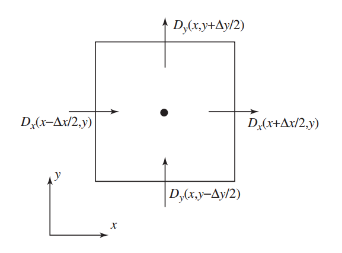

```{r, include=FALSE}
knitr::opts_chunk$set(out.width="100px",out.heigt="200px", dpi=120)
```

\newpage 

# Introducción

El objetivo del proyecto es implementar un FDTD en paralelo usando CUDA. Esto se intenta realizar en un instancia de Amazon usando Docker. La estructura del documento es como sigue, primero se presenta un overview de los conceptos básicos necesarios para poder entender el problema en términos físicos, matemáticos y computacionales. Se exponen los fundamentos de la teoría de aproximación en términos del cálculo difrencial multivariado representado en este caso por el método de diferencias finitas y su aplicación algorítmica sobre la rama de ecuaciones diferenciales ordinarias, en las que se busca encontrar una solución numérica a sistemas lineales. En particular se expone una variante del método en el cual se tiene un sistema con 4 dimensiones x,y,z,t en el cual se realiza una aplicación de diferencias finitas a través del dominio temporal, la cual es muy utilizada en varios sistemas físicos. Por otro lado se explicará brevemente la aplicación del método al caso del electromagnetismo, ya que es una rama importante de la física computacional que ha florecido con mayor precisión gracias a los avances tecnológicos como son los procesadores GPU.

Luego de establecer los marcos teóricos básicos, es decir los conceptos básicos para el modelo físico, el modelo matemático y el modelo computacional, se presenta formalmente el problema a resolver asi como la implementación computacional que se lleva a cabo en el que se consideran los temas de eficiencia en un contexto de ejecución en paralelo.  Asimismo se explica el código que se utiliza para llevar a cabo dicha implementación y se discuten los puntos débiles y las medidas de control que son llevadas a cabo. 

En otra sección se realiza la exposición de resultados numéricos en términos del performance y un análisis del error en el que se puede incurrir a partir de usar aproximaciones lineales en términos matemáticos, y los errores que se pueden ocasionar respecto al uso de aproximaciones de máquina en el caso de la aritmética de punto flotante así como la estabilidad y complejidad del algoritmo. 

Por último se lleva a cabo una exposición de como hacer de esto un programa ejecutable en una infraestructura en la nube de amazon, a través de una imagen de docker que contiene la paquetería ed software de nvidia. 

Como se verá más adelante, existe una serie de reglas importantes que seguir para optimizar el computo en paralelo, no obstante no siempre son aplicables y no siempre son las únicas decisiones que se tienen que llevar a cabo en términos de almacenamiento en memoria por ejemplo, ya que la forma de almacenar mallas multidimensionales no tiene una única forma de ejecutarse. Por lo tanto, no se pretende que sea un estudio exhaustivo de las diferentes configuraciones en las que se puede implementar el programa de diferencias finitas.  

# Fundamentos

A continuación se exhibirán las bases necesarias para entender primero el método de aproximación general formulado en términos matemáticos en el que cual se lleva a cabo una discretización del espacio para poder expresar valores de las derivadas de una función a través de valores de la función en puntos vecinos. Luego se harå un recuento rápido de las propiedades físicas de los campos que varían con el tiempo, en especial las propiedades derivadas de los modelos físicos sobre campos eléctricos y campos magnéticos, así como sus variantes en medios con conductividad perfecta. Por último se establecen los conceptos computacionales importantes para la implementación en CUDA.   

## Método Matemático

La técnica de diferencias finitas en el dominio temporal ofrece muchas ventajas como una herramienta para modelar y simular y analizar en el campo del electromagnetismo ya que permite manejar una variedad arbitraria de geometrías tridimensionales así como con los parametro de conductividad, medio, respuesta, etc. Este método forma parte de una clase mayor en la disciplina de Termodinámica Computacional. Asi mismo el método de diferencias finitas en el dominio temporal es un caso particular del aproximaciones realizadas por el método de diferencias finitas. 

La idea básica detrás del algoritmo de diferencias finitas es discretizar sistemas que tengan una especificación continua de modo que se aproximen los valores de las derivadas a través del cambios incrementales sobre la malla de discretización.

En el caso univariado se tiene que 

\begin{equation}
 F'(x_0)= \begin{cases} 
           \frac{F ( x_0 + \Delta x  )- F ( x_0 )}{\Delta x} & \text{Diferencia hacia adelante} \\
           \frac{F ( x_0)- F ( x_0-\Delta x  )}{\Delta x} & \text{Diferencia hacia atrás} \\
          \frac{F ( x_0 + \Delta x  )- F ( x_0 - \Delta x )}{2 \Delta x} & \text{Diferencia central} 
   \end{cases}
\end{equation}

Si se recuerda un curso básico de cálculo siempre existe una sección en la que hablan de las aproximaciones de distinto tipo de orden sobre las derivadas de una función, en general la idea subyace en la expansion de Taylos de la función $F$. En particular para la expansion de Taylor para las cantidades anteriores son 

\begin{eqnarray}
F ( x_0 + \Delta x ) =& F ( x_0 ) + \Delta x F'( x_0 ) + \frac{\Delta x^2}{2}F''(x_0)  + \frac{\Delta x^3}{6} F'''( \xi_1 ) \text{ } \xi_1 \in [x_0,x_0 + \Delta x] \\
F ( x_0 - \Delta x ) =& F ( x_0 ) - \Delta x F'( x_0 ) + \frac{\Delta x^2}{2}F''(x_0)  - \frac{\Delta x^3}{6} F'''( \xi_2 ) \text{ } \xi_2 \in [x_0-\Delta x,x_0 ]
\end{eqnarray}

Por lo que estas expansión llevada al nivel de serie de potencias en la diferencia $\Delta x$, según aumente el orden de aproximación el error ocasionado por la discretización estará gobernado principalmente por una potencia de $\Delta x$. Dependiendo de la configuración se puede controlar mejor con esquemas distintos de diferencias 

\begin{align}
F'( x_0 ) =& \frac{F ( x_0 + \Delta x )-F ( x_0 )}{\Delta x} - \frac{\Delta x}{2}F''(x_0) - \frac{\Delta x^2}{6} F'''( \xi_1 )\text{ }  \xi_1 \in [x_0,x_0 + \Delta x] & \text{Diferencias Adelante/Atrás tiene un error de orden } O(\Delta x) \\
F'( x_0 ) =& \frac{F ( x_0 + \Delta x )-F ( x_0 - \Delta x )}{2 \Delta x} - \frac{\Delta x^2}{6}F'''( \xi_3 )  \text{ } \xi_3 \in [x_0 - \Delta x, x_0 + \Delta x] & \text{ Diferencia Central tiene un error de orden } O(\Delta x^2)
\end{align}

Por lo cual se dice que el método de diferencias finitas centrales es de segundo orden, en el que se realiza un muestreo en el dominio. Esto es la sustitución $x = i \Delta x$ de modo que $F(x) = F(i)$ es decir se tiene el valor de la función en $x$ a través de evaluarla en un entero $i$ a través del proceso de discretización.

### Método de Diferencias en más dimensiones

En el caso de dos dimensiones se requiere del concepto general de campo vectorial y de los operadores que describen propiedades geométricas de los mismos. El símbolo nabla $\nabla$ denota la operación sobre campos escalares $f$ y generar un campo vectorial denominado gradiente de $f$ 

\begin{equation}
\nabla f = a_x \frac{\partial f}{\partial x} + a_y \frac{\partial f}{\partial y} +a_z \frac{\partial f}{\partial z}
\end{equation}

que de cierta forma mide el cambio en el campo al efectuar movimientos sobre trayectorias determinadas. 
Se muestra a continuación la idea geométrica que subyace a las aproximaciones en más dimensiones para las cantidades geométricas que caracterizan a los camops vectoriales. 


Considerese entonces las diferencias en el plano xy por ejemplo para la densidad del flujo eléctrico $D$

\begin{equation}
\frac{\partial D_x}{\partial x} + \frac{\partial D_y}{\partial y} \approx \frac{ D_x(x + \frac{\Delta x}{2},y) - D_x(x - \frac{\Delta x}{2},y)}{\Delta x} + \frac{ D_x(x ,y + \frac{\Delta y}{2}) - D_x(x, y- \frac{\Delta y}{2})}{\Delta y}
\end{equation}

Si se pone atención en los signos de la expresión anterior se puede encontrar el sentido del campo vectorial evaluado en los puntos, de modo que la divergencia es esencialemente la suma sobre los campos en las caras del rectángulo con los signos denotando flujo hacia adentro (negativo) y flujo hacia afuera (positivo). Esto tiene un fundamento importante en el comportamiento del flujo eléctrico en presencia de carga, en el cual la divergencia del campo representa la fuerza con que se es atractor o repulsor. 

Por otro lado, si se considera el operador de torsión ahora sobre por ejemplo el campo eléctrico $E$

\begin{equation}
\nabla \times E = a_x (\frac{\partial E_z}{\partial y}  - \frac{\partial E_y}{\partial z}) + a_y(\frac{\partial E_x}{\partial z}  - \frac{\partial E_z}{\partial x}) +a_z(\frac{\partial E_y}{\partial x}  - \frac{\partial E_x}{\partial y}) 
\end{equation}

En este caso veamos el comportamiento únicamente de la componente $z$ del operador, que está gobernada por el plano xy. 
\begin{equation}
\frac{\partial E_y}{\partial x}  - \frac{\partial E_x}{\partial y} \approx  \frac{ E_y(x + \frac{\Delta x}{2},y) - E_y(x - \frac{\Delta x}{2},y)}{\Delta x} - \frac{ E_x(x ,y + \frac{\Delta y}{2}) - E_x(x, y- \frac{\Delta y}{2})}{\Delta y}
\end{equation}

De nuevo inspeccionando la fórmula anterior y siendo apoyado en la representación gráfica que se muestra a continuación se puede observar que las aproximaciones de diferencias finitas de nuevo están basadas en los valores del campo en las orillas del rectángulo que rodean el punto de interés $(x,y)$. No obstante, en este caso son las fuerzas tangenciales y no las fuerzas normales a los bordes del rectángulo. La suma del lado derecho tiene un signo positivo cuando la componente vectorial apunta en dirección contrario a las manecillas del reloj y es negativa cuando va en el sentido del reloj. En términos físicos, cuando la suma es positiva el campo electrico tiene a empujar carga positiva en la dirección contraria de las manecillas.


## Condición de Estabilidad 

Courant (1928) tuvo un desarrollo importante para establecer las condiciones de estabilidad para el esquema de muestreo temporal para la aproximación de las derivadas en el esquema de diferencias finitas cuando se requiere resolver un sistema de ecuaciones clásico para la interacción entre campos eléctricos y campos magnéticos. La derivación de esta cota para la estabilidad en términos de convergencia cuadrática es muy similar a la que realiza Euler para el caso del método de aproximación para ecuaciones diferenciales ordinarias.

\begin{equation}
\Delta x \leq \frac{\lambda}{10}; \text{ Estabilidad si }  \Delta t \leq  \frac{\Delta x}{c \sqrt{\alpha}}
\end{equation}

donde $\alpha$ varía dependiendo si es un espacio $\alpha$ dimensional. Es decir $\alpha=1$ en el caso unidimensional, $\alpha=2$ en 2D y $\alpha=3$ en el caso de 3 dimensiones.


## Modelo Físico 

Cuando se consideran campos que son dinámicos, es decir se mueven a lo largo del tiempo es importante formular el problema pensando en qué debe sucedes cuando una carga puntual se mueve? Se sabe que cuando una carga está en movimiento esto origina un campo magnético, pero si la carga se mueve su campo eléctrico asociado también debe cambiar. Por lo mismo se dice que cuando un sistema varía en el tiempo entonces los campos magnéticos y los campos eléctricos  están acoplados. Uno de los grandes reconocimientos que lleva a cabo Maxwell es que se debe considerar que la densidad de carga puede cambiar en el tiempo de modo que el decidió incorporar la derivada temporal de la densidad del flujo eléctrico para poder obtener un modelo más general que no solo aplicara a campos que no cambian en el tiempo. 

\begin{equation}
\nabla \times H = J + \frac{\partial D}{\partial t}
\end{equation}

Los términos $J$ y $\frac{\partial D}{\partial t}$ suelen ser identificados con la corriente conductiva y la corriente de dezplazamiento respectivamente y es comunmente conocida como la Ley de Ampere. 

Si se considera el cambio en el potencial eléctrico sobre alguna trayectoria es decir la fuera electromotriz ejercida por el campo, en particular sobre una trayectoria cerrada se escribe como la integral de linea del producto punto del vector de velocidad con el campo E y al hacer uso del teorema de stokes se tiene que es igual al cambio sobre la densidad del flujo magnetico B sobre la superficie que encierra dicha trayectoria, de donde se sigue que 

\begin{equation}
\nabla \times E = - \frac{\partial B}{\partial t}
\end{equation}

la cual es conocida como la Ley de Faraday.

Las ecuaciones de Maxwell están constituidas por un conjunto de ecuaciones diferenciales parciales, las cuales junto con una ley de fuerza de Lorentz, conforman el fundamento del electromagnetismo y óptica clásicos así como de los circuitos eléctricos. Las ecuaciones son nombradas en honor al físico y matemático James Clerk Maxwell, quien entre 1861 y 1862 publicó las ecuaciones así como una proposición de que la luz es un fenómeno electromagnético. En particular en un medio isotrópico se tiene que las ecuaciones toman la forma siguiente (en MKS)

\begin{eqnarray}
\frac{\partial \mathbf{B}}{\partial t} + \nabla \times \mathbf{E} &=0  \\
\frac{\partial \mathbf{D}}{\partial t} - \nabla \times \mathbf{H} &=\mathbf{J}  \\
\mathbf{B} &= \mu \mathbf{H} \\
\mathbf{D} &= \epsilon \mathbf{E} 
\end{eqnarray}  

En las cuales se asume que $\mathbf{J}$, $\mu$ $\epsilon$ son funciones del espacio tiempo conocidas. Recordar que $H$ e sun campo magnético auxilar que representa como un campo magnético B influye sobre la organización de los dipolos magnéicos es un medio determinado, incluyendo la migración dipolar y la reorientación dipolar magnética, con $\mu$ representa la permeabilidad. En el caso en el que el medio es isotropico (es decir igual en todas las direcciones) entonces $\mu$ es un escalar. Cuando el medio es anisotrópico $\mu$ resulta ser un tensor de segundo rango. En general la permeabilidad es la medida en que un material puede soportar la formación del campo magnético en si mismo, es decir es el grado de magnetización de que un material obtiene en respuesta a la aplicación de un campo magnético. Está medida en henries por metro $H/m$ o bien newtons por ampere al cuadrado $N/A^2$

\begin{figure}[htp]
\centering
\includegraphics[width=.3\textwidth]{img/dipole_electric.svg.png}
\includegraphics[width=.3\textwidth]{img/dipole_magnetic.svg.png}
\includegraphics[width=.3\textwidth]{img/dipole_point.svg.png}
\caption{Campos para un par de polos eléctricos, un dipolo magnético y un dipolo general (límite cuando la distancia entre polos tiende a cero)}
\end{figure}

## Discretizacion del problema

En términos de un sistema de coordenadas rectangulares las Leyes de Faraday y Ampere, son equivalentes a 

\begin{eqnarray}
- \frac{\partial \mathbf{B}_x}{\partial t} &= \frac{\partial \mathbf{E}_z}{\partial y} - \frac{\partial \mathbf{E}_y}{\partial z} \\
- \frac{\partial \mathbf{B}_y}{\partial t} &= \frac{\partial \mathbf{E}_x}{\partial z} - \frac{\partial \mathbf{E}_z}{\partial x} \\
\frac{\partial \mathbf{B}_z}{\partial t} &= \frac{\partial \mathbf{E}_x}{\partial y} - \frac{\partial \mathbf{E}_y}{\partial x} \\
\frac{\partial \mathbf{D}_x}{\partial t} &= \frac{\partial \mathbf{H}_z}{\partial y} - \frac{\partial \mathbf{H}_y}{\partial z} -\mathbf{J}_x \\
\frac{\partial \mathbf{D}_y}{\partial t} &= \frac{\partial \mathbf{H}_x}{\partial z} - \frac{\partial \mathbf{H}_z}{\partial x} -\mathbf{J}_y \\
\frac{\partial \mathbf{D}_z}{\partial t} &= \frac{\partial \mathbf{H}_y}{\partial x} - \frac{\partial \mathbf{H}_x}{\partial y} -\mathbf{J}_z \\
\end{eqnarray}

En el caso de discretización tridimensional se denota a un punto de la malla 

\begin{equation}
(i,j.k) = (i\Delta x, j\Delta y, k\Delta z) y 
\end{equation}

y para cualquier función del espacio tiempo se define 
\begin{equation}
F(i\Delta x, j\Delta y, k\Delta z, n\Delta t) = F^n(i,j,k)
\end{equation}

### Sistemas de Ecuaciones

Un conjunto de ecuaciones de diferencias finitas para el sistema arriba descrito para el caso de condiciones de frontera de conductividad perfecta son 

\begin{equation}
\frac{B_x^{n+\frac{1}{2}}(i,j+\frac{1}{2},k+\frac{1}{2}) - B_x^{n-\frac{1}{2}}(i,j+\frac{1}{2},k+\frac{1}{2})}{\Delta t} = \frac{E_y^n(i,j+\frac{1}{2},k+1) - E_y^n(i,j+\frac{1}{2},k)}{\Delta z} - \frac{E_z^n(i,j+1,k+\frac{1}{2}) - E_z^n(i,j,k+\frac{1}{2})}{\Delta y}
\end{equation}

Las correspondientes discretizaciones para 2b y 2c son analogas

\begin{equation}
\frac{D_x^{n}(i+\frac{1}{2},j,k) - D_x^{n-1}(i+\frac{1}{2},j,k)}{\Delta t} = \frac{H_z^{n-\frac{1}{2}}(i+\frac{1}{2},j+\frac{1}{2},k) - H_z^{n-\frac{1}{2}}(i+\frac{1}{2},j-\frac{1}{2},k)}{\Delta y} - \frac{H_y^{n-\frac{1}{2}}(i+\frac{1}{2},j,k+\frac{1}{2}) - H_y^{n-\frac{1}{2}}(i+\frac{1}{2},j,k-\frac{1}{2})}{\Delta z} + J_x^{n-\frac{1}{2}}(i+\frac{1}{2},j,k)
\end{equation}

#### Condiciones de Frontera 

Las condiciones de frontera para una superficie de conductividad perfecta se traduce en que las componentes tangenciales del campo eléctrico se desvanecen. Esta condición también implica que las componentes normales del campo mágnetico se desvanecen en el superficie. La superficie de conducción será aproximada a través de una colección de superficies de cubos cuyas aristas y lados son paralelos a los ejes coordenados como se muestra en la figura.  


El espacio de la malla debe ser tal que un incremento el campo electromagnetico no cambie significativamente. Esto significa ue  para tener resultados plausibles la dimensión lineal de la malla debe ser una fracción de la longitud de onda. En este caso $\Delta x =  \Delta y =  \Delta z$ . Para estabilidad computacional es necesario satisfacer una relaci entre los incrementos espaciales y los temporales.  Cuando $\epsilon$ y $\mu$ son variables, un criterio rigurosos es dificil de obtener, pero en el caso en que son constantes 

\begin{equation}
\sqrt{ (\Delta x)^2+(\Delta y)^2+(\Delta z)^2} > c\Delta t = \sqrt{ \frac{1}{\mu \epsilon}}\Delta t
\end{equation}
 
donde $c$ es la velocidad de la luz. Este requerimiento pone restricciones sobre $\Delta t$ dados los incrementos espaciales. 

El algortimo fue propuesto por Kane Yee en [1966] en el cual se usan diferencias centradas de segundo orden y puede ser resumido de la siguiente forma 

\begin{itemize}
\item Se reemplazan todas las derivadas de las leyes de Ampere y Faraday por diferencias finitas. Se discretiza el espacio y tiempo de modo que los campos eléctrico y magnético are staggered tanto en tiempo como en espacio. 
\item Se resuelve el sistema de diferencias finitas para obtener ecuaciones de actualización que expresan los campos futuros desconocidos en términos de campos pasados conocidos. 
\item Se evalúan los campos magnéticos un paso temporal hacia el futuro de modo que sean conocidos
\item Se evalúan los campos eléctricos un paso temporal hacia el futuro de modo que se vuelven conocidos
\item Se repite los pasos previos hasta que se obtenga la duración deseada. 
\end{itemize}

En el modelo discretizado se tiene que las componentes eléctricas son tangenciales a la celda de Yee mientras que las componentes magnéticas son ortogonales a la caras de la celda.

En un ejemplo se puede considerar $J \equiv 0$ y tomar $\mu$ y $\epsilon$ constantes de modo que sea sencillo interpretar los conceptos fundamentales de una onda sencilla que se dispersa. De hecho se puede tener una descomposición importante si se realiza un cambio de coordenadas. En particular se tiene que en coordenadas cilindrícas  cualquier campo electromagnético se puede descomponer en dos campos básicos: el campo transversal eléctrico (TE) y el campo transversal magnético (TM) en el caso que $\epsilon$ y $\mu$ son constantes


Es importante notar que los cubos 'aproximan' el fenómeno en cuatro dimensiones, es decir la evolución del campo. En términos de las aproximaciones del cálculo dierencial, se hace uso de aproximaciones tridimensionales sucesivas en el dominio temporal para aproximar los valores de la función que satisface el sistema de ecuaciones que dicta la dinámica del campo electromagnético. En particular el sistema de diferencias finitas encontrado explícitamente de las aproximaciones de segundo orden, realiza el efecto que tiene un campo sobre el otro a lo largo del tiempo, creando así un mecanismo de actualización sobre el conjunto discreto que es la malla tridimensional.


## Arquitectura Computacional:  CUDA 

Las unidades de procesamiento grafico (GPU) están adecuadas especialmente para atacar problemas que pueden ser expresadas como computo en paralelo, esto es el mismo programa es ejecutado en muchos elementos en paralelo.  Por otro lado el algoritmo de diferencias finitas en el dominio temporal (FDTD) es ese tipo de algoritmos que ejecuta el mismo cálculo en todas las componentes del campo tridimensional en todas las celdas del dominio computacional. 

CUDA C extiende el lenguaje de programación C al permitir que el programador defina funciones de C, llamadas kernels, que son aquellas que ejecutan N veces en paralelo por N diferentes threads. Cada thread que ejecuta el kernel tiene un ```threadId``` único que es posible de acceder desde el kernel a través de la variable ```threadIdx```, que por conveniencia es un vector de 3 componentes, de modo que los threads pueden ser identificados por un indice de 1,2 o 3 dimensiones formando un bloque de threads que puede ser de 1,2 o 3 dimensiones. 

Dado que el kernel se ejecuta en bloques que tienen la misma forma, el numero total de threads es igual al numero de threads por bloque multiplicado por el número de bloques. Los múltiples bloques pueden estar organizados en una malla uni o bi dimensional. Cada bloque en la malla está identificado con un indice uni o bidimensional que es accesible desde el kernel a través de la variable ```blockIdx```.


### Espacios de Memoria

Los threads de CUDA pueden acceder a los datos desde múltples espacios de memoria durante su ejecución. Cada thread tiene una memoria local privada y una memoria compartida que es visible para todoss los threads del bloque y con la misma duración que el bloque. Todos los threads tienen acceso a la misma memoria global, la cual es el espacio  principal de memoria en el device en la que se almacenan los datos.  


Acceso a la memoria global es muy limitada y se convierte en el principal cuello de botella en la ejecución del kernel. Por otro lado la memoria compartida es mucho más rápida de acceder pero en términos de tamaño es muy limitada. No obstante, provee de los medios para reutilizar datos y mejorar la eficiencia del kernel. 

Los espacios de memoria constante y textura son dos espacios adicionales de lectura limitadas en tamaño y accedibles por todos los threads durante toda la aplicación. 

El kernel ejecuta en una unidad de procesamiento gráfico a la que es referida como el *device* y el resto del programa se ejecuta en la unidad de procesamiento central y es referida como *host*  


### Estrategias de optimización 

En los manuales de programación de CUDA se exponen mejores prácticas, las cuales fungen como recomendaciones para optimizar las implementaciones de algoritmos en general. Entre las más importantes están 

- Estructurar los algoritmos de forma que se exhiba el paralelismo en los cálculos tanto como sea posible

- Una vez que el algoritmo tiene dicha estructura, es necesario un mapeo hacia el hardware tan eficiente como sea posible

- Asegurarse que los accesos a memoria global sean de tipo coalescente siempre que sea posible. \footnote{Coalescencia: Es la propiedad de las cosas para unirse o fundirse. En términos computacionales fue una novedad de los GPUS, ya que tienen la capacidad de fusionar bloques adyacentes de memoria para llenar las brechas ocasionadas por la memoria desalojada}

- Minimizar el uso de memoria global y preferentemente usar en su lugar memoria compartida

- Usar memoria compartida para evitar transferencias redundantes desde la memoria global

- Reducir la latencia que surge de las dependencias con el register, esto es tiempo de transferencia entre memoria

- Usar múltiplos de 32 para el número de threads por bloque, ya que estro permite eficiencia óptima en computo y facilita la coalescencia 

Más en \url{http://docs.nvidia.com/cuda/cuda-c-best-practices-guide/#memory-optimizations}


# Implementación de FDTD en GPU

La formulación considerada en CUDA está fundamentada en actualizar las ecuaciones para propiedades anisotropicas de materiales en las se que se incluyen permisividad, permeabilidad y conductividades eléctrica y magnética. El dominio para el problema FDTD es una celda, referida en la literatura como la celda de Yee, como se muestra a continuación.

## Construccion del Kernel 

En cada iteración temporal del ciclo de FDTD se calculan tres valores para el campo magnético en cada celda del dominio computacional de forma simultánea con base en los valores pasados del campo eléctrico y asimismo se calculan tres valores que actualizan las componentes del campo eléctrico de forma simultánea. Dado que los cálculos para cada celda pueden ser realizados de forma independiente de las demás celdas, se puede diseñar una implementación que asigne el cálculo de cada celda a thread independientes y que así esta alcance un nivel alto de paralelización.

En CUDA cada bloque tiene un máximo posible de 512 threads, los cuales pueden ser organizados en 1, 2 o 3 dimensiones. Por lo tanto una subsección del problema en un espacio tridimensional puede ser naturalmente mapeado a un bloque de threads tridimensional. Sin embargo, los bloques sólo pueden ser organizados en mallas de forma unidimensional o bidimensional, por lo que el dominio tridimensional entero del algoritmo de diferencias finitas en el dominio temporal no puede ser mapeado naturalmente a una malla uni o bi dimensional, por lo que se debe utilizar un mapeo alternativo para el dominio del algoritmo FDTD


### Acceso a Memoria Global Coalesced

Las instrucciones de memoria incluyen cualquier instrucción que lee desde o escribe a cualquier memoria compartida, local o global. Cuado se accede a la memoria local o global hay entre 400 y 600 clock cycles de memory latency. 

En ciertas ocasiones está latencia puede ser escondida por el scheduler de threads si existen instrucciones arimeticas que puedes ser consideradas mientras se espera por el acceso a la memoria global. La mala noticia es que en el caso del FDTD las operaciones están dominadas por accesos a memoria más que por instrucciones aritméticas, por lo que el acceso ineficiente a memoria resulta el principal cuello de botella para los GPUS. 

El ancho de banda de memoria global es usadata casi eficientemente cuando los accesos simultaneos por los threads en un half-warp (durante la ejecucion de una instrucción de escritura o lectura) puede ser coalescida en una sola transacción de memoria de 32 64 o 128 bytes. 

### Acceso a Memoria Compartida

El acceso a memoria compartida es mucho más rápida que la memoria local o global debido a que es una memoria on-chip. Aquellos parametros que residan en el espacio de memoria compartida de un bloque de threads tienen la misma duración que el bloque y son accedibles por todos losthreads del bloque. Por lo que si el kernel utilizará frecuentemente bloques de información de la memoria global es mejor cargar los datos en la memoria compartida para que exista reciclado de datos.

En particular la memoria compartida es muy útil en el caso que lso threads deben acceder a datos 'desalineados' (unaligned), por ejemplo para calcular $H_y(i,j,k)$, un thread es mapeado a la celda $(i,j,k)$ necesita $E_x$ y $E_z$ en $(i,j,k)$ así como en $E_x$ en $(i,j,k+1)$ y $E_z(i+1,j,k)$. En un caso se tiene que el acceso posee coalescencia sobre $(i,j+1,k)$ y $(i,j,k+1)$, no obstante $(i+1,j,k)$ no lo está y si es necesario un acceso a una celda vecina que no está en modo de coalescencia $E_z(i+1,j,k)$ para $H_y(i,j,k)$ y $E_y(i+1,j,k)$ para $H_z(i,j,k)$ entonces la memoria compartida se puede utilizar para cargar el bloque de datos mapeados a un bloque de threads y el campo vecino es accedido a través de memoria compartida.En este punto uno necesita utilizar la sincronización de los thredas en un bloque de modo que todos los datos necearios estén cargadps en memoria compartida antes de que se usen por sus threads vecinos.

Aunque los accesos que no son coalsced pueden ser eliminados usando memoria compartida existe un problema cuando se accede a la información de celdas vecinas a través de la memoria compartida. Cuando se carga la memoria compartida cada thread copia un elemetod de la memoria global a la memoria compartida, si el thread de la frontera del bloque desea acceder a la informacion de la celda vecina estos datos no estarán disponibles si no están cargados en la memoria compartida. Por lo tanto es necesario cargar otro conjunto de datos que inluye los datos de las celdas vecinas a la memoria compartida. 

La asignación de espacio se extienda por 16 y en algunos threads del bloque son utilizados para copiar datos de la memoria global a esta extensión de la memoria compartida. Así las transferencias de datos desde y hacia la memoria global deben ser evitadas tanto com osea posible. en algunos casos es mejor recalcular que volver a leer de la memoria global. En otras palabras si hay datos que ya han sido transferidos desde la memoria global ddeben ser utilizados tantas veces sea posible.

\begin{table}[htbp]
\centering
\caption{Características de los Espacios de Memoria}
\begin{tabular}{l|l|l|l|l|l}
Memory & Location on/off chip & Cached & Access & Scope & Lifetime \\
\hline
Register & On & n/a & R/W & 1 thread & Thread \\
Local & Off & Yes & R/W & 1 thread & Thread \\
Shared & On & n/a & R/W & All threads in block & Block \\
Global & Off & Yes & R/W & All threads + host & Host allocation \\
Constant & Off & Yes & R & All threads + host & Host allocation \\
Texture & Off & Yes & R & All threads + host & Host allocation
\end{tabular}
\end{table}


## Código BASE

A continuación llevamos a cabo la descripción del código de los archivos integrados en la carpeta de entrega el Lunes 17 de Abril. Parte de este cdigo viene de Nvidia.

Descripción de la carpeta:

* inc
    + FDTD3d.h
    + FDTD3dGPU.h
    + FDTD3dGPUKernel.cuh
    + FDTD3dReference.h
* src
    + FDTD3d.cpp
    + FDTD3dGPU.cu
    + FDTD3dReference.cpp
* FDTD3d.txt
* Makefile
* NsightEclipse.xml
* readme.txt

#### INC

En la carpeta **inc** incluimos todos los archivos a incluir en el codigo de C. Principalmente *header files* tanto para el caso paralelo como para el no-paralelo. Estos archivos despues seran "incluidos" `#include` en las partes "centrales" del codigo de C.

**FDTD3d.h**

*Header file.* Definimos las variables a usar para el caso no paralelo.

```{r engine='Rcpp', eval=FALSE}
#ifndef _FDTD3D_H_
#define _FDTD3D_H_
```

Definimos las dimensiones minimas y maximas de las matrices. Estos se pueden ajustar pero cuando son operaciones de grandes dimensiones puede tomar muchisimo tiempo en correr.

```{r engine='Rcpp', eval=FALSE}
#define k_dim_min           96
#define k_dim_max           376
#define k_dim_qa            248
```

Definimos el radio que usara el kernel, lo definimos como 4 ya que se necesita una constante. Si se ajusta este variable se debe de hacer su respectivo ajuste en el kernel.

```{r engine='Rcpp', eval=FALSE}
#define k_radius_min        4
#define k_radius_max        4
#define k_radius_default    4
```


```{r engine='Rcpp', eval=FALSE}
#define k_timesteps_min     1
#define k_timesteps_max     10
#define k_timesteps_default 5
```

**FDTD3dGPU.h**

*Header filea* En esta parte definimos el codigo para el caso paralelo.

```{r engine='Rcpp', eval=FALSE}
#ifndef _FDTD3DGPU_H_
#define _FDTD3DGPU_H_
```


```{r engine='Rcpp', eval=FALSE}
#include <cstddef>
#if defined(WIN32) || defined(_WIN32) || defined(WIN64) || defined(_WIN64) && defined(_MSC_VER)
typedef unsigned __int64 memsize_t;
#else
#include <stdint.h>
typedef uint64_t memsize_t;
#endif

```


```{r engine='Rcpp', eval=FALSE}
#define k_blockDimX    32
#define k_blockDimMaxY 16
#define k_blockSizeMin 128
#define k_blockSizeMax (k_blockDimX * k_blockDimMaxY)
```

Definimos todas las variables usadas para el caso paralelo. Como el radio, las 3 dimensiones a usar, etc.

```{r engine='Rcpp', eval=FALSE}
bool getTargetDeviceGlobalMemSize(memsize_t *result, const int argc, const char **argv);
bool fdtdGPU(float *output, const float *input, const float *coeff, const int dimx, const int dimy, const int dimz, const int radius, const int timesteps, const int argc, const char **argv);
```


**FDTD3dGPUKernel.cuh**

*Header file de cuda.* Definimos las variables a usar en el kernel de CUDA:

**FDTD3dGPUReference.h**

*Header file.* Declaramos todas las variables a usar en partes posteriores del codigo. 

```{r engine='Rcpp', eval=FALSE}
void generateRandomData(float *data, const int dimx, const int dimy, const int dimz, const float lowerBound, const float upperBound);
void generatePatternData(float *data, const int dimx, const int dimy, const int dimz, const float lowerBound, const float upperBound);
bool fdtdReference(float *output, const float *input, const float *coeff, const int dimx, const int dimy, const int dimz, const int radius, const int timesteps);
bool compareData(const float *output, const float *reference, const int dimx, const int dimy, const int dimz, const int radius, const float tolerance=0.0001f);
```

#### SRC

En esta parte incluimos el *source code.* Esta es la parte "central" del programa.

**FDTD3d.cpp**

*Codigo para implemententacion de FDTD. No-paralelo.

**FDTD3dGPU.cpp**

*Codigo para implemententacion de FDTD usando GPU. Modo paralelo.

**FDTD3dGPUReference.cpp**

Definicion de variables a usar en el codigo de paralelo.

#### Makefile

Makefile para la compilacion del program. Incluye las partes del codigo de CUDA.

#### NsightEclipse.xml

*Project file.* Contiene la informacion acerca del proyecto.

```{r, engine='sh', eval = FALSE, include=FALSE}
<?xml version="1.0" encoding="UTF-8"?> 
<!DOCTYPE entry SYSTEM "SamplesInfo.dtd">
<entry>
  <name>FDTD3d</name>
  <description><![CDATA[This sample applies a finite differences time domain progression stencil on a 3D surface.]]></description>
  <devicecompilation>whole</devicecompilation>
  <includepaths>
    <path>inc</path>
    <path>./</path>
    <path>../</path>
    <path>../../common/inc</path>
  </includepaths>
  <keyconcepts>
    <concept level="advanced">Performance Strategies</concept>
  </keyconcepts>
  <keywords>
    <keyword>GPGPU</keyword>
    <keyword>CUDA</keyword>
    <keyword>finite difference</keyword>
    <keyword>fdtd</keyword>
    <keyword>differential equation</keyword>
    <keyword>pde</keyword>
    <keyword>ode</keyword>
  </keywords>
  <libraries>
  </libraries>
  <librarypaths>
  </librarypaths>
  <nsight_eclipse>true</nsight_eclipse>
  <primary_file>FDTD3d.cpp</primary_file>
  <scopes>
    <scope>1:CUDA Advanced Topics</scope>
    <scope>1:Performance Strategies</scope>
  </scopes>
  <sm-arch>sm20</sm-arch>
  <sm-arch>sm30</sm-arch>
  <sm-arch>sm35</sm-arch>
  <sm-arch>sm37</sm-arch>
  <sm-arch>sm50</sm-arch>
  <sm-arch>sm52</sm-arch>
  <sm-arch>sm60</sm-arch>
  <supported_envs>
    <env>
      <arch>x86_64</arch>
      <platform>linux</platform>
    </env>
    <env>
      <platform>windows7</platform>
    </env>
    <env>
      <arch>x86_64</arch>
      <platform>macosx</platform>
    </env>
    <env>
      <arch>arm</arch>
    </env>
    <env>
      <arch>ppc64le</arch>
      <platform>linux</platform>
    </env>
  </supported_envs>
  <supported_sm_architectures>
    <include>all</include>
  </supported_sm_architectures>
  <title>CUDA C 3D FDTD</title>
  <type>exe</type>
</entry>
```

## Desempeño del código 

Fue examinado como una función del tamaño en el algoritmo ... como un mapeo xy xyz? El análisis se realizó con una tarjeta [NVIDIA GEForce GTX 960M](http://www.geforce.com/hardware/notebook-gpus/geforce-gtx-960m/specifications) que tiene 640 CUDA cores en una máquina con Ubuntu-Linux 64 bit. ... Dado que se recorrio un dominio de tamaño cúbico  en el problema de diferencias finitas en el tiempo, el numero de millón de celdas por segundo (NMCPS) es calculado como medida de desempeño del programa de CUDA  

\begin{equation}
NMCPS = \frac(NMCPS){n_{steps} \times N_x \times N_y \times N_z}{t_s}\times 10^{-6}
\end{equation}

donde $n_{steps}$ es el número de pasos que itera el progama, t_s el total de tiempo en segundos.  

Determinación del número óptimo de threads CUDA Visual Profiler, las funciones del kernel que actualizan las componentes de los campos eléctrico y magnético son ejecutados usando diferentes numeros de threads por bloque, en este caso 8 Millones = $200^3$ 


## Resultados / Analisis de Error Numerico  ?


# Infraestructura de Instancias con CUDA en Amazon

Para la implementacion del problema, usaremos una instancia EC2 de Amazon AWS de tipo G2. Estas instancias cuentan con 1,536 cores de CUDA para paralelizar, asi como un Intel Xeon E5-2670.

La implementacion de FDTD suele ser demasiado costosa computacionalmente, el avance en el uso de tarjeta graficas para "general purpose programming" ha permitido que metodos como el FDTD puedan ser ejecutados en tiempos razonables.

La "forma" tipica en la que es implementado un codigo en CUDA es similar al mostrado en la imagen a continuacion. 

*Basic Code Flowchart*


Fuente: D. Danielo,E.Alessandra,T.Luciano,C.Luca, Introduction to GPU Computing and CUDA Programming: A Case Study on FDTD, Unive ity of Stellenbosch, June 2010.

El codigo, claro, esta escrito para que pueda ser ejecutado en forma paralela (Vease archivos de codigo), generalmete de la forma SIMT.  Diversos articulos de la literatura muestran un ganancia en eficiencie de hasta un 80% en cuestion de tiempo de ejecucion, este varia un poco dependiendo de la metrica que se use para medir la eficiencia. 

El codigo se planea implementar de tal manera que todos los threads se utilicen en la maquina de Amazon, asi como eficientar el acceso a memoria.

## Docker

Crearemos un cluster de Docker en una maquina de Amazon. El ejemplo basico de la integracion de Docker con CUDA se puede observar en la imagen 1.2.

Para esto, usaremos el Dockerfile oficial de Nvidia, con el ajuste para correr nuestro codigo. 


Los pasos basicos a seguir para una correcta instalacion de CUDA en Docker y Amazon son:

* Creamos la instancia de Amazon (puede ser via docker-machine)
* Instalamos los drives de Nvidia
* Descargamos la imagen de Docker de NVidia con CUDA o podemos usar una propia
* Creamos los contenedores
* Manejamos remotamente con `nvidia-docker`

Esta parte se puede ejecutar corriendo el script de `docker-machine.sh`. Tal como se mencionaa arriba, creamos la isntancia de Amazon de tipo G2, instalaremos los drives de Nvidia asi como el docker, y despues haremos un deploy via nvidia-docker. El deploy se puede hacer usando `deploy.sh`.


# Referencias 

	- [Micikevicius, P. 3D finite difference computation on GPUs using CUDA. In Proceedings of 2nd workshop on general purpose processing on graphics processing units pp. 79-84., March, 2009 ](https://drive.google.com/open?id=0B1GlF2qCvHCXa0JYWHBNcVdmSUk)

	- [V. Demir, A.Z. Elsherbeni, "Compute Unified Device Architecture (CUDA) Based Finite- Difference Time-Domain (FDTD) Implementation", Appl. Comput. Electromagn. Soc. J., vol. 25, n. 4, pp. 303-314, April 2010](https://drive.google.com/open?id=0B1GlF2qCvHCXUlk5NUx1THNxczQ)

	- [Finite Difference Methods in CUDA C/C++, Part 1](https://devblogs.nvidia.com/parallelforall/finite-difference-methods-cuda-cc-part-1/)

	- [Finite Difference Methods in CUDA C/C++, Part 2](https://devblogs.nvidia.com/parallelforall/finite-difference-methods-cuda-c-part-2/)

	- [Yee, K. Numerical solution of initial boundary value problems involving Maxwell's equations in isotropic media. IEEE Transactions on antennas and propagation, 14(3), 302-307, 1966](https://drive.google.com/open?id=0B1GlF2qCvHCXMkJSWHdhSkFFRFE)
