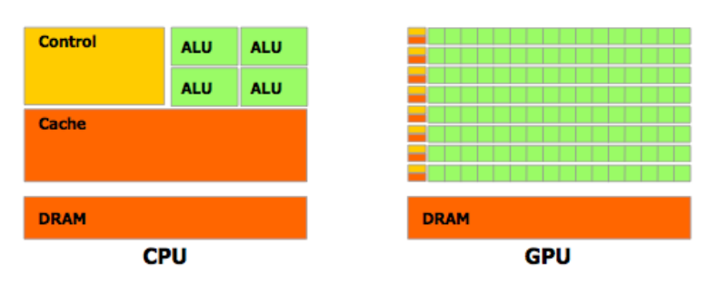
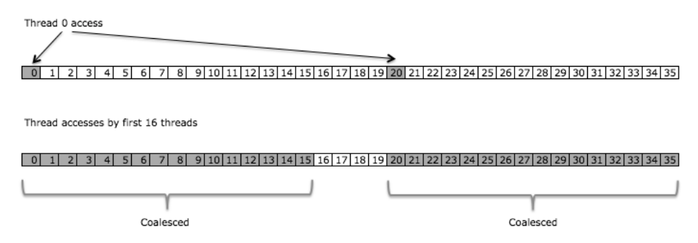

```{r, include=FALSE}
knitr::opts_chunk$set(out.width="100px",out.heigt="200px", dpi=120)
```

\newpage 

# Introducción

El objetivo del proyecto es implementar el método de Diferencias Finita en el Dominio Temporal (FDTD por sus siglas en inglés) en paralelo usando CUDA\footnote{Computer Unified Device Architecture}. Esto se desea realizar en un instancia de Amazon usando Docker. 

La estructura del documento es como sigue, primero se presenta una revisión de los conceptos básicos necesarios para poder entender el problema en términos físicos, matemáticos y computacionales. Se exponen los fundamentos de la teoría de aproximación en términos del cálculo difrencial multivariado representado en este caso por el método de diferencias finitas y su aplicación algorítmica sobre la rama de ecuaciones diferenciales parciales, en las que se busca encontrar una solución numérica a sistemas lineales. En particular se expone una variante del método en el cual se tiene un sistema con cuatro dimensiones $x$,$y$,$z$,$t$ en el cual se realiza una aplicación de diferencias finitas a través del dominio temporal, la cual es muy utilizada en varios sistemas físicos. Por otro lado se explicará brevemente la aplicación del método al caso del electromagnetismo, ya que es una rama importante de la Física Computacional que ha florecido con mayor precisión gracias a los avances tecnológicos como son los procesadores GPU \footnote{Graphical Processor Units}.

Luego de establecer los marcos teóricos básicos, es decir los conceptos básicos para el modelo físico, el modelo matemático y el modelo computacional, se presenta formalmente el problema a resolver así como la implementación computacional que se lleva a cabo, en la cual se consideran los temas de eficiencia, particularmente en el manejo de memoria, en un contexto de ejecución en paralelo.  Asimismo se explica el código que se utiliza para llevar a cabo dicha implementación y se discuten los puntos débiles y las medidas de control que son llevadas a cabo. 

En otra sección se realiza la exposición de resultados numéricos en términos del desempeño y análisis del error en el que se puede incurrir a partir de usar aproximaciones lineales en términos matemáticos y los que se pueden ocasionar respecto al uso de aproximaciones de máquina en el caso de la aritmética de punto flotante así como la estabilidad y complejidad del algoritmo. 

Por último se lleva a cabo una exposición de cómo hacer de esto un programa ejecutable en una infraestructura en la nube de amazon, a través de una imagen de docker que contiene la paquetería del software de Nvidia. 

Como se verá más adelante, existe una serie de reglas importantes o buenas prácticas para optimizar el cómputo en paralelo, no obstante no siempre son aplicables y no siempre son las únicas decisiones que se tienen que llevar a cabo en términos de almacenamiento en memoria por ejemplo, ya que la forma de almacenar mallas multidimensionales no tiene una única forma de ejecutarse y dependerá más de la naturaleza del algoritmo. Por lo tanto, no se pretende que sea un estudio exhaustivo de las diferentes configuraciones en las que se puede implementar el programa de diferencias finitas.  

# Fundamentos

A continuación se exhibirán las bases necesarias para entender primero el método de aproximación general formulado en términos matemáticos en el que cual se lleva a cabo una discretización del espacio para poder expresar valores de las derivadas de una función a través de valores de la función en puntos vecinos. Luego se harå un recuento rápido de las propiedades físicas de los campos que varían con el tiempo, en especial las propiedades derivadas de los modelos físicos sobre campos eléctricos y campos magnéticos, así como sus variantes en medios con conductividad perfecta. Por último se establecen los conceptos computacionales importantes para la implementación en CUDA.   

## Método Matemático

La técnica de diferencias finitas en el dominio temporal ofrece muchas ventajas como una herramienta para modelar y simular y analizar en el campo del electromagnetismo ya que permite manejar una variedad arbitraria de geometrías tridimensionales así como con los parametro de conductividad, medio, respuesta, etc. Este método forma parte de una clase mayor en la disciplina de Termodinámica Computacional. Asimismo el método de diferencias finitas en el dominio temporal es un caso particular del aproximaciones realizadas por el método de diferencias finitas. 

La idea básica detrás del algoritmo de diferencias finitas es discretizar sistemas que tengan una especificación continua de modo que se aproximen los valores de las derivadas a través del cambios incrementales sobre la malla de discretización.

En el caso univariado se tiene que 


\begin{equation}
\resizebox{.8\hsize}{!}{$
 F'(x_0)= \begin{cases} 
           \frac{F ( x_0 + \Delta x  )- F ( x_0 )}{\Delta x} & \text{Diferencia hacia adelante} \\
           \frac{F ( x_0)- F ( x_0-\Delta x  )}{\Delta x} & \text{Diferencia hacia atrás} \\
          \frac{F ( x_0 + \Delta x  )- F ( x_0 - \Delta x )}{2 \Delta x} & \text{Diferencia central} 
   \end{cases}
$}
\end{equation}

Si se recuerda un curso básico de cálculo usualmente existe una sección en la que hablan de las aproximaciones de distinto tipo de orden sobre las derivadas de una función, en general la idea subyace en la expansión de Taylos de la función $F$. En particular para las expansiones de Taylor para las cantidades anteriores son 

\begin{eqnarray}
F ( x_0 + \Delta x ) =& F ( x_0 ) + \Delta x F'( x_0 ) + \frac{\Delta x^2}{2}F''(x_0)  + \frac{\Delta x^3}{6} F'''( \xi_1 ) \text{ } \xi_1 \in [x_0,x_0 + \Delta x] \\
F ( x_0 - \Delta x ) =& F ( x_0 ) - \Delta x F'( x_0 ) + \frac{\Delta x^2}{2}F''(x_0)  - \frac{\Delta x^3}{6} F'''( \xi_2 ) \text{ } \xi_2 \in [x_0-\Delta x,x_0 ]
\end{eqnarray}

Por lo que esta expansión llevada al nivel de serie de potencias en la diferencia $\Delta x$, según aumente el orden de aproximación el error ocasionado por la discretización estará gobernado principalmente por una potencia de $\Delta x$. Dependiendo de la configuración se puede controlar mejor con esquemas distintos de diferencias 

\begin{equation}
\resizebox{.8\hsize}{!}{$
F'( x_0 ) = \frac{F ( x_0 + \Delta x )-F ( x_0 )}{\Delta x} - \frac{\Delta x}{2}F''(x_0) - \frac{\Delta x^2}{6} F'''( \xi_1 )\text{ }  \xi_1 \in [x_0,x_0 + \Delta x] \textbf{ Diferencias Adelante/Atrás tiene un error de orden } O(\Delta x) $}
\end{equation}

\begin{equation}
\resizebox{.8\hsize}{!}{$
F'( x_0 ) = \frac{F ( x_0 + \Delta x )-F ( x_0 - \Delta x )}{2 \Delta x} - \frac{\Delta x^2}{6}F'''( \xi_3 )  \text{ } \xi_3 \in [x_0 - \Delta x, x_0 + \Delta x] \textbf{ Diferencia Central tiene un error de orden } O(\Delta x^2) $}\end{equation}


Por lo cual se dice que el método de diferencias finitas centrales es de segundo orden, en el que se realiza un muestreo en el dominio. Esto es la sustitución $x = i \Delta x$ de modo que $F(x) = F(i)$ es decir se tiene el valor de la función en $x$ a través de evaluarla en un entero $i$ a través del proceso de discretización.

### Método de Diferencias en más dimensiones

En el caso de dos dimensiones se requiere del concepto general de campo vectorial y de los operadores que describen propiedades geométricas de los mismos. El símbolo nabla $\nabla$ denota la operación sobre campos escalares $f$ y genera un campo vectorial denominado gradiente de $f$ 

\begin{equation}
\nabla f = a_x \frac{\partial f}{\partial x} + a_y \frac{\partial f}{\partial y} +a_z \frac{\partial f}{\partial z}
\end{equation}

que mide, en cierta forma, el cambio en el campo al efectuar movimientos sobre trayectorias determinadas. 
Se muestra a continuación la idea geométrica que subyace a las aproximaciones en más dimensiones para las cantidades geométricas que caracterizan a los campos vectoriales. 


Con estos elementos se pueden, por ejemplo, considerar entonces las diferencias en el plano $xy$ por ejemplo para la densidad del flujo eléctrico $D$, siendo aproximadas por las fórmulas direccionales

\begin{equation}
\frac{\partial D_x}{\partial x} + \frac{\partial D_y}{\partial y} \approx \frac{ D_x(x + \frac{\Delta x}{2},y) - D_x(x - \frac{\Delta x}{2},y)}{\Delta x} + \frac{ D_x(x ,y + \frac{\Delta y}{2}) - D_x(x, y- \frac{\Delta y}{2})}{\Delta y}
\end{equation}

Si se pone atención en los signos de la expresión anterior se puede encontrar el sentido del campo vectorial evaluado en los puntos, de modo que la divergencia es esencialemente la suma sobre los campos en las caras del rectángulo con los signos denotando flujo hacia adentro (negativo) y flujo hacia afuera (positivo). Esto tiene un fundamento importante en el comportamiento del flujo eléctrico en presencia de carga, en el cual la divergencia del campo representa la fuerza con que se es atractor o repulsor. 

Por otro lado, si se considera el operador rotacional, aquel que mide la rotación infinitesimal, ahora sobre el campo eléctrico $E$

\begin{equation}
\nabla \times E = a_x (\frac{\partial E_z}{\partial y}  - \frac{\partial E_y}{\partial z}) + a_y(\frac{\partial E_x}{\partial z}  - \frac{\partial E_z}{\partial x}) +a_z(\frac{\partial E_y}{\partial x}  - \frac{\partial E_x}{\partial y}) 
\end{equation}

En este caso se observa el comportamiento únicamente de la componente $z$ del operador, que está gobernada por el plano $xy$.

\begin{equation}
\frac{\partial E_y}{\partial x}  - \frac{\partial E_x}{\partial y} \approx  \frac{ E_y(x + \frac{\Delta x}{2},y) - E_y(x - \frac{\Delta x}{2},y)}{\Delta x} - \frac{ E_x(x ,y + \frac{\Delta y}{2}) - E_x(x, y- \frac{\Delta y}{2})}{\Delta y}
\end{equation}

De nuevo inspeccionando la fórmula anterior y con apoyo en la representación gráfica que se muestra a continuación se puede observar que las aproximaciones de diferencias finitas de nuevo están basadas en los valores del campo en las orillas del rectángulo que rodean el punto de interés $(x,y)$. No obstante, en este caso son las fuerzas tangenciales y no las fuerzas normales a los bordes del rectángulo. La suma del lado derecho tiene un signo positivo cuando la componente vectorial apunta en dirección contraria a las manecillas del reloj y es negativa cuando va en el sentido del reloj. En términos físicos, cuando la suma es positiva el campo eléctrico tiende a empujar carga positiva en la dirección contraria de las manecillas.


## Condición de Estabilidad 

Courant [1928] obtuvo un desarrollo importante para establecer las condiciones de estabilidad para el esquema de muestreo temporal para la aproximación de las derivadas en el esquema de diferencias finitas cuando se requiere resolver un sistema de ecuaciones clásico para la interacción entre campos eléctricos y campos magnéticos. La derivación de esta cota para la estabilidad en términos de convergencia cuadrática es muy similar a la que realiza Euler para el caso del método de aproximación para ecuaciones diferenciales ordinarias.

\begin{equation}
\Delta x \leq \frac{\lambda}{10}; \text{ Estabilidad si }  \Delta t \leq  \frac{\Delta x}{c \sqrt{\alpha}}
\end{equation}

donde $\alpha$ varía dependiendo si es un espacio $\alpha$ dimensional. Es decir $\alpha=1$ en el caso unidimensional, $\alpha=2$ en 2D y $\alpha=3$ en el caso de 3 dimensiones.


## Modelo Físico 

Cuando se consideran campos que son dinámicos, es decir se mueven a lo largo del tiempo es importante formular el problema pensando en qué debe suceder cuando una carga puntual se mueve. Se sabe que cuando una carga está en movimiento esto origina un campo magnético, pero si la carga se mueve su campo eléctrico asociado también debe cambiar. Por lo mismo se dice que cuando un sistema varía en el tiempo entonces los campos magnéticos y los campos eléctricos están acoplados. Uno de los grandes reconocimientos que lleva a cabo James Clerk Maxwell es que se debe considerar que la densidad de carga puede cambiar en el tiempo de modo que decidió incorporar la derivada temporal de la densidad del flujo eléctrico para poder obtener un modelo más general que no solo aplicara a campos estáticos, es decir, que no cambian en el tiempo. 

\begin{equation}
\nabla \times H = J + \frac{\partial D}{\partial t}
\end{equation}

Los términos $J$ y $\frac{\partial D}{\partial t}$ suelen ser identificados con la corriente conductiva y la corriente de dezplazamiento respectivamente y esta expresión es comúnmente conocida como la Ley de Ampere. 

Si se considera el cambio en el potencial eléctrico sobre alguna trayectoria es decir la fuera electromotriz ejercida por el campo, en particular sobre una trayectoria cerrada se escribe como la integral de línea del producto punto del vector de velocidad con el campo $E$ y al hacer uso del Teorema de Stokes se tiene que es igual al cambio sobre la densidad del flujo magnético $B$ sobre la superficie que encierra dicha trayectoria, de donde se sigue que 

\begin{equation}
\nabla \times E = - \frac{\partial B}{\partial t}
\end{equation}

la cual es conocida como la Ley de Faraday.

Las ecuaciones de Maxwell están constituidas por un conjunto de ecuaciones diferenciales parciales, las cuales junto con una Ley de Fuerza de Lorentz, conforman el fundamento del electromagnetismo y óptica clásicos así como de los circuitos eléctricos. Las ecuaciones son nombradas en honor al físico y matemático James Clerk Maxwell, quien entre 1861 y 1862 publicó las ecuaciones así como una proposición de que la luz es un fenómeno electromagnético. En particular en un medio isotrópico (es decir que es homogéneo como medio en todas las direcciones) se tiene que las ecuaciones toman la forma siguiente \footnote{ El sistema está expresado en el sistema MKS, que denota cualquier medida usando como unidades fundamentales el metro, el kilo y el segundo } 

\begin{eqnarray}
\frac{\partial \mathbf{B}}{\partial t} + \nabla \times \mathbf{E} &=0  \\
\frac{\partial \mathbf{D}}{\partial t} - \nabla \times \mathbf{H} &=\mathbf{J}  \\
\mathbf{B} &= \mu \mathbf{H} \\
\mathbf{D} &= \epsilon \mathbf{E} 
\end{eqnarray}  

En las cuales se asume que $\mathbf{J}$, $\mu$ $\epsilon$ son funciones del espacio tiempo conocidas. Recordar que $H$ es un campo magnético auxilar que representa cómo un campo magnético $B$ influye sobre la organización de los dipolos magnéticos en un medio determinado, incluyendo la migración dipolar y la reorientación dipolar magnética, en la cual $\mu$ representa la permeabilidad. En el caso en el que el medio es isotrópico (es decir igual en todas las direcciones) entonces $\mu$ es un escalar. Cuando el medio es anisotrópico $\mu$ resulta ser un tensor de rango dos.  En general la permeabilidad es la medida en que un material puede soportar la formación del campo magnético en sí mismo, es decir es el grado de magnetización que un material obtiene en respuesta a la aplicación de un campo magnético y está medida en Henries por metro $H/m$ o bien Newtons por Ampere al cuadrado $N/A^2$.

\begin{figure}[htp]
\centering
\includegraphics[width=.3\textwidth]{img/dipole_electric.svg.png}
\includegraphics[width=.3\textwidth]{img/dipole_magnetic.svg.png}
\includegraphics[width=.3\textwidth]{img/dipole_point.svg.png}
\caption{Campos para un par de polos eléctricos, un dipolo magnético y un dipolo general (límite cuando la distancia entre polos tiende a cero)}
\end{figure}

## Discretización del problema

En términos de un sistema de coordenadas rectangulares las Leyes de Faraday y Ampere, son equivalentes a 

\begin{eqnarray}
- \frac{\partial \mathbf{B}_x}{\partial t} &= \frac{\partial \mathbf{E}_z}{\partial y} - \frac{\partial \mathbf{E}_y}{\partial z} \\
- \frac{\partial \mathbf{B}_y}{\partial t} &= \frac{\partial \mathbf{E}_x}{\partial z} - \frac{\partial \mathbf{E}_z}{\partial x} \\
\frac{\partial \mathbf{B}_z}{\partial t} &= \frac{\partial \mathbf{E}_x}{\partial y} - \frac{\partial \mathbf{E}_y}{\partial x} \\
\frac{\partial \mathbf{D}_x}{\partial t} &= \frac{\partial \mathbf{H}_z}{\partial y} - \frac{\partial \mathbf{H}_y}{\partial z} -\mathbf{J}_x \\
\frac{\partial \mathbf{D}_y}{\partial t} &= \frac{\partial \mathbf{H}_x}{\partial z} - \frac{\partial \mathbf{H}_z}{\partial x} -\mathbf{J}_y \\
\frac{\partial \mathbf{D}_z}{\partial t} &= \frac{\partial \mathbf{H}_y}{\partial x} - \frac{\partial \mathbf{H}_x}{\partial y} -\mathbf{J}_z \\
\end{eqnarray}

En el caso de discretización tridimensional se denota a un punto de la malla 

\begin{equation}
(i,j.k) = (i\Delta x, j\Delta y, k\Delta z) 
\end{equation}

y para cualquier función del espacio tiempo se define 
\begin{equation}
F(i\Delta x, j\Delta y, k\Delta z, n\Delta t) = F^n(i,j,k)
\end{equation}

### Sistemas de Ecuaciones

Un conjunto de ecuaciones de diferencias finitas para el sistema arriba descrito para el caso de condiciones de frontera de conductividad perfecta son 

\begin{equation}
\resizebox{.8\hsize}{!}{$
\frac{B_x^{n+\frac{1}{2}}(i,j+\frac{1}{2},k+\frac{1}{2}) - B_x^{n-\frac{1}{2}}(i,j+\frac{1}{2},k+\frac{1}{2})}{\Delta t} = \frac{E_y^n(i,j+\frac{1}{2},k+1) - E_y^n(i,j+\frac{1}{2},k)}{\Delta z} - \frac{E_z^n(i,j+1,k+\frac{1}{2}) - E_z^n(i,j,k+\frac{1}{2})}{\Delta y} $}
\end{equation}

Las correspondientes discretizaciones para 2b y 2c son analogas

\begin{equation}
\resizebox{.8\hsize}{!}{$
\frac{D_x^{n}(i+\frac{1}{2},j,k) - D_x^{n-1}(i+\frac{1}{2},j,k)}{\Delta t} = \frac{H_z^{n-\frac{1}{2}}(i+\frac{1}{2},j+\frac{1}{2},k) - H_z^{n-\frac{1}{2}}(i+\frac{1}{2},j-\frac{1}{2},k)}{\Delta y} - \frac{H_y^{n-\frac{1}{2}}(i+\frac{1}{2},j,k+\frac{1}{2}) - H_y^{n-\frac{1}{2}}(i+\frac{1}{2},j,k-\frac{1}{2})}{\Delta z} + J_x^{n-\frac{1}{2}}(i+\frac{1}{2},j,k)
$}
\end{equation}

#### Condiciones de Frontera 

Las condiciones de frontera para una superficie de conductividad perfecta se traduce en que las componentes tangenciales del campo eléctrico se desvanecen. Esta condición también implica que las componentes normales del campo mágnetico se desvanecen en el superficie. La hipersuperficie de conducción será aproximada a través de una colección de hipersuperficies, esto es cubos, cuyas aristas y lados son paralelos a los ejes coordenados como se muestra en la figura.  


El espacio de la malla debe ser tal que dado un incremento el campo electromagnético no cambie significativamente. Esto significa que para tener resultados plausibles la dimensión lineal de la malla debe ser una fracción de la longitud de onda. En este caso, por facilidad el tamaño del paso en las dimensiones espaciales $\Delta x =  \Delta y =  \Delta z$. Entonces para obtener estabilidad computacional es necesario satisfacer una relación entre los incrementos espaciales y los temporales. Cuando $\epsilon$ y $\mu$ son variables, un criterio riguroso es difícil de obtener, pero en el caso en que son constantes 

\begin{equation}
\sqrt{ (\Delta x)^2+(\Delta y)^2+(\Delta z)^2} > c\Delta t = \sqrt{ \frac{1}{\mu \epsilon}}\Delta t
\end{equation}
 
donde $c$ es la velocidad de la luz. Este requerimiento pone restricciones sobre $\Delta t$ dados los incrementos espaciales. 

#### Base Algorítmica 

El algortimo fue propuesto por Kane Yee [1966] en el cual se usan diferencias centradas de segundo orden y puede ser resumido de la siguiente forma

- Se reemplazan todas las derivadas de las leyes de Ampere y Faraday por diferencias finitas. Se discretiza el espacio y tiempo de modo que los campos eléctrico y magnético are staggered tanto en tiempo como en espacio. 

- Se resuelve el sistema de diferencias finitas para obtener ecuaciones de actualización que expresan los campos futuros desconocidos en términos de campos pasados conocidos. 

- Se evalúan los campos magnéticos un paso temporal hacia el futuro de modo que sean conocidos

- Se evalúan los campos eléctricos un paso temporal hacia el futuro de modo que se vuelven conocidos

- Se repite los pasos previos hasta que se obtenga la duración deseada. 

En el modelo discretizado se tiene que las componentes eléctricas son tangenciales a la celda de Yee mientras que las componentes magnéticas son ortogonales a la caras de la celda.

En un ejemplo se puede considerar $J \equiv 0$ y tomar $\mu$ y $\epsilon$ constantes de modo que sea sencillo interpretar los conceptos fundamentales de una onda sencilla que se dispersa. De hecho se puede tener una descomposición importante si se realiza un cambio de coordenadas. En particular se tiene que en coordenadas cilindrícas cualquier campo electromagnético se puede descomponer en dos campos básicos: el campo transversal eléctrico ($TE$) y el campo transversal magnético ($TM$) en el caso que $\epsilon$ y $\mu$ son constantes


Es importante notar que los cubos 'aproximan' el fenómeno en cuatro dimensiones, es decir la evolución del campo. En términos de las aproximaciones del cálculo dierencial, se hace uso de aproximaciones tridimensionales sucesivas en el dominio temporal para aproximar los valores de la función que satisface el sistema de ecuaciones que dicta la dinámica del campo electromagnético. En particular, el sistema de diferencias finitas encontrado explícitamente de las aproximaciones de segundo orden, realiza el efecto que tiene un campo sobre el otro a lo largo del tiempo, creando así un mecanismo de actualización sobre el conjunto discreto que es la malla tridimensional.

## Arquitectura Computacional:  CUDA 

Las unidades de procesamiento gráfico (GPU) están adecuadas especialmente para atacar problemas que pueden ser expresadas como cómputo en paralelo, esto es, el mismo programa es ejecutado en muchos elementos en paralelo.  Por otro lado el algoritmo de diferencias finitas en el dominio temporal (FDTD) es ese tipo de algoritmos que ejecuta el mismo cálculo en todas las componentes del campo tridimensional en todas las celdas del dominio computacional. 



CUDA C extiende el lenguaje de programación C al permitir que el programador defina funciones de C, llamadas *kernels*, que son aquellas que ejecutan $N$ veces en paralelo por $N$ diferentes threads. Cada thread que ejecuta el kernel tiene un ```threadId``` único que es posible de acceder desde el kernel a través de la variable ```threadIdx```, que por conveniencia es un vector de 3 componentes, de modo que los threads pueden ser identificados por un índice de 1,2 o 3 dimensiones formando un bloque de threads que puede ser de 1, 2 o 3 dimensiones. 

Dado que el kernel se ejecuta en bloques que tienen la misma forma, el número total de threads es igual al numero de threads por bloque multiplicado por el número de bloques. Los múltiples bloques pueden estar organizados en una malla unidimensional o bidimensional. Cada bloque en la malla está identificado con un índice unidimensional o bidimensional que es accesible desde el kernel a través de la variable ```blockIdx```.


El kernel ejecuta en una unidad de procesamiento gráfico a la que es referida como el *device* y el resto del programa se ejecuta en la unidad de procesamiento central y es referida como *host*  

### Espacios de Memoria

Los threads de CUDA pueden acceder a los datos desde múltples espacios de memoria durante su ejecución. Cada thread tiene una memoria local privada y una memoria compartida que es visible para todoss los threads del bloque y con la misma duración que el bloque. Todos los threads tienen acceso a la misma memoria global, la cual es el espacio principal de memoria, en la que se almacenan los datos, ya en el *device*. 


El acceso a la memoria global es muy limitado y se convierte en el principal cuello de botella en la ejecución del kernel. Por otro lado, la memoria compartida es mucho más rápida de acceder pero en términos de tamaño es muy limitada. No obstante, provee de los medios para reutilizar datos y mejorar la eficiencia del kernel. 

Los espacios de memoria constante y textura son dos espacios adicionales de lectura limitadas en tamaño y accesibles por todos los threads durante toda la aplicación. 


### Estrategias de optimización 

En los manuales de programación de CUDA se exponen algunas mejores prácticas, las cuales fungen como recomendaciones para optimizar las implementaciones de algoritmos en general. Entre las más importantes están 

- Estructurar los algoritmos de forma que se exhiba el paralelismo en los cálculos tanto como sea posible

- Una vez que el algoritmo tiene dicha estructura, es necesario un mapeo hacia el hardware tan eficiente como sea posible

- Asegurarse que los accesos a memoria global sean de tipo coalescente siempre que sea posible. \footnote{Coalescencia: Es la propiedad de las cosas para unirse o fundirse. En términos computacionales fue una novedad de los GPUS, ya que tienen la capacidad de fusionar bloques adyacentes de memoria para llenar las brechas ocasionadas por la memoria desalojada}

- Minimizar el uso de memoria global y preferentemente usar en su lugar memoria compartida

- Usar memoria compartida para evitar transferencias redundantes desde la memoria global

- Reducir la latencia que surge de las dependencias con el register, esto es tiempo de transferencia entre memoria

- Usar múltiplos de 32 para el número de threads por bloque, ya que estro permite eficiencia óptima en computo y facilita la coalescencia 

Más en \url{http://docs.nvidia.com/cuda/cuda-c-best-practices-guide/#memory-optimizations}


# Implementación de FDTD en GPU

La formulación considerada en CUDA está fundamentada en actualizar las ecuaciones para propiedades anisotropicas de materiales en las se que se incluyen permisividad, permeabilidad y conductividades eléctrica y magnética. El dominio para el problema FDTD es una celda, referida en la literatura como la celda de Yee.


## Construccion del Kernel 

En cada iteración temporal del ciclo de FDTD se calculan tres valores para el campo magnético en cada celda del dominio computacional de forma simultánea con base en los valores pasados del campo eléctrico y asimismo se calculan tres valores que actualizan las componentes del campo eléctrico de forma simultánea. Dado que los cálculos para cada celda pueden ser realizados de forma independiente de las demás celdas, se puede diseñar una implementación que asigne el cálculo de cada celda a thread independientes y que así esta alcance un nivel alto de paralelización.

Las mallas en CUDA, son conjuntos de bloques y los bloques son conjuntos de threads. Las mallas como conjuntos de bloques sólo pueden ser bidimensionales, cada bloque puede tener threads tridimensionales. Cada kernel tiene usualmente un grid asociado sobre el cual efectuará la paralelización y se llama ```KernelName<<dimGrid, dimBlock>>>(parameters)``` donde dimGrid es struct de dos enteros que definen el tamaño del grid así como dimBlock es un struct de hasta tres enteros que define las dimensiones de los bloques. 


En CUDA cada bloque tiene un máximo posible de 512 threads, los cuales pueden ser organizados en bloques de 1, 2 o 3 dimensiones. Por lo que una subsección del problema en un espacio tridimensional puede ser naturalmente mapeado a un bloque de threads tridimensional. 

Sin embargo, los bloques sólo pueden ser organizados en mallas de forma unidimensional o bidimensional! De modo que el dominio cuatridimensional no puede ser mapeado de diferencias finitas en el dominio temporal no puede ser mapeado en términos de memoria de forma natural a una malla unidimensional o bidimensional dimensional, por lo que se debe utilizar un mapeo alternativo para el dominio del algoritmo FDTD.


### Acceso a Memoria Global Coalesced

Las instrucciones de memoria incluyen cualquier instrucción que lee desde o escribe a cualquier memoria compartida, local o global. Cuando se accede a la memoria local o global hay entre 400 y 600 clock cycles de *memory latency*. 

En ciertas ocasiones esta latencia puede ser escondida por el *scheduler* de threads si existen instrucciones ariméticas que puedes ser consideradas mientras se espera por el acceso a la memoria global. La mala noticia es que en el caso del FDTD las operaciones están dominadas por accesos a memoria más que por instrucciones aritméticas, por lo que el acceso ineficiente a memoria resulta el principal cuello de botella para los GPUS.

A continuación un ejemplo de medio warp de threads que acceden a dos bloques contiguos de memoria, que puede cargarse en dos transacciones coalescidas en lugar de 32 individuales. 



El ancho de banda de memoria global es usada casi eficientemente cuando los accesos simultáneos por los threads en un half-warp (durante la ejecución de una instrucción de escritura o lectura) puede ser coalescida en una sola transacción de memoria de 32 64 o 128 bytes. Esto se debe a que se reduce por ejemplo la redundancia de acceso y escritura a memoria. 

### Acceso a Memoria Compartida

El acceso a memoria compartida es mucho más rápida que la memoria local o global debido a que es una memoria *on-chip*. Aquellos parámetros que residan en el espacio de memoria compartida de un bloque de threads tienen la misma duración que el bloque y son accesibles por todos los threads del bloque. Por lo que si el kernel utilizará frecuentemente bloques de información de la memoria global es mejor cargar los datos en la memoria compartida para que exista reciclado de datos.

En particular la memoria compartida es muy útil en el caso que los threads deben acceder a datos 'desalineados' (unaligned), por ejemplo en FDTD para calcular $H_y(i,j,k)$, un thread mapeado a la celda $(i,j,k)$ necesita $E_x$ y $E_z$ en $(i,j,k)$, así como en $E_x$ en $(i,j,k+1)$ y $E_z(i+1,j,k)$. En un caso se tiene que el acceso posee coalescencia sobre $(i,j+1,k)$ y $(i,j,k+1)$, no obstante $(i+1,j,k)$ no lo está y si es necesario un acceso a una celda vecina que no está en modo de coalescencia debe incluirse de cierta forma. $E_z(i+1,j,k)$ para $H_y(i,j,k)$ y $E_y(i+1,j,k)$ para $H_z(i,j,k)$ entonces la memoria compartida se debe utilizar para cargar el bloque de datos mapeados a un bloque de threads y el campo vecino es accedido a través de memoria compartida. En este punto uno necesita utilizar la sincronización de los thredas en un bloque de modo que todos los datos necearios estén cargadps en memoria compartida antes de que se usen por sus threads vecinos. Graficamente se ve de la siguiente forma.


Aunque los accesos que no soan coalesced pueden ser eliminados usando memoria compartida existe un problema cuando se accede a la información de celdas vecinas a través de la memoria compartida. Cuando se carga la memoria compartida cada thread copia un elemeto de la memoria global a la memoria compartida, si el thread de la frontera del bloque desea acceder a la informacion de la celda vecina estos datos no estarán disponibles si no están cargados en la memoria compartida. Por lo tanto es necesario cargar otro conjunto de datos que incluye los datos de las celdas vecinas a la memoria compartida. 

La asignación de espacio se extiende por 16 y en algunos threads del bloque son utilizados para copiar datos de la memoria global a esta extensión de la memoria compartida. Así las transferencias de datos desde y hacia la memoria global deben ser evitadas tanto como sea posible. En algunos casos es mejor recalcular que volver a leer de la memoria global. En otras palabras si hay datos que ya han sido transferidos desde la memoria global deben ser utilizados tantas veces sea posible.

\begin{table}[htbp]
\centering
\caption{Características de los Espacios de Memoria}
\begin{tabular}{l|l|l|l|l|l}
Memory & Location on/off chip & Cached & Access & Scope & Lifetime \\
\hline
Register & On & n/a & R/W & 1 thread & Thread \\
Local & Off & Yes & R/W & 1 thread & Thread \\
Shared & On & n/a & R/W & All threads in block & Block \\
Global & Off & Yes & R/W & All threads + host & Host allocation \\
Constant & Off & Yes & R & All threads + host & Host allocation \\
Texture & Off & Yes & R & All threads + host & Host allocation
\end{tabular}
\end{table}


## Código Base

A continuación llevamos a cabo la descripción del código de los archivos integrados en el ejemplo del método de diferencias finitas en el dominio temporal. En general se tienen dos carpetas, una *inc* y otra *src* que contienen los headers a incluir y el código fuente que compila las rutinas principales, respectivamente. 

- ```inc```
    + ```FDTD3d.h```
    + ```FDTD3dGPU.h```
    + ```FDTD3dGPUKernel.cuh```
    + ```FDTD3dReference.h```

- ```src```
    + ```FDTD3d.cpp```
    + ```FDTD3dGPU.cu```
    + ```FDTD3dReference.cpp```

Junto con estos archivos se encuentran el archivo ```Makefile``` que se encarga de llevar a cabo el proceso de compilación de los archivos fuente asi como un file ```FDTD3d.txt``` que exhibe el resultado que debería aparecer en la consola al momento de ejecución y un ```readme.txt``` que explica los requerimientos con los que debe contar la arquitectura de CUDA en los cuales aparecen las abreviaturas *SM* que significa **Streaming Multiprocessor** y *SP* que significa **Streaming Processor** lo cual también es llamado  **CUDA Core**. Los CUDA cores procesan threads que pertenecen a un bloque (recursos compartidos).

<!-- Por otro lado otra cantidad que suele aparacer en la literatura de cómputo con GPUs con CUDA es el total de SP/CUDA Cores =  #SM * #SP/CUDA Cores por SM -->

<!-- CUDA threads -->
<!-- Se lanza el grid  -->
<!-- Blocks son asignado a SM en orden arbitrario de bloque en bloque. eg. GT200 puede hacer max 8bloques o máximo 1024 threads por SM.  -->
<!-- Un bloque asignado es particionado en warps, su execution es interleaved  -->
<!-- Warps son asignados a SM (un thread para cada SP) -->
<!-- Warps pueden ser demorados si idles for some reaaseon  -->

### Carpeta inc

En la carpeta **inc** se incluyen todos los archivos que se deben anexar al codigo de C. Principalmente son *header files* tanto para el caso paralelo como para el no-paralelo que será denominado de referencia. Estos archivos después serán "incluidos" a través de la directiva `#include` en las partes "centrales" o "src" del código.

**FDTD3d.h**

```{r engine='Rcpp', eval=FALSE}
#ifndef _FDTD3D_H_
#define _FDTD3D_H_

#define k_dim_min           96
#define k_dim_max           376
#define k_dim_qa            248

#define k_radius_min        4
#define k_radius_max        4
#define k_radius_default    4

#define k_timesteps_min     1
#define k_timesteps_max     10
#define k_timesteps_default 5
```

En este header se definen los parámetros generales así como algunas de las funciones necesarias para el caso no paralelo. En las primeras dos líneas se ejecutan las directivas que revisan si el identificador ```_FDTD3D_H_``` existe. En las siguientes tres lineas se declaran las dimensiones mínimas y máximas de las matrices. Estos se pueden ajustar respecto a la cantidad de memoria disponible pero cuando se opera con grandes dimensiones puede tomar mucho tiempo en correr.

En las siguientes tres lineas de código se definen los radios que usará el kernel. Ya que el kernel usa un número constante todos se definen igual a 4. Si se reajusta esta variable se debe de hacer un cambio respectivo en el kernel. En general esta variable es la que define el radio del stencil. Un *stencil* es un arreglo geométrico de un grupo de nodos que se relacionan respecto al punto de interés a través de una rutina de aproximación numérica. Los stencils son la base de muchos algoritmos que resuelven numéricamente las ecuaciones diferenciales parciales. 


En general los coeficientes de diferencias finitas para un stencil dado son fijos y determinados por los coeficientes al despejar de los polinomios de Taylor como se explica en secciones anteriores. Por último se tienen las dimensiones máximas y mínimas del paso en la dimensión temporal.

**FDTD3dReference.h**

```{r engine='Rcpp', eval=FALSE}
#ifndef _FDTD3DREFERENCE_H_
#define _FDTD3DREFERENCE_H_
void generateRandomData(float *data, const int dimx, const int dimy, const int dimz, \ 
                          const float lowerBound, const float upperBound);
void generatePatternData(float *data, const int dimx, const int dimy, const int dimz, \ 
                         const float lowerBound, const float upperBound);
bool fdtdReference(float *output, const float *input, const float *coeff, \
                   const int dimx, const int dimy, const int dimz, \
                   const int radius, const int timesteps);
bool compareData(const float *output, const float *reference, \ 
                 const int dimx, const int dimy, const int dimz, \
                 const int radius, const float tolerance=0.0001f);
#endif
```

Análogamente para el caso del archivo ```FDTD3dReference.h``` se tiene la directiva para definir ```_FDTD3DREFERENCE_H_``` en caso que no exista. En las siguientes 4 lineas se declaran funciones y variables que serán utilizadas durante de la ejecución del código principal y definidas en los siguientes archivos.


**FDTD3dGPU.h**

```{r engine='Rcpp', eval=FALSE}
#ifndef _FDTD3DGPU_H_
#define _FDTD3DGPU_H_

#include <cstddef>
#if defined(WIN32) || defined(_WIN32) || \
    defined(WIN64) || defined(_WIN64) && defined(_MSC_VER)
typedef unsigned __int64 memsize_t;
#else
#include <stdint.h>
typedef uint64_t memsize_t;
#endif

#define k_blockDimX    32
#define k_blockDimMaxY 16
#define k_blockSizeMin 128
#define k_blockSizeMax (k_blockDimX * k_blockDimMaxY)

bool getTargetDeviceGlobalMemSize(memsize_t *result, const int argc, const char **argv);
bool fdtdGPU(float *output, const float *input, const float *coeff, \
             const int dimx, const int dimy, const int dimz, \
             const int radius, const int timesteps, \
             const int argc, const char **argv);
```

De nuevo en este header se tiene la directiva sobre el identificador ```_FDTD3DGPU_H_``` así como el uso de la librería de definiciones estándares para C ```<cstddef>```  en el cual se definen varios tipos implícitos generadoos o utiilizados por ciertas expresiones. Un paso importante es la linea cuarta de código en la cual se define el tamaño de memoria a utilizar dependiendo del sistema operativo, junto con la carga del header ```<stdint.h>``` que define un conjunto de tipos de entero con ciertos requerimientos de tamaño junto con macro que espcifican los límites de los mismos. por ejemplo el ```uint64_t``` que define el tamaño memoria como un entero a 64 bits. 

En las definiciones se encuentran los parámetros importantes para el uso de memoria. Se tiene la definición del tamaño de los bloques, como mínimo 128 threads por bloque y como máximo 32*16 =``` k_blockDimX x k_blockDimMaxY``` que resultan ser la dimensión horizontal y vertical del bloque. 

Por último se tienen las funciones ```getTargetDeviceGlobalMemSize``` que obtiene el tamaño de memoria global del *device* y otro más con output booleana ```fdtdGPU``` que será la bandera que determinará si el algoritmo corrió con éxito o no.  A continuación el archivo principal para el cómputo en paralelo en el cual se define el kernel.

**FDTD3dGPUKernel.cuh**

```{r engine='Rcpp', eval=FALSE}
#include "FDTD3dGPU.h"
#define RADIUS 4
__constant__ float stencil[RADIUS + 1];
__global__ void FiniteDifferencesKernel(float *output,
                                        const float *input,
                                        const int dimx,
                                        const int dimy,
                                        const int dimz)
{
    bool validr = true;
    bool validw = true;
    const int gtidx = blockIdx.x * blockDim.x + threadIdx.x;
    const int gtidy = blockIdx.y * blockDim.y + threadIdx.y;
    const int ltidx = threadIdx.x;
    const int ltidy = threadIdx.y;
    const int workx = blockDim.x;
    const int worky = blockDim.y;
    __shared__ float tile[k_blockDimMaxY + 2 * RADIUS][k_blockDimX + 2 * RADIUS];
    const int stride_y = dimx + 2 * RADIUS;
    const int stride_z = stride_y * (dimy + 2 * RADIUS);
    int inputIndex  = 0;
    int outputIndex = 0;
    // Advance inputIndex to start of inner volume
    inputIndex += RADIUS * stride_y + RADIUS;
    // Advance inputIndex to target element
    inputIndex += gtidy * stride_y + gtidx;
    float infront[RADIUS];
    float behind[RADIUS];
    float current;
    const int tx = ltidx + RADIUS;
    const int ty = ltidy + RADIUS;
    // Check in bounds
    if ((gtidx >= dimx + RADIUS) || (gtidy >= dimy + RADIUS))
        validr = false;
    if ((gtidx >= dimx) || (gtidy >= dimy))
        validw = false;
    // Preload the "infront" and "behind" data
    for (int i = RADIUS - 2 ; i >= 0 ; i--)
    {
        if (validr)
            behind[i] = input[inputIndex];
        inputIndex += stride_z;
    }
    if (validr)
        current = input[inputIndex];
    outputIndex = inputIndex;
    inputIndex += stride_z;
    for (int i = 0 ; i < RADIUS ; i++)
    {
        if (validr)
            infront[i] = input[inputIndex];
        inputIndex += stride_z;
    }
    // Step through the xy-planes
#pragma unroll 9
    for (int iz = 0 ; iz < dimz ; iz++)
    {
        // Advance the slice (move the thread-front)
        for (int i = RADIUS - 1 ; i > 0 ; i--)
            behind[i] = behind[i - 1];
        behind[0] = current;
        current = infront[0];
#pragma unroll 4
        for (int i = 0 ; i < RADIUS - 1 ; i++)
            infront[i] = infront[i + 1];
        if (validr)
            infront[RADIUS - 1] = input[inputIndex];
        inputIndex  += stride_z;
        outputIndex += stride_z;
        __syncthreads();
        // Update the data slice in the local tile
        // Halo above & below
        if (ltidy < RADIUS)
        {
            tile[ltidy][tx]                  = input[outputIndex - RADIUS * stride_y];
            tile[ltidy + worky + RADIUS][tx] = input[outputIndex + worky * stride_y];
        }
        // Halo left & right
        if (ltidx < RADIUS)
        {
            tile[ty][ltidx]                  = input[outputIndex - RADIUS];
            tile[ty][ltidx + workx + RADIUS] = input[outputIndex + workx];
        }
        tile[ty][tx] = current;
        __syncthreads();
        // Compute the output value
        float value = stencil[0] * current;
#pragma unroll 4
        for (int i = 1 ; i <= RADIUS ; i++)
        {
            value += stencil[i] * (infront[i-1] + behind[i-1] + \
              tile[ty - i][tx] + tile[ty + i][tx] + tile[ty][tx - i] + tile[ty][tx + i]);
        }
        // Store the output value
        if (validw)
            output[outputIndex] = value;
    }
}
```

En este header de CUDA se manda a llamar el header de GPU definido arriba y se define los actores principales de este documento. La variable ```stencil``` de dimensión 5 captura los coeficientes que resultan de la expansión de Taylor. El kernel consta esencialmente de el mapeo de índices con el cual se traduce cada volumen tridimensional al grid de bloques de memoria compartida a través de los enteros ```gtidx```, ```gtidy```, ```ltidx```, ```ltidy```, ```workx```,```worky``` a través de los cuales se accede a la variable *tile* que sera el struct de información compartida en una forma bidimensional. También están los ```stride_y``` y ```stride_z``` que representan el número de pasos que se tienen que hacer en el arreglo de threads para cada punto evaluado.

Como se explicó en el caso de uso de memoria, la parte fina realmente está en el orden del mapero sobre el plano $xy$ y cómo se realizan las actualizaciones cuando se llega a las fronteras dentro del grid. Al final se calcula valor con base en las ecuaciones descritas arriba y se actualiza el vector output.

Cabe mencionar el uso de ```#pragma unroll n``` con $n=4$ y $n=9$ con el cual realiza el traslado de un del behind al front al momento de recorrer los slices. En específico esta directiva justo antes de cada loop es una optimización para el compilador ya que prácticamente reemplaza el for por la ejecución secuencial, aminorando carga sobre el procesador, ya que en el caso del for loop es necesaria la iniciación del índice $i$ evaluación para $n$ y $n-1$ incrementos, mientras que en el segundo caso sólo se llenan los arreglos. Más en la [guía de programación](http://docs.nvidia.com/cuda/cuda-c-programming-guide/index.html#pragma-unroll).

La forma de mapear la memoria está asociada con un traverse sobre el eje $z$, el cual es conocido como un $xy$ mapping, con el cual se calcula en cada rebanada los valores necesarios de modo que siempre existen los valores necesarios para la rebanda siguiente en la dirección de $z$ para la siguiente.


### Carpeta src 

En esta sección se explicarán los programas principales que invocan los métodos y funciones definidas en los archivos anteriormente mencionados.

**FDTD3dReference.cpp**

Por facilidad de exposición se eliminaron partes de código que son exhibidas de forma completa al final del documento en el anexo. 

```{r engine='Rcpp', eval=FALSE}
#include "FDTD3dReference.h"
#include <cstdlib>
#include <cmath>
#include <iostream>
#include <iomanip>
#include <stdio.h>

void generateRandomData(...){...}
void generatePatternData(...){...}

bool fdtdReference(...)
{
...
    // Allocate temporary buffer
    printf(" calloc intermediate\n");
    intermediate = (float *)calloc(volumeSize, sizeof(float));
...
    // Run the FDTD (naive method)
    printf(" Host FDTD loop\n");
    for (int it = 0 ; it < timesteps ; it++)
    {
...
        for (int iz = -radius ; iz < dimz + radius ; iz++)
        {
        for (int iy = -radius ; iy < dimy + radius ; iy++)
        {
            for (int ix = -radius ; ix < dimx + radius ; ix++)
            {
                if (ix >= 0 && ix < dimx && iy >= 0 && iy < dimy && iz >= 0 && iz < dimz)
                {
                    float value = (*src) * coeff[0];

                    for (int ir = 1 ; ir <= radius ; ir++)
                    {
value += coeff[ir] * (*(src + ir) + *(src - ir));                       // horizontal
value += coeff[ir] * (*(src + ir * stride_y) + *(src - ir * stride_y)); // vertical
value += coeff[ir] * (*(src + ir * stride_z) + *(src - ir * stride_z)); // front/ behind
                    }
                    *dst = value;}else{*dst = *src;}
                ++dst;
                ++src;
            }
        }
    }
...
}
bool compareData(...){...}
```


En este archivo prácticamente se cargan librerías


- ```<cstdlib>``` "C Standard General Utilities Library".- Este header define las funciones "general-purpose", como el manejo dinamico de la memoria, la generacion de numeros aleatorios, la comunicacion con el ambiente, busqueda, "sorting" y conversiones.

- ```<cmath>``` C numerics library.- Header <cmath> declara una serie de funciones para realizar operaciones matematicas comunes y transformaciones.

- ```<iostream>``` Standard Input / Output Streams Library.- Header que define los objectos estandard de i/o.

- ```<iomanip>``` IO Manipulators.- Header que contiene los parametros de los "manipulator": que son funciones que están diseñadas específicamente para ser usadas en conjunción con los operadores de inserción ```<<``` y extracción ```>>``` sobre objetos tipo *stream* usualemente para cambiar formatos o usar expresiones regulares.

Además se declaran las funciones para desarrollar la carga o generación del input ```generateRandomData``` 
```generatePatternData``` así como el código para la versión secuencial del FDTD ```fdtdReference```, en la que se destaca el uso de buffers que sirven como memoria tipo cache. Por último la función que calcula la diferencia en las aproximaciones ```compareData```.

**FDTD3dGPU.cu**

```{r engine='Rcpp', eval=FALSE}
#include "FDTD3dGPU.h"
#include <iostream>
#include <algorithm>
#include <helper_functions.h>
#include <helper_cuda.h>
#include "FDTD3dGPUKernel.cuh"

bool getTargetDeviceGlobalMemSize(...){...}

bool fdtdGPU(...)
{
  ...
    // Get the number of CUDA enabled GPU devices
    checkCudaErrors(cudaGetDeviceCount(&deviceCount));
    // Select target device (device 0 by default)
    targetDevice = findCudaDevice(argc, (const char **)argv);
    checkCudaErrors(cudaSetDevice(targetDevice));
    // Allocate memory buffers
    checkCudaErrors(cudaMalloc((void **)&bufferOut, paddedVolumeSize * sizeof(float)));
    checkCudaErrors(cudaMalloc((void **)&bufferIn, paddedVolumeSize * sizeof(float)));
...
    // Set the block size
...
    // cudaMemCpy Calls
    // Copy the input to the device input buffer 
    // Copy the input to the device output buffer (actually only need the halo)
    // cudaMemcpyToSymbol
    // Copy the coefficients to the device coefficient buffer
    // Execute the FDTD
    printf(" GPU FDTD loop\n");
#ifdef GPU_PROFILING
    // Enqueue start event
    checkCudaErrors(cudaEventRecord(profileStart, 0));
#endif
    for (int it = 0 ; it < timesteps ; it++)
    {
    printf("\tt = %d ", it);
    // Launch the kernel
    printf("launch kernel\n");
    FiniteDifferencesKernel<<<dimGrid, dimBlock>>>(bufferDst, bufferSrc, dimx, dimy, dimz);
    // Toggle the buffers
    // Visual Studio 2005 does not like std::swap
    //    std::swap<float *>(bufferSrc, bufferDst);
    float *tmp = bufferDst;
    bufferDst = bufferSrc;
    bufferSrc = tmp;
    }
    // Wait for the kernel to complete
    checkCudaErrors(cudaDeviceSynchronize());
    // Read the result back, result is in bufferSrc (after final toggle)
    // cudaMemCpy Calls
...
    // Cleanup
    ...
        checkCudaErrors(cudaFree(bufferIn));
        checkCudaErrors(cudaFree(bufferOut));
    ...}
```

En este archivo de nuevo manda a llamar librerías auxiliares de CUDA, así como la librería de algoritmos que permite revisar el funcionamiento de las funciones. Luego de ejecutar el llamado de la memoria global del device junto con las propiedades del device, ejecuta la función de fdtdGPU en el cual se hace énfasis en el profiling de código y en cuidar que cada ejecución contenga un ```checkCudaErrors``` una función súper útil para el desarrollo de algoritmos eficientes. Además del priofiling en GPU, es importante mencionar la transferencia de información a través de ```cudaMemcp``` y ```cudaMemcpyHostToDevice``` luego de hacer un ```cudaMalloc``` a través de los buffers. Por otro lado existen otras funciones importantes para el funcionamiento correcto del programa como es el ```cudaDeviceSynchronize``` que hace la sincronización del device antes de realizar la transferencia de regreso con ```cudaMemcpyDeviceToHost```. En general luego de la llamada al kernel se tiene un perfilado del tiempo de ejecución así como la liberación de los buffers. 


**FDTD3d.cpp**

```{r engine='Rcpp', eval=FALSE}
// Includes ...

// Forward declarations
bool runTest(int argc, const char **argv);
void showHelp(const int argc, const char **argv);

int main(int argc, char **argv)
{ 
  ...
        // Execute
        bTestResult = runTest(argc, (const char **)argv);
    }

    // Finish
    exit(bTestResult ? EXIT_SUCCESS : EXIT_FAILURE);
}

void showHelp(...){...}

bool runTest(int argc, const char **argv)
{
// Parameter Declaration
...
    getTargetDeviceGlobalMemSize(&memsize, argc, argv);
...
    // Determine volume size
    outerDimx = dimx + 2 * radius;
    outerDimy = dimy + 2 * radius;
    outerDimz = dimz + 2 * radius;
    volumeSize = outerDimx * outerDimy * outerDimz;

    // Allocate memory
    host_output = (float *)calloc(volumeSize, sizeof(float));
    input       = (float *)malloc(volumeSize * sizeof(float));
    coeff       = (float *)malloc((radius + 1) * sizeof(float));

    // Create coefficients
    for (int i = 0 ; i <= radius ; i++){ coeff[i] = 0.1f;}

    // Generate data
    printf(" generateRandomData\n\n");
    generateRandomData(input, outerDimx, outerDimy, outerDimz, lowerBound, upperBound);

    // Execute on the host
    printf("fdtdReference...\n");
    fdtdReference(host_output, input, coeff, dimx, dimy, dimz, radius, timesteps);
    printf("fdtdReference complete\n");

    // Allocate memory
    device_output = (float *)calloc(volumeSize, sizeof(float));

    // Execute on the device
    printf("fdtdGPU...\n");
    fdtdGPU(device_output, input, coeff, dimx, dimy, dimz, radius, timesteps, argc, argv);
    printf("fdtdGPU complete\n");

    // Compare the results
    float tolerance = 0.0001f;
    printf("\nCompareData (tolerance %f)...\n", tolerance);
    return compareData(device_output, host_output, dimx, dimy, dimz, radius, tolerance);
}

```

En el código fuente para el caso que no usa procesadores gráficos se tiene 

- ```<helper_functions.h>```
- ```<math.h>```
- ```<assert.h>```

Las principales funciones dentro del codigo son:

- *CLAMP*.- Función definida por el usuario

- *getTargetDeviceGlobalMemSize*.- Función que obtiene el numero maximo de GPU habilitados para CUDA, selecciona el device "target" y regresa el maximo de memoria para alocar.

- *checkCmdLineFlag*.- Función que regresa si la linea de commandos tiene un "device" ya esta especificado. 

- *compareData*.- Función que compara la suma obtenida mediante GPU con la de CPUs.

- *generateRandomData*.- Función para generar datos aleatorios del tamaño dado en megabytes. Usada principalmente para probar diversos escenarios de memoria.

- *showHelp*.- Muestra ayuda sobre especificaciones de CUDA. Como el device, benchmarck, hostmemory, etc.


**Makefile**

```{r engine='bash', eval=FALSE}
...
FDTD3d.o:src/FDTD3d.cpp
        $(EXEC) $(NVCC) $(INCLUDES) $(ALL_CCFLAGS) $(GENCODE_FLAGS) -o $@ -c $<

FDTD3dGPU.o:src/FDTD3dGPU.cu
        $(EXEC) $(NVCC) $(INCLUDES) $(ALL_CCFLAGS) $(GENCODE_FLAGS) -o $@ -c $<

FDTD3dReference.o:src/FDTD3dReference.cpp
        $(EXEC) $(NVCC) $(INCLUDES) $(ALL_CCFLAGS) $(GENCODE_FLAGS) -o $@ -c $<

FDTD3d: FDTD3d.o FDTD3dGPU.o FDTD3dReference.o
        $(EXEC) $(NVCC) $(ALL_LDFLAGS) $(GENCODE_FLAGS) -o $@ $+ $(LIBRARIES)
        $(EXEC) mkdir -p ../../bin/$(TARGET_ARCH)/$(TARGET_OS)/$(BUILD_TYPE)
        $(EXEC) cp $@ ../../bin/$(TARGET_ARCH)/$(TARGET_OS)/$(BUILD_TYPE)

run: build
        $(EXEC) ./FDTD3d
...
```

Makefile para la compilacion del programa. Incluye las partes del codigo de CUDA y de C. En general tiene los argumento básicos para generar el ćodigo (gencode arguments) así como realizar la verificación de compiladores y arquitectura y reglas objetivo para los scripts. Al final se tienen los outputs ```FDTD3d.o``` ```FDTD3dGPU.o``` ```FDTD3dReference.o``` consolidados en ```FDTD3d```. 

## Resultados

Fue examinado como una función del tamaño en el algoritmo como un mapeo $xy$. El análisis se realizó con una tarjeta [NVIDIA GEForce GTX 960M](http://www.geforce.com/hardware/notebook-gpus/geforce-gtx-960m/specifications) que tiene 640 CUDA cores en una máquina con Ubuntu-Linux 64 bit. Dado que se recorrió un dominio de tamaño cúbico en el problema de diferencias finitas en el tiempo, el numero de millón de celdas por segundo (NMCPS) es calculado como medida de desempeño del programa de CUDA  

\begin{equation}
NMCPS = \frac{n_{steps} \times N_x \times N_y \times N_z}{t_s}\times 10^{-6}
\end{equation}

donde $n_{steps}$ es el número de pasos que itera el progama, $t_s$ el total de tiempo en segundos.  

En este caso se utilizó el CUDA Visual Profiler, en el cual se presentan a detalle los tiempos de ejecución así como la ocupación de los tipos de memoria que existe en el device así como los tiempos de traslado entre host y device. En general, presenta un informe muy detallado de todo lo que es necesario para determinar el desempeño o recursos de cómputo dividos en CPU y GPUs.  La especificación de las propiedades de la tarjeta gráfica utilizada se encuentra en el anexo. 

A continuación se presenta una tabla con los resultados principales comparando ambos 

\begin{table}
    \centering
  	\caption{Comparacion secuencial vs paralelo - tiempo de ejecución}
    \begin{tabular}{lr}
      \\
      Metodo & Tiempo\\
      \hline
      Secuencial & 1.2 s\\
      Paralelo & 0.05 s\\
      \hline
    \end{tabular}
\end{table}

Se tiene que incluso para dimensiones relativamente pequeñas el código en parello ejecuta prácticamente 25 veces más rápido. Por lo que representa una buena reducción en el tiempo de ejecución gracias al procesamiento en paralelo para cada actualización temporal.

### Impresión Resultado del código 

Los resultados obtenidos de correr el ejemplo base son los siguientes

```
Set-up, based upon target device GMEM size...
 getTargetDeviceGlobalMemSize
 cudaGetDeviceCount
GPU Device 0: "GeForce GTX 960M" with compute capability 5.0

 cudaGetDeviceProperties
 generateRandomData

FDTD on 376 x 376 x 376 volume with symmetric filter radius 4 for 5 timesteps...

fdtdReference...
 calloc intermediate
 Host FDTD loop
	t = 0
	t = 1
	t = 2
	t = 3
	t = 4

fdtdReference complete
fdtdGPU...
GPU Device 0: "GeForce GTX 960M" with compute capability 5.0

 set block size to 32x16
 set grid size to 12x24
 GPU FDTD loop
	t = 0 launch kernel
	t = 1 launch kernel
	t = 2 launch kernel
	t = 3 launch kernel
	t = 4 launch kernel

fdtdGPU complete

CompareData (tolerance 0.000100)...
```

En está ejecución se puede apreciar la impresión a pantalla de las funciones declaradas en los programas anteriores al momento de su finalización y se imprime la tolerancia obtenida entre ambas soluciones. 

# Infraestructura de Instancias con CUDA en Amazon

Para la implementacion del problema, usaremos una instancia EC2 de Amazon AWS de tipo p2.xlarge. Estas instancias cuentan con un 1 GPU que cuenta con 2,496 cores para procesamiento en paralelo.

La implementacion de FDTD suele ser demasiado costosa computacionalmente, el avance en el uso de tarjeta graficas para "general purpose programming" ha permitido que metodos como el FDTD puedan ser ejecutados en tiempos razonables.

La "forma" tipica en la que es implementado un codigo en CUDA es similar al mostrado en la imagen a continuacion. 

*Basic Code Flowchart*


El codigo, claro, está escrito para que pueda ser ejecutado en forma paralela (ver archivos de código), generalmete de la forma SIMT (single input multiple threads).  Diversos articulos de la literatura muestran un ganancia en eficiencie de hasta un 80% en cuestion de tiempo de ejecución, este varia un poco dependiendo de la métrica que se use para medir la eficiencia. 

El código se planea implementar de tal manera que todos los threads se utilicen en la máquina de Amazon, así como eficientar el acceso a memoria.

## Docker

Se crea un cluster de Docker en una máquina de Amazon. El ejemplo básico de la integración de Docker con CUDA se puede observar en la imagen 1.2.

Para esto, se usará el Dockerfile oficial de Nvidia, con el ajuste para correr nuestro codigo. 


Los pasos básicos a seguir para una correcta instalacion de CUDA en Docker y Amazon son:

- Se crea la instancia de Amazon (puede ser via docker-machine)
- Se instalan los drives de Nvidia
- Se descarga la imagen de Docker de NVidia con CUDA o podemos usar una propia
- Se crea los contenedores
- Se maneja remotamente con `nvidia-docker`

Esta parte se puede ejecutar corriendo el script de `docker-machine.sh`. Tal como se menciona arriba, se crea la instancia de Amazon de tipo p2.2large, se instalan los drives de Nvidia asi como el docker, y despues se hace un deploy via nvidia-docker. 

Despues de realizar el deploy, se usa el Dockerfile para levantar el conteneder y poder ejecutar algoritmo luego de hacer una compilación del mismo a través del comando ```make```. En el anexo se agregan tanto el ``Dockerfile``` como el ```docker-machine.sh```.


# Referencias 

- [Micikevicius, P. 3D finite difference computation on GPUs using CUDA. In Proceedings of 2nd workshop on general purpose processing on graphics processing units pp. 79-84., March, 2009 ](https://drive.google.com/open?id=0B1GlF2qCvHCXa0JYWHBNcVdmSUk)

- [V. Demir, A.Z. Elsherbeni, "Compute Unified Device Architecture (CUDA) Based Finite- Difference Time-Domain (FDTD) Implementation", Appl. Comput. Electromagn. Soc. J., vol. 25, n. 4, pp. 303-314, April 2010](https://drive.google.com/open?id=0B1GlF2qCvHCXUlk5NUx1THNxczQ)

- [Finite Difference Methods in CUDA C/C++, Part 1](https://devblogs.nvidia.com/parallelforall/finite-difference-methods-cuda-cc-part-1/)

- [Finite Difference Methods in CUDA C/C++, Part 2](https://devblogs.nvidia.com/parallelforall/finite-difference-methods-cuda-c-part-2/)

- [Yee, K. Numerical solution of initial boundary value problems involving Maxwell's equations in isotropic media. IEEE Transactions on antennas and propagation, 14(3), 302-307, 1966](https://drive.google.com/open?id=0B1GlF2qCvHCXMkJSWHdhSkFFRFE)

- [Nvidia Blog CUDA nvprof](https://devblogs.nvidia.com/parallelforall/cuda-pro-tip-nvprof-your-handy-universal-gpu-profiler/)

- [Computing 3D Finite Difference schemes for acoustics – a CUDA approach, Craig J. Web, 2010](https://drive.google.com/open?id=0B1GlF2qCvHCXUlk5NUx1THNxczQ)	
	
-[D. Danielo,E.Alessandra,T.Luciano,C.Luca, Introduction to GPU Computing and CUDA Programming: A Case Study on FDTD, Unive ity of Stellenbosch, June 2010.](https://drive.google.com/open?id=0B1GlF2qCvHCXUlk5NUx1THNxczQ)

# Anexo 

```{r engine='Rcpp', eval=FALSE}
#include "FDTD3dGPU.h"

// Note: If you change the RADIUS, you should also change the unrolling below
#define RADIUS 4

__constant__ float stencil[RADIUS + 1];

__global__ void FiniteDifferencesKernel(float *output,
                                        const float *input,
                                        const int dimx,
                                        const int dimy,
                                        const int dimz)
{
    bool validr = true;
    bool validw = true;
    const int gtidx = blockIdx.x * blockDim.x + threadIdx.x;
    const int gtidy = blockIdx.y * blockDim.y + threadIdx.y;
    const int ltidx = threadIdx.x;
    const int ltidy = threadIdx.y;
    const int workx = blockDim.x;
    const int worky = blockDim.y;
    __shared__ float tile[k_blockDimMaxY + 2 * RADIUS][k_blockDimX + 2 * RADIUS];

    const int stride_y = dimx + 2 * RADIUS;
    const int stride_z = stride_y * (dimy + 2 * RADIUS);

    int inputIndex  = 0;
    int outputIndex = 0;

    // Advance inputIndex to start of inner volume
    inputIndex += RADIUS * stride_y + RADIUS;

    // Advance inputIndex to target element
    inputIndex += gtidy * stride_y + gtidx;

    float infront[RADIUS];
    float behind[RADIUS];
    float current;

    const int tx = ltidx + RADIUS;
    const int ty = ltidy + RADIUS;

    // Check in bounds
    if ((gtidx >= dimx + RADIUS) || (gtidy >= dimy + RADIUS))
        validr = false;
    if ((gtidx >= dimx) || (gtidy >= dimy))
        validw = false;
    // Preload the "infront" and "behind" data
    for (int i = RADIUS - 2 ; i >= 0 ; i--)
    {
        if (validr)
            behind[i] = input[inputIndex];
        inputIndex += stride_z;
    }
    if (validr)
        current = input[inputIndex];
    outputIndex = inputIndex;
    inputIndex += stride_z;
    for (int i = 0 ; i < RADIUS ; i++)
    {
        if (validr)
            infront[i] = input[inputIndex];
        inputIndex += stride_z;
    }
    // Step through the xy-planes
#pragma unroll 9
    for (int iz = 0 ; iz < dimz ; iz++)
    {
        // Advance the slice (move the thread-front)
        for (int i = RADIUS - 1 ; i > 0 ; i--)
            behind[i] = behind[i - 1];
        behind[0] = current;
        current = infront[0];
#pragma unroll 4
        for (int i = 0 ; i < RADIUS - 1 ; i++)
            infront[i] = infront[i + 1];
        if (validr)
            infront[RADIUS - 1] = input[inputIndex];
        inputIndex  += stride_z;
        outputIndex += stride_z;
        __syncthreads();
        // Note that for the work items on the boundary of the problem, the
        // supplied index when reading the halo (below) may wrap to the
        // previous/next row or even the previous/next xy-plane. This is
        // acceptable since a) we disable the output write for these work
        // items and b) there is at least one xy-plane before/after the
        // current plane, so the access will be within bounds.

        // Update the data slice in the local tile
        // Halo above & below
        if (ltidy < RADIUS)
        {
            tile[ltidy][tx]                  = input[outputIndex - RADIUS * stride_y];
            tile[ltidy + worky + RADIUS][tx] = input[outputIndex + worky * stride_y];
        }
        // Halo left & right
        if (ltidx < RADIUS)
        {
            tile[ty][ltidx]                  = input[outputIndex - RADIUS];
            tile[ty][ltidx + workx + RADIUS] = input[outputIndex + workx];
        }
        tile[ty][tx] = current;
        __syncthreads();
        // Compute the output value
        float value = stencil[0] * current;
#pragma unroll 4
        for (int i = 1 ; i <= RADIUS ; i++)
        {
            value += stencil[i] * (infront[i-1] + behind[i-1] + \
              tile[ty - i][tx] + tile[ty + i][tx] + tile[ty][tx - i] + tile[ty][tx + i]);
        }
        // Store the output value
        if (validw)
            output[outputIndex] = value;
    }
}
```


**FDTD3dReference.cpp**

```{r engine='Rcpp', eval=FALSE}
#include "FDTD3dReference.h"
#include <cstdlib>
#include <cmath>
#include <iostream>
#include <iomanip>
#include <stdio.h>

void generateRandomData(float *data, const int dimx, const int dimy, const int dimz, const float lowerBound, const float upperBound)
{
    srand(0);
    for (int iz = 0 ; iz < dimz ; iz++)
    {
        for (int iy = 0 ; iy < dimy ; iy++)
        {
            for (int ix = 0 ; ix < dimx ; ix++)
            {
                *data = (float)(lowerBound + ((float)rand() / (float)RAND_MAX) * (upperBound - lowerBound));
                ++data;
            }
        }
    }
}

void generatePatternData(float *data, const int dimx, const int dimy, const int dimz, const float lowerBound, const float upperBound)
{
    for (int iz = 0 ; iz < dimz ; iz++)
    {
        for (int iy = 0 ; iy < dimy ; iy++)
        {
            for (int ix = 0 ; ix < dimx ; ix++)
            {
                *data = (float)(lowerBound + ((float)iz / (float)dimz) * (upperBound - lowerBound));
                ++data;
            }
        }
    }
}

bool fdtdReference(float *output, const float *input, const float *coeff, const int dimx, const int dimy, const int dimz, const int radius, const int timesteps)
{
    const int     outerDimx    = dimx + 2 * radius;
    const int     outerDimy    = dimy + 2 * radius;
    const int     outerDimz    = dimz + 2 * radius;
    const size_t  volumeSize   = outerDimx * outerDimy * outerDimz;
    const int     stride_y     = outerDimx;
    const int     stride_z     = stride_y * outerDimy;
    float        *intermediate = 0;
    const float  *bufsrc       = 0;
    float        *bufdst       = 0;
    float        *bufdstnext   = 0;
    // Allocate temporary buffer
    printf(" calloc intermediate\n");
    intermediate = (float *)calloc(volumeSize, sizeof(float));
    // Decide which buffer to use first (result should end up in output)
    if ((timesteps % 2) == 0)
    {
        bufsrc     = input;
        bufdst     = intermediate;
        bufdstnext = output;
    }
    else
    {
        bufsrc     = input;
        bufdst     = output;
        bufdstnext = intermediate;
    }
    // Run the FDTD (naive method)
    printf(" Host FDTD loop\n");
    for (int it = 0 ; it < timesteps ; it++)
    {
        printf("\tt = %d\n", it);
        const float *src = bufsrc;
        float *dst       = bufdst;
        for (int iz = -radius ; iz < dimz + radius ; iz++)
        {
            for (int iy = -radius ; iy < dimy + radius ; iy++)
            {
                for (int ix = -radius ; ix < dimx + radius ; ix++)
                {
                    if (ix >= 0 && ix < dimx && iy >= 0 && iy < dimy && iz >= 0 && iz < dimz)
                    {
                        float value = (*src) * coeff[0];

                        for (int ir = 1 ; ir <= radius ; ir++)
                        {
                            value += coeff[ir] * (*(src + ir) + *(src - ir));                       // horizontal
                            value += coeff[ir] * (*(src + ir * stride_y) + *(src - ir * stride_y)); // vertical
                            value += coeff[ir] * (*(src + ir * stride_z) + *(src - ir * stride_z)); // in front & behind
                        }

                        *dst = value;
                    }
                    else
                    {
                        *dst = *src;
                    }
                    ++dst;
                    ++src;
                }
            }
        }
        // Rotate buffers
        float *tmp = bufdst;
        bufdst     = bufdstnext;
        bufdstnext = tmp;
        bufsrc = (const float *)tmp;
    }
    printf("\n");
    if (intermediate)
        free(intermediate);
    return true;
}
bool compareData(const float *output, const float *reference, const int dimx, const int dimy, const int dimz, const int radius, const float tolerance)
{
    for (int iz = -radius ; iz < dimz + radius ; iz++)
    {
        for (int iy = -radius ; iy < dimy + radius ; iy++)
        {
            for (int ix = -radius ; ix < dimx + radius ; ix++)
            {
                if (ix >= 0 && ix < dimx && iy >= 0 && iy < dimy && iz >= 0 && iz < dimz)
                {
                    // Determine the absolute difference
                    float difference = fabs(*reference - *output);
                    float error;
                    // Determine the relative error
                    if (*reference != 0)
                        error = difference / *reference;
                    else
                        error = difference;
                    // Check the error is within the tolerance
                    if (error > tolerance)
                    {
                        printf("Data error at point (%d,%d,%d)\t%f instead of %f\n", ix, iy, iz, *output, *reference);
                        return false;
                    }
                }

                ++output;
                ++reference;
            }
        }
    }
    return true;
}
```


**FDTD3dGPU.cu**

```{r engine='Rcpp', eval=FALSE}
#include "FDTD3dGPU.h"
#include <iostream>
#include <algorithm>
#include <helper_functions.h>
#include <helper_cuda.h>
#include "FDTD3dGPUKernel.cuh"

bool getTargetDeviceGlobalMemSize(memsize_t *result, const int argc, const char **argv)
{
    int               deviceCount  = 0;
    int               targetDevice = 0;
    size_t            memsize      = 0;

    // Get the number of CUDA enabled GPU devices
    printf(" cudaGetDeviceCount\n");
    checkCudaErrors(cudaGetDeviceCount(&deviceCount));

    // Select target device (device 0 by default)
    targetDevice = findCudaDevice(argc, (const char **)argv);

    // Query target device for maximum memory allocation
    printf(" cudaGetDeviceProperties\n");
    struct cudaDeviceProp deviceProp;
    checkCudaErrors(cudaGetDeviceProperties(&deviceProp, targetDevice));

    memsize = deviceProp.totalGlobalMem;

    // Save the result
    *result = (memsize_t)memsize;
    return true;
}

bool fdtdGPU(float *output, const float *input, const float *coeff, const int dimx, const int dimy, const int dimz, const int radius, const int timesteps, const int argc, const char **argv)
{
    const int         outerDimx  = dimx + 2 * radius;
    const int         outerDimy  = dimy + 2 * radius;
    const int         outerDimz  = dimz + 2 * radius;
    const size_t      volumeSize = outerDimx * outerDimy * outerDimz;
    int               deviceCount  = 0;
    int               targetDevice = 0;
    float            *bufferOut    = 0;
    float            *bufferIn     = 0;
    dim3              dimBlock;
    dim3              dimGrid;

    // Ensure that the inner data starts on a 128B boundary
    const int padding = (128 / sizeof(float)) - radius;
    const size_t paddedVolumeSize = volumeSize + padding;

#ifdef GPU_PROFILING
    cudaEvent_t profileStart = 0;
    cudaEvent_t profileEnd   = 0;
    const int profileTimesteps = timesteps - 1;

    if (profileTimesteps < 1)
    {
        printf(" cannot profile with fewer than two timesteps (timesteps=%d), profiling is disabled.\n", timesteps);
    }

#endif

    // Check the radius is valid
    if (radius != RADIUS)
    {
        printf("radius is invalid, must be %d - see kernel for details.\n", RADIUS);
        exit(EXIT_FAILURE);
    }

    // Get the number of CUDA enabled GPU devices
    checkCudaErrors(cudaGetDeviceCount(&deviceCount));

    // Select target device (device 0 by default)
    targetDevice = findCudaDevice(argc, (const char **)argv);

    checkCudaErrors(cudaSetDevice(targetDevice));

    // Allocate memory buffers
    checkCudaErrors(cudaMalloc((void **)&bufferOut, paddedVolumeSize * sizeof(float)));
    checkCudaErrors(cudaMalloc((void **)&bufferIn, paddedVolumeSize * sizeof(float)));

    // Check for a command-line specified block size
    int userBlockSize;

    if (checkCmdLineFlag(argc, (const char **)argv, "block-size"))
    {
        userBlockSize = getCmdLineArgumentInt(argc, argv, "block-size");
        // Constrain to a multiple of k_blockDimX
        userBlockSize = (userBlockSize / k_blockDimX * k_blockDimX);

        // Constrain within allowed bounds
        userBlockSize = MIN(MAX(userBlockSize, k_blockSizeMin), k_blockSizeMax);
    }
    else
    {
        userBlockSize = k_blockSizeMax;
    }

    // Check the device limit on the number of threads
    struct cudaFuncAttributes funcAttrib;
    checkCudaErrors(cudaFuncGetAttributes(&funcAttrib, FiniteDifferencesKernel));

    userBlockSize = MIN(userBlockSize, funcAttrib.maxThreadsPerBlock);

    // Set the block size
    dimBlock.x = k_blockDimX;
    // Visual Studio 2005 does not like std::min
    //    dimBlock.y = std::min<size_t>(userBlockSize / k_blockDimX, (size_t)k_blockDimMaxY);
    dimBlock.y = ((userBlockSize / k_blockDimX) < (size_t)k_blockDimMaxY) ? (userBlockSize / k_blockDimX) : (size_t)k_blockDimMaxY;
    dimGrid.x  = (unsigned int)ceil((float)dimx / dimBlock.x);
    dimGrid.y  = (unsigned int)ceil((float)dimy / dimBlock.y);
    printf(" set block size to %dx%d\n", dimBlock.x, dimBlock.y);
    printf(" set grid size to %dx%d\n", dimGrid.x, dimGrid.y);

    // Check the block size is valid
    if (dimBlock.x < RADIUS || dimBlock.y < RADIUS)
    {
        printf("invalid block size, x (%d) and y (%d) must be >= radius (%d).\n", dimBlock.x, dimBlock.y, RADIUS);
        exit(EXIT_FAILURE);
    }

    // Copy the input to the device input buffer
    checkCudaErrors(cudaMemcpy(bufferIn + padding, input, volumeSize * sizeof(float), cudaMemcpyHostToDevice));

    // Copy the input to the device output buffer (actually only need the halo)
    checkCudaErrors(cudaMemcpy(bufferOut + padding, input, volumeSize * sizeof(float), cudaMemcpyHostToDevice));

    // Copy the coefficients to the device coefficient buffer
    checkCudaErrors(cudaMemcpyToSymbol(stencil, (void *)coeff, (radius + 1) * sizeof(float)));


#ifdef GPU_PROFILING

    // Create the events
    checkCudaErrors(cudaEventCreate(&profileStart));
    checkCudaErrors(cudaEventCreate(&profileEnd));

#endif

    // Execute the FDTD
    float *bufferSrc = bufferIn + padding;
    float *bufferDst = bufferOut + padding;
    printf(" GPU FDTD loop\n");


#ifdef GPU_PROFILING
    // Enqueue start event
    checkCudaErrors(cudaEventRecord(profileStart, 0));
#endif

    for (int it = 0 ; it < timesteps ; it++)
    {
        printf("\tt = %d ", it);

        // Launch the kernel
        printf("launch kernel\n");
        FiniteDifferencesKernel<<<dimGrid, dimBlock>>>(bufferDst, bufferSrc, dimx, dimy, dimz);

        // Toggle the buffers
        // Visual Studio 2005 does not like std::swap
        //    std::swap<float *>(bufferSrc, bufferDst);
        float *tmp = bufferDst;
        bufferDst = bufferSrc;
        bufferSrc = tmp;
    }

    printf("\n");

#ifdef GPU_PROFILING
    // Enqueue end event
    checkCudaErrors(cudaEventRecord(profileEnd, 0));
#endif

    // Wait for the kernel to complete
    checkCudaErrors(cudaDeviceSynchronize());

    // Read the result back, result is in bufferSrc (after final toggle)
    checkCudaErrors(cudaMemcpy(output, bufferSrc, volumeSize * sizeof(float), cudaMemcpyDeviceToHost));

    // Report time
#ifdef GPU_PROFILING
    float elapsedTimeMS = 0;

    if (profileTimesteps > 0)
    {
        checkCudaErrors(cudaEventElapsedTime(&elapsedTimeMS, profileStart, profileEnd));
    }

    if (profileTimesteps > 0)
    {
        // Convert milliseconds to seconds
        double elapsedTime    = elapsedTimeMS * 1.0e-3;
        double avgElapsedTime = elapsedTime / (double)profileTimesteps;
        // Determine number of computations per timestep
        size_t pointsComputed = dimx * dimy * dimz;
        // Determine throughput
        double throughputM    = 1.0e-6 * (double)pointsComputed / avgElapsedTime;
        printf("FDTD3d, Throughput = %.4f MPoints/s, Time = %.5f s, Size = %u Points, NumDevsUsed = %u, Blocksize = %u\n",
               throughputM, avgElapsedTime, pointsComputed, 1, dimBlock.x * dimBlock.y);
    }

#endif

    // Cleanup
    if (bufferIn)
    {
        checkCudaErrors(cudaFree(bufferIn));
    }

    if (bufferOut)
    {
        checkCudaErrors(cudaFree(bufferOut));
    }

#ifdef GPU_PROFILING

    if (profileStart)
    {
        checkCudaErrors(cudaEventDestroy(profileStart));
    }

    if (profileEnd)
    {
        checkCudaErrors(cudaEventDestroy(profileEnd));
    }

#endif
    return true;
}
```


**FDTD3d.cpp**

```{r engine='Rcpp', eval=FALSE}
#include "FDTD3d.h"
#include <iostream>
#include <iomanip>
#include "FDTD3dReference.h"
#include "FDTD3dGPU.h"
#include <helper_functions.h>
#include <math.h>
#include <assert.h>
#ifndef CLAMP
#define CLAMP(a, min, max) ( MIN(max, MAX(a, min)) )
#endif
//// Name of the log file
//const char *printfFile = "FDTD3d.txt";
// Forward declarations
bool runTest(int argc, const char **argv);
void showHelp(const int argc, const char **argv);

int main(int argc, char **argv)
{
    bool bTestResult = false;
    // Start the log
    printf("%s Starting...\n\n", argv[0]);

    // Check help flag
    if (checkCmdLineFlag(argc, (const char **)argv, "help"))
    {
        printf("Displaying help on console\n");
        showHelp(argc, (const char **)argv);
        bTestResult = true;
    }
    else
    {
        // Execute
        bTestResult = runTest(argc, (const char **)argv);
    }

    // Finish
    exit(bTestResult ? EXIT_SUCCESS : EXIT_FAILURE);
}

void showHelp(const int argc, const char **argv)
{
    if (argc > 0)
        std::cout << std::endl << argv[0] << std::endl;

    std::cout << std::endl << "Syntax:" << std::endl;
    std::cout << std::left;
    std::cout << "    " << std::setw(20) << "--device=<device>" << "Specify device to use for execution" << std::endl;
    std::cout << "    " << std::setw(20) << "--dimx=<N>" << "Specify number of elements in x direction (excluding halo)" << std::endl;
    std::cout << "    " << std::setw(20) << "--dimy=<N>" << "Specify number of elements in y direction (excluding halo)" << std::endl;
    std::cout << "    " << std::setw(20) << "--dimz=<N>" << "Specify number of elements in z direction (excluding halo)" << std::endl;
    std::cout << "    " << std::setw(20) << "--radius=<N>" << "Specify radius of stencil" << std::endl;
    std::cout << "    " << std::setw(20) << "--timesteps=<N>" << "Specify number of timesteps" << std::endl;
    std::cout << "    " << std::setw(20) << "--block-size=<N>" << "Specify number of threads per block" << std::endl;
    std::cout << std::endl;
    std::cout << "    " << std::setw(20) << "--noprompt" << "Skip prompt before exit" << std::endl;
    std::cout << std::endl;
}

bool runTest(int argc, const char **argv)
{
    float *host_output;
    float *device_output;
    float *input;
    float *coeff;

    int defaultDim;
    int dimx;
    int dimy;
    int dimz;
    int outerDimx;
    int outerDimy;
    int outerDimz;
    int radius;
    int timesteps;
    size_t volumeSize;
    memsize_t memsize;

    const float lowerBound = 0.0f;
    const float upperBound = 1.0f;

    // Determine default dimensions
    printf("Set-up, based upon target device GMEM size...\n");
    // Get the memory size of the target device
    printf(" getTargetDeviceGlobalMemSize\n");
    getTargetDeviceGlobalMemSize(&memsize, argc, argv);

    // We can never use all the memory so to keep things simple we aim to
    // use around half the total memory
    memsize /= 2;

    // Most of our memory use is taken up by the input and output buffers -
    // two buffers of equal size - and for simplicity the volume is a cube:
    //   dim = floor( (N/2)^(1/3) )
    defaultDim = (int)floor(pow((memsize / (2.0 * sizeof(float))), 1.0/3.0));

    // By default, make the volume edge size an integer multiple of 128B to
    // improve performance by coalescing memory accesses, in a real
    // application it would make sense to pad the lines accordingly
    int roundTarget = 128 / sizeof(float);
    defaultDim = defaultDim / roundTarget * roundTarget;
    defaultDim -= k_radius_default * 2;

    // Check dimension is valid
    if (defaultDim < k_dim_min)
    {
        printf("insufficient device memory (maximum volume on device is %d, must be between %d and %d).\n", defaultDim, k_dim_min, k_dim_max);
        exit(EXIT_FAILURE);
    }
    else if (defaultDim > k_dim_max)
    {
        defaultDim = k_dim_max;
    }

    // For QA testing, override default volume size
    if (checkCmdLineFlag(argc, argv, "qatest"))
    {
        defaultDim = MIN(defaultDim, k_dim_qa);
    }

    //set default dim
    dimx = defaultDim;
    dimy = defaultDim;
    dimz = defaultDim;
    radius    = k_radius_default;
    timesteps = k_timesteps_default;

    // Parse command line arguments
    if (checkCmdLineFlag(argc, argv, "dimx"))
    {
        dimx = CLAMP(getCmdLineArgumentInt(argc, argv, "dimx"), k_dim_min, k_dim_max);
    }
    if (checkCmdLineFlag(argc, argv, "dimy"))
    {
        dimy = CLAMP(getCmdLineArgumentInt(argc, argv, "dimy"), k_dim_min, k_dim_max);
    }
    if (checkCmdLineFlag(argc, argv, "dimz"))
    {
        dimz = CLAMP(getCmdLineArgumentInt(argc, argv, "dimz"), k_dim_min, k_dim_max);
    }
    if (checkCmdLineFlag(argc, argv, "radius"))
    {
        radius = CLAMP(getCmdLineArgumentInt(argc, argv, "radius"), k_radius_min, k_radius_max);
    }
    if (checkCmdLineFlag(argc, argv, "timesteps"))
    {
        timesteps = CLAMP(getCmdLineArgumentInt(argc, argv, "timesteps"), k_timesteps_min, k_timesteps_max);
    }

    // Determine volume size
    outerDimx = dimx + 2 * radius;
    outerDimy = dimy + 2 * radius;
    outerDimz = dimz + 2 * radius;
    volumeSize = outerDimx * outerDimy * outerDimz;

    // Allocate memory
    host_output = (float *)calloc(volumeSize, sizeof(float));
    input       = (float *)malloc(volumeSize * sizeof(float));
    coeff       = (float *)malloc((radius + 1) * sizeof(float));

    // Create coefficients
    for (int i = 0 ; i <= radius ; i++)
    {
        coeff[i] = 0.1f;
    }

    // Generate data
    printf(" generateRandomData\n\n");
    generateRandomData(input, outerDimx, outerDimy, outerDimz, lowerBound, upperBound);
    printf("FDTD on %d x %d x %d volume with symmetric filter radius %d for %d timesteps...\n\n", dimx, dimy, dimz, radius, timesteps);

    // Execute on the host
    printf("fdtdReference...\n");
    fdtdReference(host_output, input, coeff, dimx, dimy, dimz, radius, timesteps);
    printf("fdtdReference complete\n");

    // Allocate memory
    device_output = (float *)calloc(volumeSize, sizeof(float));

    // Execute on the device
    printf("fdtdGPU...\n");
    fdtdGPU(device_output, input, coeff, dimx, dimy, dimz, radius, timesteps, argc, argv);
    printf("fdtdGPU complete\n");

    // Compare the results
    float tolerance = 0.0001f;
    printf("\nCompareData (tolerance %f)...\n", tolerance);
    return compareData(device_output, host_output, dimx, dimy, dimz, radius, tolerance);
}

```


**Especificaciones Tarjeta Gráfica**

- CUDA Driver Version / Runtime Version          8.0 / 8.0
- CUDA Capability Major/Minor version number:    5.0
- Total amount of global memory:                 4044 MBytes (4240965632 bytes)
- ( 5) Multiprocessors, (128) CUDA Cores/MP:     640 CUDA Cores
- GPU Max Clock rate:                            1176 MHz (1.18 GHz)
- Memory Clock rate:                             2505 Mhz
- Memory Bus Width:                              128-bit
- L2 Cache Size:                                 2097152 bytes
- Maximum Texture Dimension Size (x,y,z)         1D=(65536), 2D=(65536, 65536), 3D=(4096, 4096, 4096)
- Maximum Layered 1D Texture Size, (num) layers  1D=(16384), 2048 layers
- Maximum Layered 2D Texture Size, (num) layers  2D=(16384, 16384), 2048 layers
- Total amount of constant memory:               65536 bytes
- Total amount of shared memory per block:       49152 bytes
- Total number of registers available per block: 65536
- Warp size:                                     32
- Maximum number of threads per multiprocessor:  2048
- Maximum number of threads per block:           1024
- Max dimension size of a thread block (x,y,z): (1024, 1024, 64)
- Max dimension size of a grid size    (x,y,z): (2147483647, 65535, 65535)
- Maximum memory pitch:                          2147483647 bytes
- Texture alignment:                             512 bytes
- Concurrent copy and kernel execution:          Yes with 1 copy engine(s)
- Run time limit on kernels:                     Yes
- Integrated GPU sharing Host Memory:            No
- Support host page-locked memory mapping:       Yes
- Alignment requirement for Surfaces:            Yes
- Device has ECC support:                        Disabled
- Device supports Unified Addressing (UVA):      Yes
- Device PCI Domain ID / Bus ID / location ID:   0 / 2 / 0


**Dockerfile**

```{r engine='bash', eval=FALSE}
FROM ubuntu:16.04
LABEL maintainer "NVIDIA CORPORATION <cudatools@nvidia.com>"

LABEL com.nvidia.volumes.needed="nvidia_driver"

RUN NVIDIA_GPGKEY_SUM=d1be581509378368edeec8c1eb2958702feedf3bc3d17011adbf24efacce4ab5 && \
    NVIDIA_GPGKEY_FPR=ae09fe4bbd223a84b2ccfce3f60f4b3d7fa2af80 && \
    apt-key adv --fetch-keys http://developer.download.nvidia.com/compute/cuda/repos/ubuntu1604/x86_64/7fa2af80.pub && \
    apt-key adv --export --no-emit-version -a $NVIDIA_GPGKEY_FPR | tail -n +5 > cudasign.pub && \
    echo "$NVIDIA_GPGKEY_SUM  cudasign.pub" | sha256sum -c --strict - && rm cudasign.pub && \
    echo "deb http://developer.download.nvidia.com/compute/cuda/repos/ubuntu1604/x86_64 /" > /etc/apt/sources.list.d/cuda.list

ENV CUDA_VERSION 8.0.61
LABEL com.nvidia.cuda.version="${CUDA_VERSION}"

ENV CUDA_PKG_VERSION 8-0=$CUDA_VERSION-1
RUN apt-get update && apt-get install -y --no-install-recommends \
        cuda-nvrtc-$CUDA_PKG_VERSION \
        cuda-nvgraph-$CUDA_PKG_VERSION \
        cuda-cusolver-$CUDA_PKG_VERSION \
        cuda-cublas-8-0=8.0.61.1-1 \
        cuda-cufft-$CUDA_PKG_VERSION \
        cuda-curand-$CUDA_PKG_VERSION \
        cuda-cusparse-$CUDA_PKG_VERSION \
        cuda-npp-$CUDA_PKG_VERSION \
        cuda-cudart-$CUDA_PKG_VERSION && \
    ln -s cuda-8.0 /usr/local/cuda && \
    rm -rf /var/lib/apt/lists/*

RUN echo "/usr/local/cuda/lib64" >> /etc/ld.so.conf.d/cuda.conf && \
    ldconfig

RUN echo "/usr/local/nvidia/lib" >> /etc/ld.so.conf.d/nvidia.conf && \
    echo "/usr/local/nvidia/lib64" >> /etc/ld.so.conf.d/nvidia.conf

ENV PATH /usr/local/nvidia/bin:/usr/local/cuda/bin:${PATH}
ENV LD_LIBRARY_PATH /usr/local/nvidia/lib:/usr/local/nvidia/lib64

RUN apt-get update && apt-get install -y --no-install-recommends \
        cuda-samples-$CUDA_PKG_VERSION && \
    rm -rf /var/lib/apt/lists/*

WORKDIR /usr/local/cuda/samples/
RUN make
```

**docker-machine.sh**

```{r engine='bash', eval=FALSE}
#Creamos instancia con docker-machine 
docker-machine create cuda 

#Nos conectamos e instalamos los drives de Nvidia
docker-machine ssh cuda
sudo apt-key adv --fetch-keys http://developer.download.nvidia.com/compute/cuda/repos/ubuntu1604/x86_64/7fa2af80.pub
sudo sh -c 'echo "deb http://developer.download.nvidia.com/compute/cuda/repos/ubuntu1604/x86_64 /" > /etc/apt/sources.list.d/cuda.list'
sudo apt-get update && sudo apt-get install -y --no-install-recommends linux-headers-generic dkms cuda-drivers

# Instalamos los dockers
wget -P /tmp https://github.com/NVIDIA/nvidia-docker/releases/download/v1.0.1/nvidia-docker_1.0.1-1_amd64.deb
sudo dpkg -i /tmp/nvidia-docker*.deb && rm /tmp/nvidia-docker*.deb

# Reseteamos la maquina
exit
docker-machine restart cuda
```
