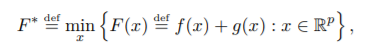
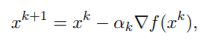
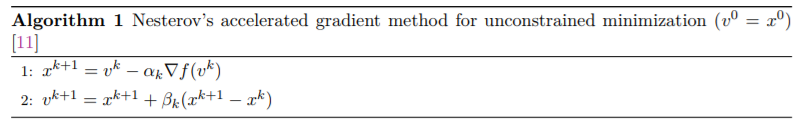
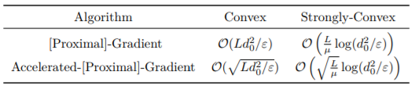
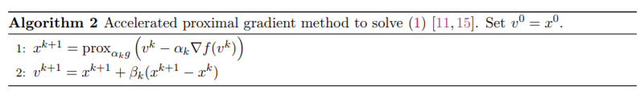
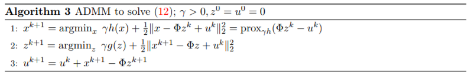
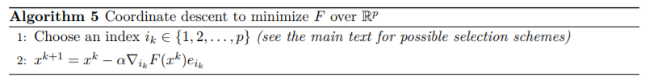

Este artículo revisa los recientes avances en algoritmos de optimización convexos para Big Data, que apuntan a reducir los cuellos de botella computacionales, de almacenamiento y de comunicaciones. Proporcionamos una visión general de este campo emergente, describimos las técnicas de aproximación contemporáneas como los métodos de primer orden y la aleatorización para la escalabilidad, y estudiamos el importante papel de la computación paralela y distribuida. Los nuevos algoritmos de Big Data se basan en principios sorprendentemente simples y logran aceleraciones asombrosas incluso en problemas clásicos.

El problema a Reolver:

#Métodos de primer orden

Cuando la función objetivo es suave, se asume como convexa y derivable, para resolver este problema se utiliza el gradiente descendente  y l principio de mapeo próximo. son robustos para realizar optimizaciones y son adecuados para computo paralelo.
Este método utliza la siguiente actualización en cada iteración $k$:

aunque también existen otros métodos que son más rápidos como newton.

otro método es el de Nesterov:

este es un método de primer orden óptimo que logra el menor error posible en el peor escenario.

También existe el método del gradiente acelerado donde la función g tiene la formulación de LASSO, si la función objetivo consiste en un función convexa $f$ y una función convexa no suave $g$, en general la no diferenciabilidad de $g$ reduce la eficiencia de los métodos de primer orden. No obstante, se pueden utilizar métodos de gradiente proximales que utilizan la misma aproximación para $f$ pero incluyen el término g.

Número total de iteraciones soluciones precisas de métodos de primer orden. 

el operador proximal es eficiente y en otro caso particular donde g es una función indicadora de un conjunto compacto, el problema de optimización compuesto se pude resolver con el método de Frank-Wolfe:

$$
x^{k+1} = prox_{\alpha_k g} * (v^k - \alpha_k * \nabla{f(v^k)})
v^{k+1} = x^{k+1} + \beta_k * (x^{k+1} - x^k)

$$
#Objetivos compuestos.

El objetivo $F$ consiste de funciones $f$ diferenciables y una función no suavizada convexa $g$. Los métodos de gradientes proximales aprovechan la estructura compuesta para retener las mismas razones del método gradiente para las clases de problema suave.

método acelerado de gradiente proximal:

Algoritmo ADMM que utiliza técnicas Lagrangiana y descomposición dual:

alternating direction method model, este algorimo es altamente recomendable para optimización distribuida y requiere un parámetro de penalización. 2 puntos en contra pues una parte del mismo se tiene que resolver numéricamente y la otra es que si se realiza la extensión a tener más dos términos objetivo, la convergencia ya no se está garantizada.

#Aleatorización para la escalabilidad

En esta sección el artículo describe los métodos de descenso por coordenada o entrada, metodos de gradiente estocástico y aleatoriedad en algebra lineal.

En teoría, los métodos de primer orden están bien posicionados para abordar problemas a gran escala. En la práctica, sin embargo, los cálculos numéricos exactos que exigen sus iteraciones pueden hacer que incluso estos métodos simples no factibles a medida que crecen las dimensiones del problema.

#Descenso coordinado

El cálculo del gradiente completo para la formulación del problema del PageRank requiere una operación matriz-vector en cada iteración. Una operación de vector más económica sería elegir una coordenada i de x y solo modificar la variable correspondiente xi para mejorar la función objetivo.

El ejemplo anterior subraya la dificultad fundamental en los métodos de descendencia coordinada. Encontrar la mejor coordenada para actualizar, el máximo de las magnitudes del elemento de degradado, puede requerir un esfuerzo computacional tan alto como el cálculo del gradiente en sí mismo.

#Métodos de gradiente estocástico.

En contraste con los métodos de coordenadas aleatorias, que actualizan una sola coordenada a la vez
con su gradiente exacto, los métodos de gradiente estocástico actualizan todas las coordenadas simultáneamente pero usan gradientes aproximados.

De forma similar a los métodos de descendencia coordinada, el problema de diseño crucial en los métodos de gradiente estocásticos es la selección de los puntos de datos j en cada iteración. Análogamente, obtenemos mejores tasas de convergencia seleccionando j de manera uniforme al azar en lugar de recorrer los datos.

#Algebra Lineal Aleatorizada

En el caso de los problemas de Big Data, las operaciones de álgebra lineal básica, como las descomposiciones de la matriz (por ejemplo, valor propio, valor singular y Cholesky) y las multiplicaciones de matrices y matrices pueden ser de gran importancia computacional.
cuellos de botella debido a su dependencia superlineal de las dimensiones. Sin embargo, cuando la matriz relevante los objetos tienen representaciones de bajo rango, a eficiencia de estos métodos mejora de manera uniforme. Por ejemplo, el valor singular correspondiente la descomposición (SVD) de M solo costaría fracasos O (pr 2 + r 3). La idea detrás de los métodos de álgebra lineal aleatorizados es aproximar M ≈ Q (Q T M) con Q ∈ R p × r, o para construir una representación de bajo rango por selección de subconjunto de columna o fila en orden para acelerar el cálculo. 

Los impactos de este método son: acelerar el cómputo de operadores de proximidad de funciones que dependen de valores espectrales de una matriz, obtener gradiente no sesgado cuando la aleatorización es seleccionada apropiadamente y Acercamiento aleatorizado puede ser utilizado para realizar un bosquejo de funciones objetivo.

#Cómputo paralelo y distribuido

2 dificultades:

1.-Comunicación: los enlaces de comunicación desiguales o defectuosos entre las computadoras y dentro de la jerarquía de la memoria local pueden reducir significativamente la eficiencia numérica general de los métodos de primer orden. Dos enfoques abordan ampliamente tales inconvenientes. Primero, podemos diseñar específicamente algoritmos que minimizan la comunicación. En segundo lugar, podemos eliminar un vector maestro $x_k$ y en su lugar, trabaje con una copia local en cada máquina que conduzca a un consenso x? en la convergencia.

2.-Sincronización: para realizar exactamente los cálculos de forma distribuida, primer orden
los métodos deben coordinar las actividades de diferentes computadoras cuyas primitivas numéricas dependen del mismo vector $x_k$ en cada iteración. Sin embargo, este procedimiento se ralentiza incluso
cuando una sola máquina lleva mucho más tiempo que las otras.
Para aliviar este problema de sincronización por excelencia, los algoritmos asíncronos permiten actualizaciones utilizando versiones obsoletas de sus parámetros

#Métodos asíncronos de primer orden con comunicaciones descentralizadas

El gradiente y los métodos de descomposición anteriores aún requieren una sincronización global para manejar problemas. Por ejemplo, el algoritmo de gradiente calcula el gradiente
exactamente con respecto a uno (o más) ejemplos en $x_k$ y luego se sincroniza en secuencia para actualizar $x_{k + 1}$ en una implementación estándar. Por el contrario, algoritmos de gradiente estocásticos que abordan solo usan una aproximación cruda del gradiente. Por lo tanto, esperamos que este algoritmo sea robusto.

#Métodos de primer orden con comunicaciones reducidas o descentralizadas

En sistemas grandes, comunicar el gradiente o sus elementos a una ubicación central puede crear un cuello de botella en la comunicación. En esta configuración, los métodos de descendencia coordinada proporcionan un enfoque basado en principios para reducir las comunicaciones. De hecho, hay un trabajo sustancial en el desarrollo de versiones paralelas de estos métodos, que datan del trabajo sobre el algoritmo de Jacobi para resolver sistemas lineales. La idea básica es simplemente aplicar varias actualizaciones de descenso coordinado al mismo tiempo en paralelo. La ventaja de esta estrategia en términos de comunicación es que cada procesador solo necesita comunicar una única actualización de coordenadas, mientras que solo necesita recibir las actualizaciones de las coordenadas.

#Métodos de primer orden paralelos

En el cómputo paralelo, la formulación del problema convexo hace una gran diferencia.
Un importante ejemplo paralelo es el cálculo del vector gradiente cuando el objetivo se descompone naturalmente. Aquí, podemos procesar cada $F_i$ con una de m computadoras usando solo $O (n / m)$ cómputo local. Cada máquina también almacena datos localmente con las muestras de datos $O (n / m)$ correspondientes, ya que cada $F_i$ corresponde directamente a un punto de datos. Cada procesador entonces se comunica con la ubicación central para formar el gradiente final y lograr el ideal lineal
acelerar.

Los problemas de Big Data requieren una revisión fundamental de cómo diseñamos algoritmos de optimización convexos y sugieren opciones computacionales no convencionales.
Este artículo deja en claro que debemos identificar intercambios de aproximaciones algorítmicas dependientes de la estructura clave.
Dado que las limitaciones de sincronización y comunicación del hardware disponible naturalmente
dicta la elección de los algoritmos, esperamos que las nuevas herramientas de aproximación se adapten a los algoritmos convexos a la heterogeneidad de las plataformas computacionales.

obtener la misma información, pero hacerlo más rápido, es un problema que ha sido discutido pero aún no ha tenido impacto en la práctica.

