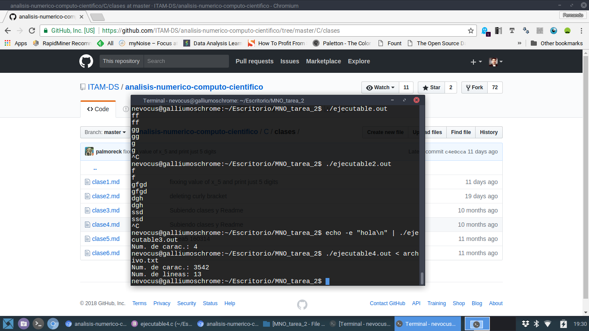

# Ejecutable 1

```
#include <stdio.h>
int main(void){
int c;
c = getchar();
while( c != EOF){
        putchar(c);
        c = getchar();   
    } 
} 
```

# Ejecutable 2

```
#include <stdio.h>
int main(void){
int c;
while( c != EOF){
        putchar(c);
        c = getchar();   
    } 
}
```

# Ejecutable 3

```
#include <stdio.h>
int main(void){
int c;
int caracteres = 0;
while((c = getchar()) != EOF && c != '\n'){
	caracteres ++;
    } 
printf("Num. de carac.: ");
printf("%d", caracteres);
printf("\n");
}
```

# Ejecutable 4

```
#include <stdio.h>
int main(void){
int c;
int caracteres = 0;
int lineas = 0;
while((c = getchar()) != EOF) {
   if((c != '\t') && (c != '\t' ) && (c != '\n') && (c != '\v'))
      caracteres++;
   if (c == '\n')
      lineas++;
	}
printf("Num. de carac.: %d\n", caracteres);
printf("Num. de lineas: %d\n", lineas);
}
```

# Resultados

