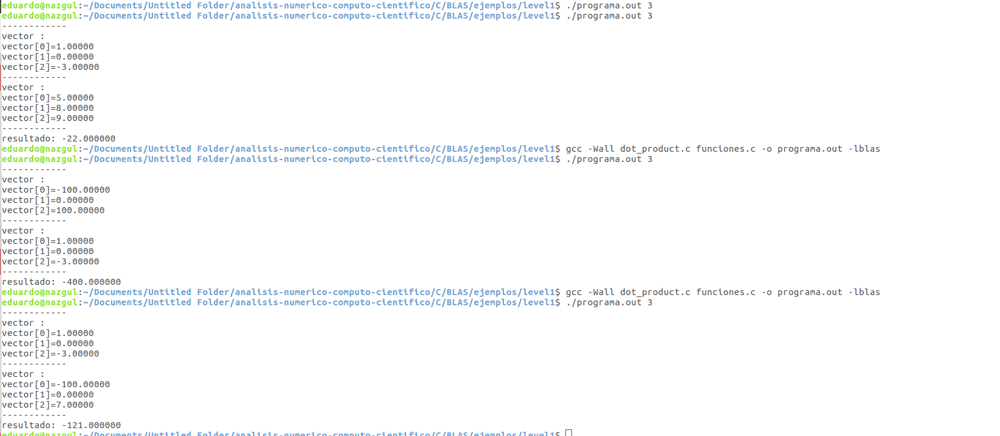

```{r setup, include=FALSE}
knitr::opts_chunk$set(echo = TRUE)
```

### Pregunta 1
<p>La diferencia entre la combinación `#inlcude` `""` o `<>`  es porqué en el primer caso el preprocesador busca en el mismo directorio que el archivo que lo llamo. En el ejemplo el archivo `definiciones.h`es un archivo guardado de forma local</p>
<p>Por otro lado, ` stdio.h` y ` stdlib.h` son librerias, para las cuales el preprocesador busca en sus archivos de forma autonoma</p>
<p>Una variable global `static` implica que es *vista* únicamente en el archivo en el que es declarada, me parece que en este ejemplo se usarón para prevenir que interfiriece con alguna variable en el archivo definiciones.h</p>

### Pregunta 2
<p> **BLAS** **B**asic **L**inear **A**lgebra **S**ubprograms, son rutinas que proveen la capacacidad de realizar operaciones básicas de vectores y matrices. Existen tres niveles. **BLAS** nivel 1  realiza operaciones a nivel: escalar, vector y vector. **BLAS** nivel 2 realiza operaciones: matriz-vector y **BLAS** nivel 3 realiza operaciones matriz-matriz. **BLAS** es  muy usado por ser eficiente,protable y disponible ampliamente. Generalmente se usan para el desarrollo de software para algebra lineal de alta calidad por ejemplo **LAPACK**</p>
<p>**LAPACK** **L**inear **A**lgebra **PACK**age, es un sofware que provee la universidad de Tenesse, universidad de Califronia, Berkely, universidad de Colorado Denver y NAG Ltd. **LAPACK** provee de rutinas para resolver sistemas simultaneos de ecuaciones lineales, minimos cuadrados en sistemas lineales, probemas con eigen-valores y problem de unico valor. Tambien incluye rutinas para realizar descomposion de matrices del tipo **LU,Cholesky,QR,SVD** </p>
<p> **CBLAS** es un encabezado de `C` el cual llama a las funciones de **BLAS**. Éstas vienen por defualt especifcadas con valores predefinidos y con prototipos para todas las funciones **BLAS**</p>
<p> **ATLAS** **A**utomatically **T**uned **L**inear **A**lgebra, esta construido para ser un software de álgebra lineal portable entre interfaces de programación: `C`, `Fortran`. Y, para su funcionamiento usa las bibliotecas de **BLAS** y **LAPACK**</p>


### Pregunta 3




### Pregunta 4

- N Entrada que especifica el numero de elementes en **X** y **Y**, permanece sin cambios en la salida

- A Entrada, **A** cotiene una constante que será multiplicada por el vector **X**, permanece sin cambios en la salida

- X Vector de dimencion al menos $(1+(N-1)*abs(INCX))$, permanece sin cambios en la salida

- Y Vector de dimencion al menos $(1+(N-1)*abs(INCY))$, el resultado se regresa en él

- INCY Entrada que especifica el incremento en los elementos del vector **Y**, sin cambios a la salida

- INCX Entrada que especifica el incremento en los elementos del vector **X**, sin cambios a la salida

### Pregunta 5

