Se entrega el 23 de marzo. De forma individual crear una carpeta con nombre igual a su clave única, debajo del nivel: 

```
analisis-numerico-computo-cientifico/MNO/entrega_tareas_de_C/tarea6
```

Dirígite a la rama de master a la ruta [analisis-numerico-computo-cientifico/C/BLAS/ejemplos/](https://github.com/ITAM-DS/analisis-numerico-computo-cientifico/tree/master/C/BLAS/ejemplos).

### 1) Investiga\* sobre la subrutina de Fortran `dgemv` (parámetros que recibe y la salida). 

```
SUBROUTINE DGEMV(TRANS, M, N, ALPHA, A, LDA, X, INCX, BETA, Y, INCY)
DOUBLE PRECISION ALPHA,BETA
INTEGER INCX,INCY,LDA,M,N
CHARACTER*1 TRANS
DOUBLE PRECISION A(LDA,*), X(*), Y(*)

Purpose
  =======

  DGEMV  performs one of the matrix-vector operations

     y := alpha*A*x + beta*y,   or   y := alpha*A'*x + beta*y,

  where alpha and beta are scalars, x and y are vectors and A is an
  m by n matrix.

  Parameters
  ==========

  TRANS  - CHARACTER*1.
           On entry, TRANS specifies the operation to be performed as
           follows:

              TRANS = 'N' or 'n'   y := alpha*A*x + beta*y.

              TRANS = 'T' or 't'   y := alpha*A'*x + beta*y.

              TRANS = 'C' or 'c'   y := alpha*A'*x + beta*y.

           Unchanged on exit.

  M      - INTEGER.
           On entry, M specifies the number of rows of the matrix A.
           M must be at least zero.
           Unchanged on exit.

  N      - INTEGER.
           On entry, N specifies the number of columns of the matrix A.
           N must be at least zero.
           Unchanged on exit.

  ALPHA  - DOUBLE PRECISION.
           On entry, ALPHA specifies the scalar alpha.
           Unchanged on exit.

  A      - DOUBLE PRECISION array of DIMENSION ( LDA, n ).
           Before entry, the leading m by n part of the array A must
           contain the matrix of coefficients.
           Unchanged on exit.

  LDA    - INTEGER.
           On entry, LDA specifies the first dimension of A as declared
           in the calling (sub) program. LDA must be at least
           max( 1, m ).
           Unchanged on exit.

  X      - DOUBLE PRECISION array of DIMENSION at least
           ( 1 + ( n - 1 )*abs( INCX ) ) when TRANS = 'N' or 'n'
           and at least
           ( 1 + ( m - 1 )*abs( INCX ) ) otherwise.
           Before entry, the incremented array X must contain the
           vector x.
           Unchanged on exit.

  INCX   - INTEGER.
           On entry, INCX specifies the increment for the elements of
           X. INCX must not be zero.
           Unchanged on exit.

  BETA   - DOUBLE PRECISION.
           On entry, BETA specifies the scalar beta. When BETA is
           supplied as zero then Y need not be set on input.
           Unchanged on exit.

  Y      - DOUBLE PRECISION array of DIMENSION at least
           ( 1 + ( m - 1 )*abs( INCY ) ) when TRANS = 'N' or 'n'
           and at least
           ( 1 + ( n - 1 )*abs( INCY ) ) otherwise.
           Before entry with BETA non-zero, the incremented array Y
           must contain the vector y. On exit, Y is overwritten by the
           updated vector y.

  INCY   - INTEGER.
           On entry, INCY specifies the increment for the elements of
           Y. INCY must not be zero.
           Unchanged on exit.
```


### 2) En la carpeta [analisis-numerico-computo-cientifico/C/BLAS/ejemplos/level2/](https://github.com/ITAM-DS/analisis-numerico-computo-cientifico/tree/master/C/BLAS/ejemplos/level2) ejecuta el programa `dgemv_mult_mat_vec.c` y realiza pruebas con diferentes matrices y vectores definidos por ti.

+ Matriz: A.txt
```
 0  1.5
 4  -5
-1  2.5
```
+ Vector: v.txt
```
1
0
```
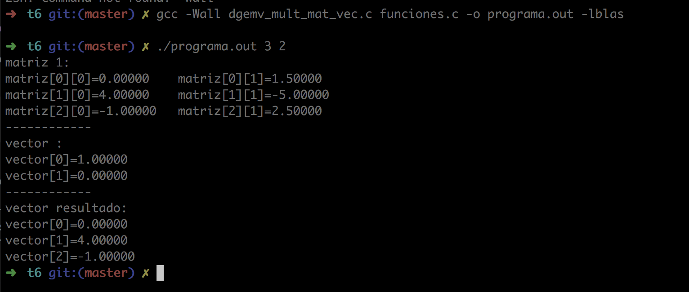
</br>

+ Matriz: A1.txt
```
 1  1.6
 3  -2
-5  1.3
```

+ Vector: v1.txt
```
5
2
```
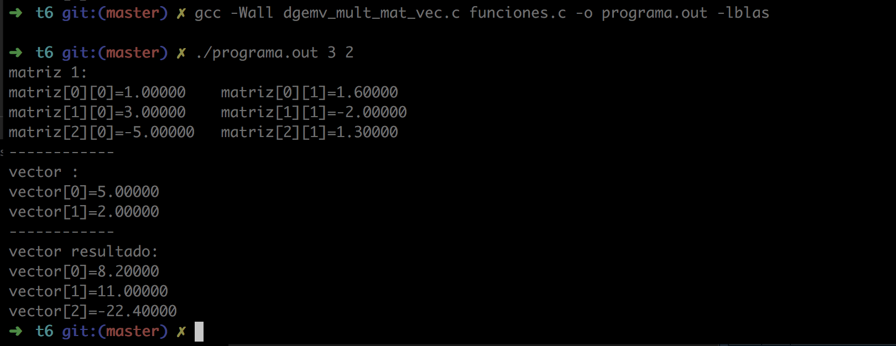


</br>

+ Matriz: A2.txt
```
-3  0.5
 1  0.5
 0  1.5
```

+ Vector: v2.txt
```
-10
3
```
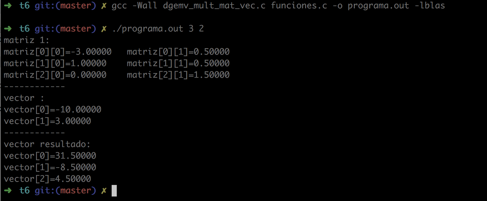

<br>

### 3) Haz un programa que utilice la subrutina `dger` de Fortran.

+ Función dger
```
DGER(M, N, ALPHA, X, INCX, Y, INCY, A, LDA)
A := alpha * x * y' + A
```

+ En el archivo `dger_mat_vec.c`

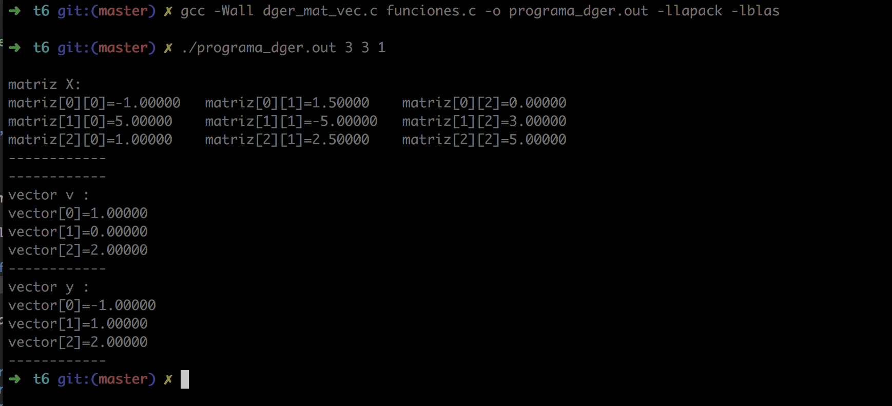

<br>


### 4) Después de haber estudiado  y entendido los archivos de `definiciones.h` y `funciones.c` y realizado los puntos anteriores y la tarea 5 responde: ¿cómo fue que pudimos llamar a las rutinas de Fortran (que almacena en una forma column-major order los arreglos de dos dimensiones) para operaciones con arreglos 2-dimensionales sin haber instalado CBLAS, si en clase se dijo que almacenar arreglos de dos dimensiones en C es en un row-major order? 

Esto es posible gracias a la directiva de compilador (línea 8)  del programa `definiciones.h`, en el cual se realiza la conversión a column major:

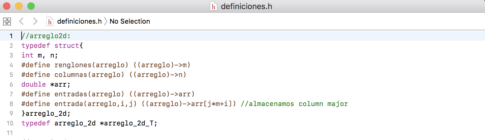

<br>

### 5) Investiga\* sobre la subrutina de Fortran `dgemm` (parámetros que recibe y la salida).

```
DGEMM('N','N',M,N,K,ALPHA,A,M,B,K,BETA,C,M)

 SUBROUTINE DGEMM ( TRANSA, TRANSB, M, N, K, ALPHA, A, LDA, B, LDB, BETA, C, LDC )
     .. Scalar Arguments ..
      CHARACTER*1        TRANSA, TRANSB
      INTEGER            M, N, K, LDA, LDB, LDC
      DOUBLE PRECISION   ALPHA, BETA
     .. Array Arguments ..
      DOUBLE PRECISION   A( LDA, * ), B( LDB, * ), C( LDC, * )
     ..

  Purpose
  =======

  DGEMM  performs one of the matrix-matrix operations

     C := alpha*op( A )*op( B ) + beta*C,

  where  op( X ) is one of

     op( X ) = X   or   op( X ) = X',

  alpha and beta are scalars, and A, B and C are matrices, with op( A )
  an m by k matrix,  op( B )  a  k by n matrix and  C an m by n matrix.

  Parameters
  ==========

  TRANSA - CHARACTER*1.
           On entry, TRANSA specifies the form of op( A ) to be used in
           the matrix multiplication as follows:

              TRANSA = 'N' or 'n',  op( A ) = A.

              TRANSA = 'T' or 't',  op( A ) = A'.

              TRANSA = 'C' or 'c',  op( A ) = A'.

           Unchanged on exit.

  TRANSB - CHARACTER*1.
           On entry, TRANSB specifies the form of op( B ) to be used in
           the matrix multiplication as follows:

              TRANSB = 'N' or 'n',  op( B ) = B.

              TRANSB = 'T' or 't',  op( B ) = B'.

              TRANSB = 'C' or 'c',  op( B ) = B'.

           Unchanged on exit.

  M      - INTEGER.
           On entry,  M  specifies  the number  of rows  of the  matrix
           op( A )  and of the  matrix  C.  M  must  be at least  zero.
           Unchanged on exit.

  N      - INTEGER.
           On entry,  N  specifies the number  of columns of the matrix
           op( B ) and the number of columns of the matrix C. N must be
           at least zero.
           Unchanged on exit.

  K      - INTEGER.
           On entry,  K  specifies  the number of columns of the matrix
           op( A ) and the number of rows of the matrix op( B ). K must
           be at least  zero.
           Unchanged on exit.

  ALPHA  - DOUBLE PRECISION.
           On entry, ALPHA specifies the scalar alpha.
           Unchanged on exit.

  A      - DOUBLE PRECISION array of DIMENSION ( LDA, ka ), where ka is
           k  when  TRANSA = 'N' or 'n',  and is  m  otherwise.
           Before entry with  TRANSA = 'N' or 'n',  the leading  m by k
           part of the array  A  must contain the matrix  A,  otherwise
           the leading  k by m  part of the array  A  must contain  the
           matrix A.
           Unchanged on exit.

  LDA    - INTEGER.
           On entry, LDA specifies the first dimension of A as declared
           in the calling (sub) program. When  TRANSA = 'N' or 'n' then
           LDA must be at least  max( 1, m ), otherwise  LDA must be at
           least  max( 1, k ).
           Unchanged on exit.

  B      - DOUBLE PRECISION array of DIMENSION ( LDB, kb ), where kb is
           n  when  TRANSB = 'N' or 'n',  and is  k  otherwise.
           Before entry with  TRANSB = 'N' or 'n',  the leading  k by n
           part of the array  B  must contain the matrix  B,  otherwise
           the leading  n by k  part of the array  B  must contain  the
           matrix B.
           Unchanged on exit.

  LDB    - INTEGER.
           On entry, LDB specifies the first dimension of B as declared
           in the calling (sub) program. When  TRANSB = 'N' or 'n' then
           LDB must be at least  max( 1, k ), otherwise  LDB must be at
           least  max( 1, n ).
           Unchanged on exit.

  BETA   - DOUBLE PRECISION.
           On entry,  BETA  specifies the scalar  beta.  When  BETA  is
           supplied as zero then C need not be set on input.
           Unchanged on exit.

  C      - DOUBLE PRECISION array of DIMENSION ( LDC, n ).
           Before entry, the leading  m by n  part of the array  C must
           contain the matrix  C,  except when  beta  is zero, in which
           case C need not be set on entry.
           On exit, the array  C  is overwritten by the  m by n  matrix
           ( alpha*op( A )*op( B ) + beta*C ).

  LDC    - INTEGER.
           On entry, LDC specifies the first dimension of C as declared
           in  the  calling  (sub)  program.   LDC  must  be  at  least
           max( 1, m ).
           Unchanged on exit.
```

### 6) En la carpeta [analisis-numerico-computo-cientifico/C/BLAS/ejemplos/level3/](https://github.com/ITAM-DS/analisis-numerico-computo-cientifico/tree/master/C/BLAS/ejemplos/level3) ejecuta el programa `dgemm_mult_mat.c` y realiza pruebas con diferentes matrices definidas por ti.

+ Matriz: A.txt
```
 0  1.5
 4  -5
-1  2.5
```
+ Matriz B.txt
```
1  0  0
0 -1  1
```
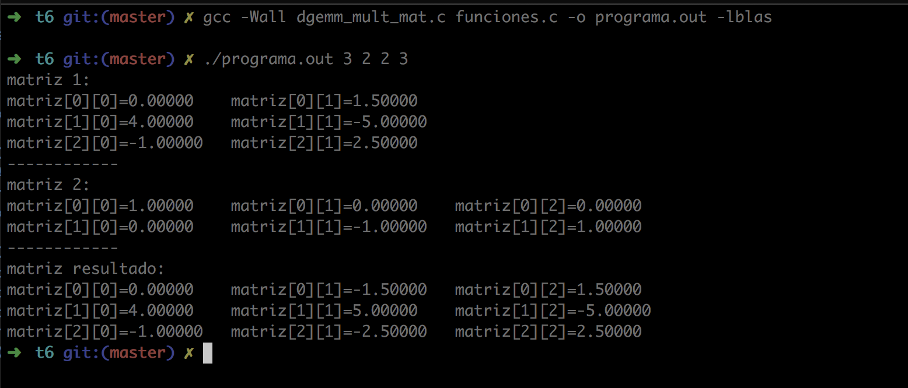

<br>

+ Matriz: A1.txt
```
 1  1.6
 3  -2
-5  1.3
```

+ Matriz B1.txt
```
1   1   5
6  -3  -1
```
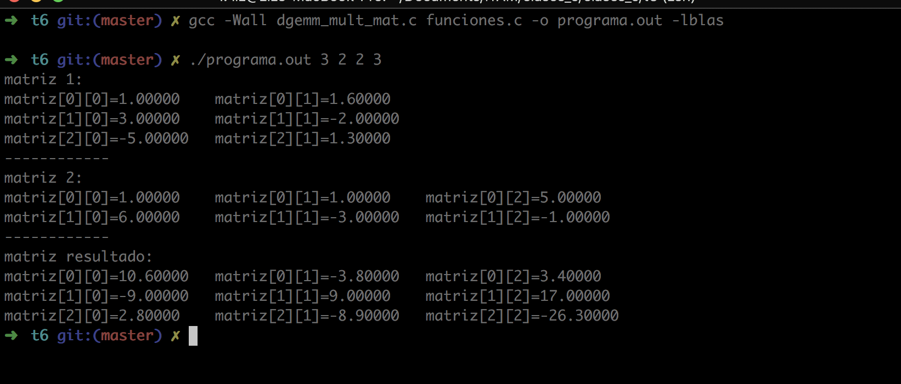

<br>

+ Matriz: A2.txt
```
-3  0.5
 1  0.5
 0  1.5
```

+ Matriz B2.txt
```
9  8   5
8  2  -1
```
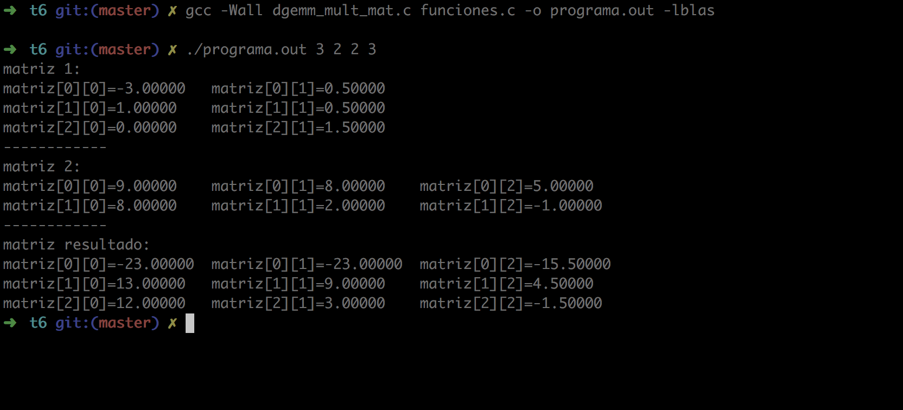

<br>

### 7) En la carpeta del punto anterior encuentras la sección **Multiplicación matriz-matriz con trick**. Ejecuta el programa de esta sección con diferentes matrices definidas por ti y resuelve la pregunta **¿por qué funciona este trick?**.


+ Matriz: A.txt
```
 0  1.5
 4  -5
-1  2.5
```
+ Matriz B.txt
```
1  0  0
0 -1  1
```
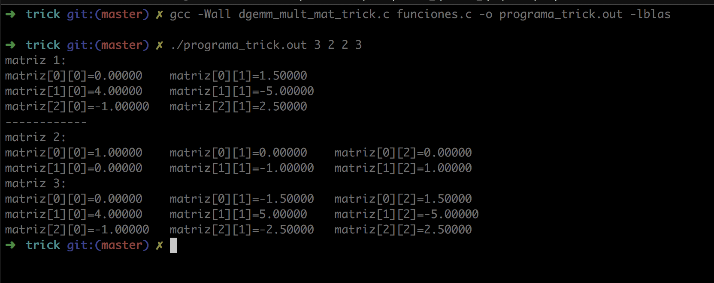

<br>

+ Matriz: A1.txt
```
 1  1.6
 3  -2
-5  1.3
```

+ Matriz B1.txt
```
1   1   5
6  -3  -1
```
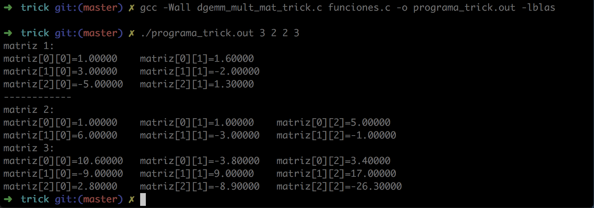

<br>

+ Matriz: A2.txt
```
-3  0.5
 1  0.5
 0  1.5
```

+ Matriz B2.txt
```
9  8   5
8  2  -1
```


<br>

**Truco**

Consiste en las siguientes diferencias:

+ En el caso de `dgemm_mult_mat.c` se piden los parámetros de la matriz A primero y después los asociados a B; en cambio, con el truco se pide primero B y después A como podemos notar en las líneas resaltadas del código:

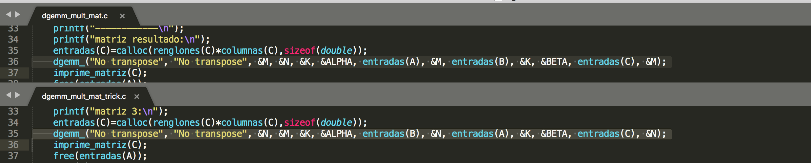

<br>

+ El archivo de `definiciones.h` es distinto al usado con el truco. Notemos que en el primer caso (línea 8) se almacena en el arreglo como *column major* y en el segundo caso con el truco se almacena como *row major*  (línea 7 de t6/trick).

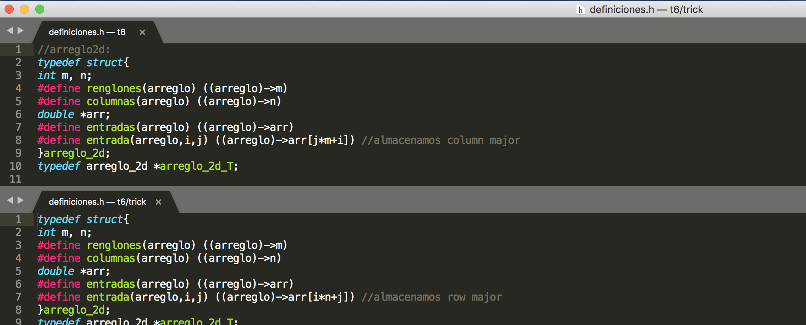

<br>

### 8) Haz un programa que utilice la subrutina `dsymm` de Fortran.

La función realiza la siguiente operación en el archivo `dsymm_mat.c`:

```
  C := alpha * A * B + beta * C
```

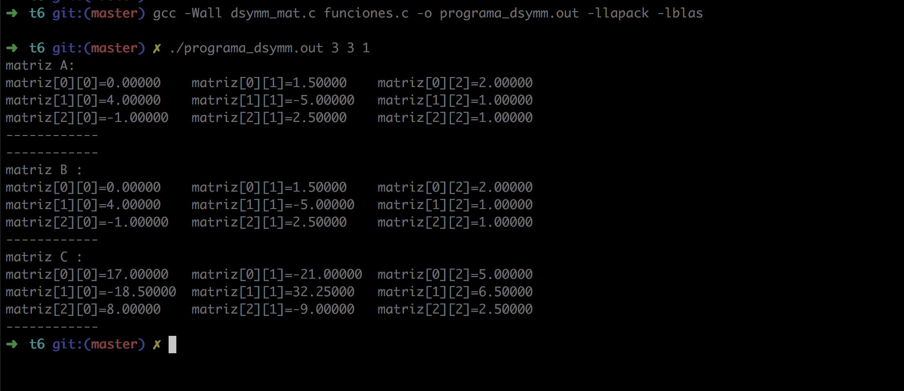
<br>

**\*Para sus investigaciones utilicen las referencias de los README's:**

[analisis-numerico-computo-cientifico/C/BLAS/](https://github.com/ITAM-DS/analisis-numerico-computo-cientifico/tree/master/C/BLAS)

[analisis-numerico-computo-cientifico/C/LAPACK/](https://github.com/ITAM-DS/analisis-numerico-computo-cientifico/tree/master/C/LAPACK)

**La tarea se hace de forma individual y personal.**
