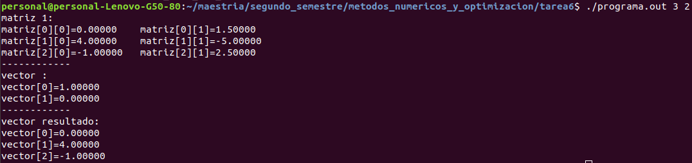
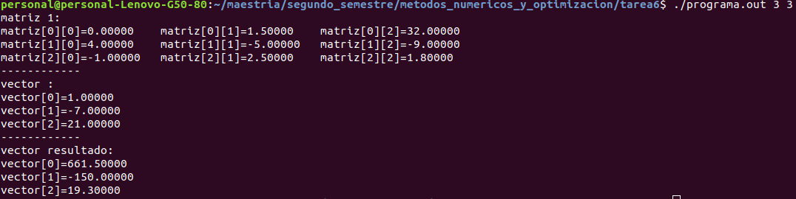
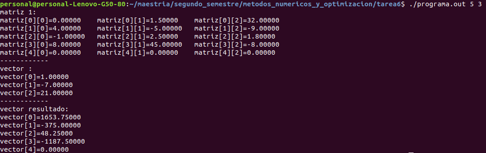
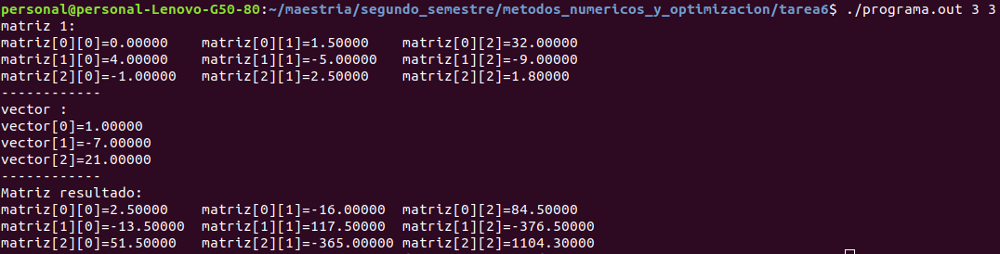
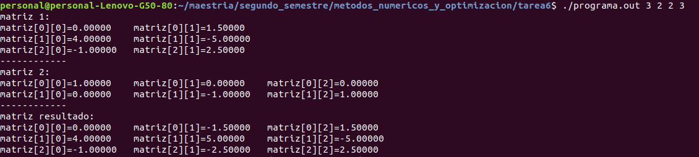
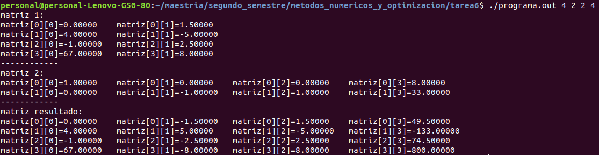
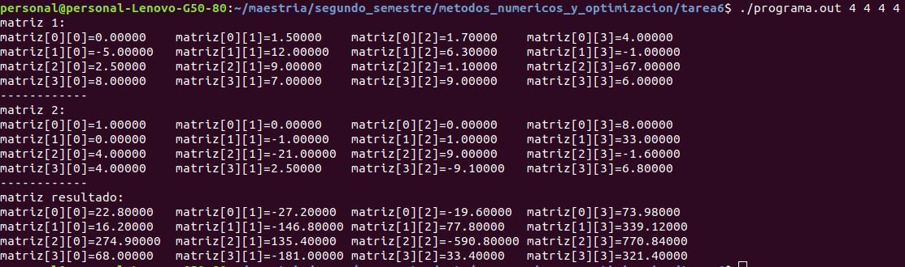
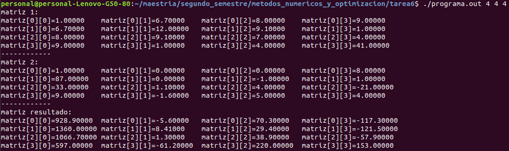

```{r setup, include=FALSE}
knitr::opts_chunk$set(echo = TRUE)
```


1. Investiga* sobre la subrutina de Fortran dgemv (parámetros que recibe y la salida).

La subrutina dgemv hace la operación de la siguiente manera:

y = $alpha*A*x + beta*y$.

En donde alpha y beta son escalares, x,y son vectores y A es una matriz de dimensiones m x n. El formato es de la siguiente manera:

Los parámetros de la subrutina son como sigue:

dgemv (TRANS, M, N, ALPHA, A, LDA, X, INCX, BETA, Y, INCY)

TRANS específico el tipo de operación a ser llevado a cabo sobre la matriz, es decir si se transpone o no.
M = Cantidad de filas de la matriz A,

N = Cantidad de columnas de la matriz A,

ALPHA = escalar

A = Matriz 

X = vector

INCX = incremento en la posición de x con cada pasada, para realizar el cómputo sobre todo el vector, INCX = 1

BETA = escalar

Y = vector

INCY = incremento en la posición de x con cada pasada, para realizar el cómputo sobre todo el vector, INCY = 1

Referencia: http://www.netlib.org/lapack/explore-html/d7/d15/group__double__blas__level2_gadd421a107a488d524859b4a64c1901a9.html#gadd421a107a488d524859b4a64c1901a9


2. En la carpeta anlisis-numerico-computo-cientifico/C/BLAS/ejemplos/level2/ ejecuta el programa dgemv_mult_mat_vec.c y realiza pruebas con diferentes matrices y vectores definidos por ti.

dgemv (TRANS, M, N, ALPHA, A, LDA, X, INCX, BETA, Y, INCY)

DGEMV lleva a cabo operaciones matriz-vector de la siguiente manera:

y = $alpha*A*x + beta*y$,   or   y = $alpha*A*T*x + beta*y$,

donde alpha y beta son escalares, x,y son vectores y A es una matriz mxn

Probé con matriz = [{0,-1.5,32},{4,-5,-9},{-1,2.5,1.8}], vectorx = {1,-7,21}, alpha = 1, beta = 0




Probé con matriz = [{0,-1.5,},{4,-5},{-1,2.5}], y vectorx = {1,0}, alpha = 1, beta = 0


Probé con matriz = [{0,1.5,32},{4,-5,-9},{-1,2.5,1.8},{8,45,-8}], y vectorx = {1,-7,21}, ajuste el valor de alpha a 2.5, ademas seleccionamos dimensiones mas grandes que la matriz M = 4, aqui el programa agrega ceros en automatico.



3. Haz un programa que utilice la subrutina dger de Fortran.
DGER lleva a cabo la siguiente operación:

    A = $alpha*x*y' + A$,

alpha es un escalar, x es un vector de tamaño m, y es un vector de tamaño n y A es una matriz de tamaño mxn

Asumimos que definiciones.h, funciones.c, archivos A.txt y v.txt están en la misma carpeta del programa

```{r eval=FALSE}
#include<stdio.h>
#include<stdlib.h>
#include"definiciones.h"
#define A_matriz "A.txt" //de tamaño MxN
#define v_vector "v.txt" //de tamaño Nx1

extern void dger_(int *m, int *n, double *alpha, double *x, int *incx, double *y, int *incy, double *a, int *lda);

int main(int argc, char *argv[]){
	arreglo_2d_T A;
	arreglo_1d_T v, v_resultado;
	int M=atoi(argv[1]);
        int LDA = atoi(argv[1]);
	int N=atoi(argv[2]);
	int incx=1;
	double ALPHA;
  ALPHA = 2.5;
	A=malloc(sizeof(*A));
	v=malloc(sizeof(*v));
	v_resultado=malloc(sizeof(*v_resultado));

	renglones(A)=M;
	columnas(A)=N;
	renglones_vector(v)=N;
	renglones_vector(v_resultado) = M;
	entradas(A)=malloc(renglones(A)*columnas(A)*sizeof(double));
	inicializa_matriz(A,A_matriz);

	entradas_vector(v)=malloc(N*sizeof(double));
	inicializa_vector(v,v_vector);

	entradas_vector(v_resultado)=calloc(M,sizeof(double));
	printf("matriz 1:\n");
	imprime_matriz(A);
	printf("------------\n");
	printf("vector :\n");
	imprime_vector(v);
	printf("------------\n");
	printf("Matriz resultado:\n");

	dger_(&M, &N, &ALPHA, entradas_vector(v), &incx,entradas_vector(v),&incx,entradas(A),&LDA);
	imprime_matriz(A);
	free(entradas(A));
	free(A);
	free(entradas_vector(v));
	free(v);
	free(entradas_vector(v_resultado));
	free(v_resultado);
	return 0;
}
```

Ejecución 

donde alfa = 2.5, x = {1,7,21},y=x, A=[{0,1.5,32},{4,-5,-9},{-1,2.5,1.8}]

4. Después de haber estudiado y entendido los archivos de definiciones.h y funciones.c y realizado los puntos anteriores y la tarea 5 responde: ¿cómo fue que pudimos llamar a las rutinas de Fortran (que almacena en una forma column-major order los arreglos de dos dimensiones) para operaciones con arreglos 2-dimensionales sin haber instalado CBLAS, si en clase se dijo que almacenar arreglos de dos dimensiones en C es en un row-major order?

Esto es posible dado que en el archivo definiciones.h se hace el cambio a column-major order en la linea 8 del archivo a continuación el código del mismo:

```{r eval=FALSE}
#define entrada(arreglo,i,j) ((arreglo)->arr[j*m+i]) //almacenamos column major
```


5. Investiga* sobre la subrutina de Fortran dgemm (parámetros que recibe y la salida).
DGEMM lleva a cabo las siguientes operaciones entre matriz-matriz:

    C = alpha*op( A )*op( B ) + beta*C,

donde op(x) es una de las siguientes operaciones:

    op( X ) = X   or   op( X ) = X**T,
    
Es decir regresa X o Regresa X transpuesta.

Donde: 
alpha = escalar
beta = escalar
A,B,C son matrices
op(A) = matriz de dimensiones m,k
op(B) = matriz de dimensiones k,n
C = matriz de dimensiones m,n

Fuente: http://www.netlib.org/lapack/explore-html/d1/d54/group__double__blas__level3_gaeda3cbd99c8fb834a60a6412878226e1.html#gaeda3cbd99c8fb834a60a6412878226e1


6. En la carpeta analisis-numerico-computo-cientifico/C/BLAS/ejemplos/level3/ ejecuta el programa dgemm_mult_mat.c y realiza pruebas con diferentes matrices definidas por ti.

Probando con los siguientes parámetros:
M = 3
K = 2
N = 3
MatrizA = [{0,1.5},{4,-5},{-1,2.5}] dimensiones de 3x2
MatrizB = [{1,0,0},{0,-1,1}] dimensiones de 2x3
op(A) = Sin transponer A.
op(B) = Sin transponer B.
Resultado = [{0,-1.5,1.5},{4,5,-5},{-1,-2.5,2.5}] matriz de 3x3





Probando con los siguientes parámetros:
M = 4
K = 2
N = 4
MatrizA = [{0,1.5},{4,-5},{-1,2.5},{67,8}] dimensiones de 4x2
MatrizB = [{1,0,0,8},{0,-1,1,33}] dimensiones de 2x4
op(A) = Sin transponer A.
op(B) = Sin transponer B.
Resultado = [{0,-1.5,1.5,49.5},{4,5,-5,-133},{-1,-2.5,2.5,74.5},{67,-8,8,800}] matriz de 4x4




Ejercicio 6_3
M = 4
K = 4
N = 4
matrizA = [{0,1.5,1.7,4},{-5,12,6.3,-1},{2.5,9,1.1,67},{8,7,9,6}] dimensiones 4 x 4
MatrizB = [{1,0,0,8},{0,-1,1,33},{4,-21,9,-1.6},{4,2.5,-9.1,6.8}] dimensiones 4 x 4
op(A) = Sin transponer A.
op(B) = Sin transponer B.
Resultado = [{22.8,-27.2,-19,73.98},{16.2,-146.8,77.8,339.12},{274.9,135.4,-590.8,770.84,68,-181,33.4,321.4}] matriz de dimension 4x4



7. En la carpeta del punto anterior encuentras la sección Multiplicación matriz-matriz con trick. Ejecuta el programa de esta sección con diferentes matrices definidas por ti y resuelve la pregunta ¿por qué funciona este trick?.

El programa "con trick" funciona dado que en los archivos definiciones.h, las siguientes definiciones son distintas: 

```{r eval=FALSE}
#define entrada(arreglo,i,j) ((arreglo)->arr[i*n+j]) //almacenamos row major
#define entrada(arreglo,i,j) ((arreglo)->arr[j*m+i]) //almacenamos column major //Con trick
```

Dado que la definiciones son distintas, en el main() del programa, se cambia el orden y los tamaños de M,N y matrices A,B y da el mismo resultado que la operación row major.

```{r eval=FALSE}

//Row major
dgemm_("No transpose", "No transpose", &M, &N, &K, &ALPHA, entradas(A), &M, entradas(B), &K, &BETA, entradas(C), &M);

//column major
dgemm_("No transpose", "No transpose", &N, &M, &K, &ALPHA, entradas(B), &N, entradas(A), &K, &BETA, entradas(C), &N);
```


8. Haz un programa que utilice la subrutina dsymm de Fortran.

DSYMM lleva a cabo las siguientes operaciones matriciales:

    C = $alpha*A*B + beta*C$,

 o

    C = $alpha*B*A + beta*C$,

Donde alpha y beta son escalares, A es una matriz simétrica, B y C son matrices de mxn.

```{r eval=FALSE}
#include<stdio.h>
#include<stdlib.h>
#include"definiciones.h"
#define A_matriz "A.txt" //de tamaño MxK
#define B_matriz "B.txt" //de tamaño KxN
#define C_matriz "C.txt"

extern void dsymm_(char *SIDE, char *UPLO, int *M, int *N, double *ALPHA, double *matrizA, int *LDA, double *matrizB, int *LDB, double *BETA,double *matrizC, int *LDC );

int main(int argc, char *argv[]){
	arreglo_2d_T A, B, C;
	int M=atoi(argv[1]);
	int K=atoi(argv[2]);
	int N=atoi(argv[3]);
	double ALPHA, BETA;
        char SIDE,UPLO;
        SIDE= 'L';
        UPLO = 'U';
        ALPHA = 1.0;
        BETA = 0.0;
	A=malloc(sizeof(*A));
	B=malloc(sizeof(*B));
	C=malloc(sizeof(*C));
	renglones(A)=M;
	columnas(A)=K;
	renglones(B)=K;
	columnas(B)=N;
	renglones(C) = M;
	columnas(C) = N;
	entradas(A)=malloc(renglones(A)*columnas(A)*sizeof(double));
	inicializa_matriz(A,A_matriz);
	entradas(B)=malloc(renglones(B)*columnas(B)*sizeof(double));
	inicializa_matriz(B,B_matriz);
        entradas(C)=malloc(renglones(C)*columnas(C)*sizeof(double));
        inicializa_matriz(C,C_matriz);
	printf("matriz 1:\n");
	imprime_matriz(A);
	printf("------------\n");
	printf("matriz 2:\n");
	imprime_matriz(B);
	printf("------------\n");
	printf("matriz resultado:\n");
	entradas(C)=calloc(renglones(C)*columnas(C),sizeof(double));

	dsymm_(&SIDE, &UPLO, &M, &N, &ALPHA, entradas(A), &M, entradas(B), &K, &BETA, entradas(C), &M);
	imprime_matriz(C);
	free(entradas(A));
	free(A);
	free(entradas(B));
	free(B);
	free(entradas(C));
	free(C);
	return 0;
}
```

Se probó con los siguientes datos:

M = 4
K = 4
N = 4
alpha = 1
beta = 0
SIDE = "L"
UPLO = "U"
matrizA = [{1,6.7,8,9},{6.7,12,9.1,1},{8,9.1,7,4},{9,1,4,41}] dimensiones 4x4, matriz simétrica
matrizB = [{1,0,0,8},{87,0,-1,1},{33,1.1,4,-21},{9,-1.6,5,4}] dimensiones 4x4
matrizResultado = [{928.9,-5.6,70.3,-117.3},{1360,8.41,29.4,-121.5},{1066.7,1.3,38.9,-57.9},{597,-61.2,220,153}]  matriz de dimensión 4x4




Fuente: http://www.netlib.org/lapack/explore-html/d1/d54/group__double__blas__level3_ga253c8edb8b21d1b5b1783725c2a6b692.html#ga253c8edb8b21d1b5b1783725c2a6b692
