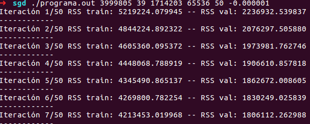
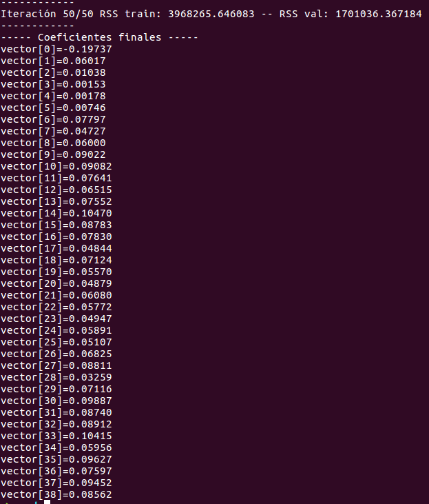
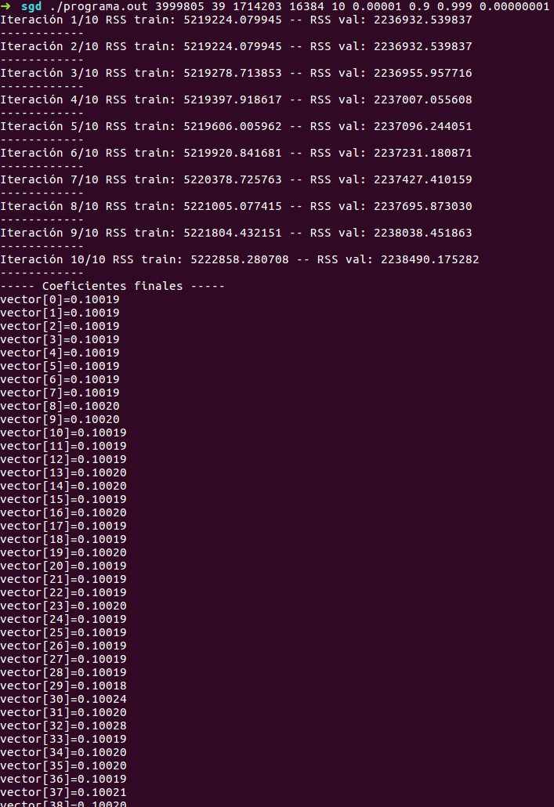
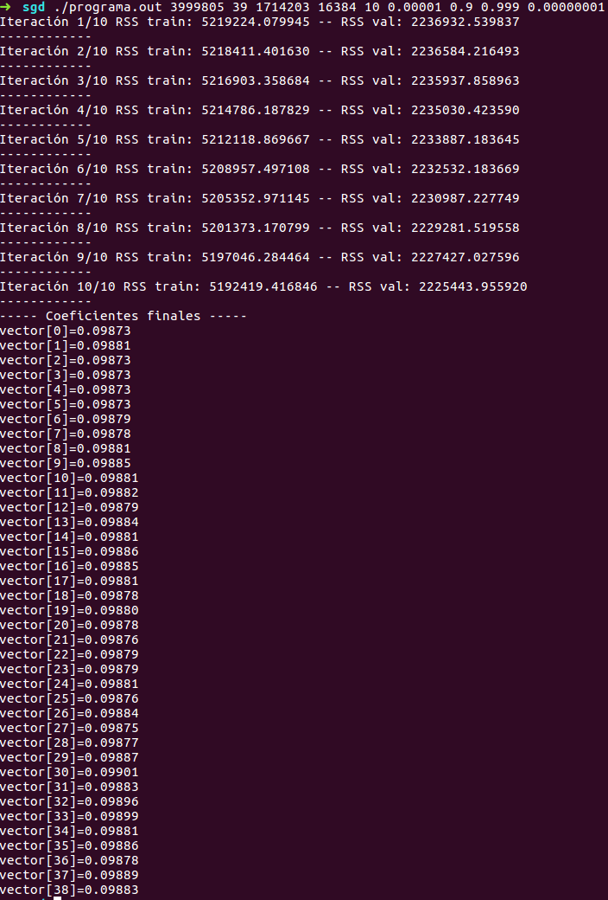

## Base de datos de prueba  

Dado que la base de Boston únicamente tenía 333 observaciones, se decidió cambiar por la base de flights, que tiene más de 5,000,000 de observaciones.  Se modificó para que pudiera ser utilizada con los modelos, todas las modificaciones a esta se explican en el repositorio paralelo en esta [ubicación](https://github.com/lizsolisd/optimizacion_convexa_minimos_cuadrados/tree/master/codigo/avance_02_05_18).  

## 1.Implementación de Descenso en Gradiente Estocástico Secuencial 

Se corrigió el código que teníamos la semana anterior con el cambio de Erick y se pudo confirmar el correcto funcionamineto del programa con la nueva base. El archivo tiene el nombre 'SGD_secuencial_f.c'.  

Para compilar el programa se ejecuta la siguiente instrucción en la consola:  
  
`gcc -Wall SGD_secuencial_f.c funciones.c -o programa.out -lblas -lm`

La ejecución del programa se hace de la siguiente forma:  

`./programa.out <renglones_entrenamiento> <columnas_entrenamiento> <renglones_validación> <tamaño_del_batch> <iteraciones> <-tasa_aprendizaje>`
  
Se encontró que los siguientes parámetros obtienen un buen movimiento en el error, sin embargo, falta hacer pruebas con más iteraciones:  

`./programa.out 3999805 39 1714203 65536 200 -0.000001`  

  
**Evidencia**  

  

## 2. Implementación de Algorítmo de ADAM

El código para el algorítmo de SGD con ADAM se encuentra en el archivo 'SGD_adam_f.c'.  

Para compilar el programa se ejecuta la siguiente instrucción en la consola:  
  
`gcc -Wall SGD_adam.c funciones.c -o programa.out -lblas -lm`

La ejecución del programa se hace de la siguiente forma:  

`./programa.out <renglones_entrenamiento> <columnas_entrenamiento> <renglones_validación> <tamaño_del_batch> <iteraciones> <tasa_aprendizaje> <Beta1> <Beta2> <epsilon>` 
  
Se experimentó con los parámetros, sin embargo, es necesario realizar más pruebas para encontrar buenos parámetros. Un ejemplo de parámetros con los que lo ejecutamos son los siguientes:  

`./programa.out 3999805 39 1714203 16384 10 0.00001 0.9 0.999 0.00000001`  

**Evidencia**  

## 3. Implementación de Algorítmo de AMSGrad

El código para el algorítmo de SGD con AMSGrad se encuentra en el archivo 'SGD_AMSGRad_f.c'.  

Para compilar el programa se ejecuta la siguiente instrucción en la consola:  
  
`gcc -Wall SGD_AMSGrad_f.c funciones.c -o programa.out -lblas -lm`

La ejecución del programa se hace de la siguiente forma:  

`./programa.out <renglones_entrenamiento> <columnas_entrenamiento> <renglones_validación> <tamaño_del_batch> <iteraciones> <tasa_aprendizaje> <Beta1> <Beta2> <epsilon>` 
  
Se experimentó con los parámetros, sin embargo, es necesario realizar más pruebas para encontrar buenos parámetros. Un ejemplo de parámetros con los que lo ejecutamos son los siguientes:  

`./programa.out 3999805 39 1714203 16384 10 0.00001 0.9 0.999 0.00000001`

**Evidencia**  

**NOTA:**  
Los ejemplos de ejecución se hicieron solamente con 10 iteracinoes para demostrar el funcionamiento correcto del programa. Para las prubeas que haremos en esta semana se desarrollarán más iteraciones.  

Esta carpeta tiene el código en C de la implementación de los programas. Para evitar la sobrecarga del repositorio de la clase creamos un repositorio paralelo que contiene los archivos adicionales.  
 
En especifico, los archivos requeridos para ejecutar este programa se encuentran en la siguiente liga: https://github.com/lizsolisd/optimizacion_convexa_minimos_cuadrados/tree/master/codigo/avance_02_05_18
