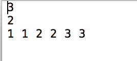
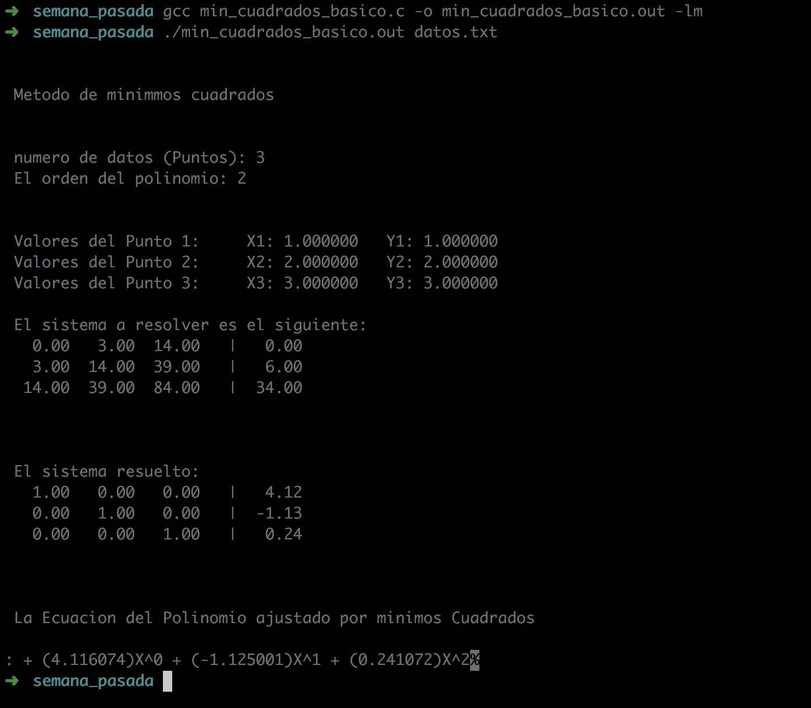

### Detalle

La semana pasada incorporé algunas modificaciones en el programa de `min_cuadrados_basico.c`  para que los inputs no fueran dados en la terminal sino que leyera un archivo.

El objetivo del programa `min_cuadrados_basico.c`   es tener una interfaz interactiva con la finalidad de entender mejor el tema de mínimos cuadrados, en el cual dados unos datos (experimentales) se encontrará la relación entre la variable explicativa y la variable respuesta a través de un polinomio de grado n y minizando el error cuadrático. 

El programa tiene como inputs: el número de datos ,  los valores para la variable explicativa y la variable respuesta,  el grado del polinomio que se desea ajustar.

El resultado del programa es un sistema de ecuaciones a resolver y el sistema resuelto; así como la ecuación del polinomio del grado deseado ajustado por mínimos cuadrados. 

Dado que este programa tenía como finalidad objetivos didácticos no se buscó la comparación con el programa de `descenso_gradiente_secuencial.c`

En la carpeta `datos` se encuentran los datos de prueba de la semana pasada.  Finalmente, hice algunas modificaciones en el código para que el programa leyera un archivo txt sin necesidad de introducir los datos de forma interactiva en la terminal.

`datos.txt` es el archivo con los datos a ingresar en el programa con la siguiente estructura:

+ número de datos en la primera linea

+ orden del polinomio en la segunda linea

+ valores de x1 y1 ... xn yn (separados por espacio y en ese orden) en la tercera linea

Por ejemplo:

### Compilación de programa

En la consola se ejecuta la siguiente instrucción:

`gcc min_cuadrados_basico.c -o min_cuadrados_basico.out -lm`

### Ejecución de programa

Con la siguiente instrucción:

`./min_cuadrados_basico.out datos.txt`

### Ejemplo de corrida

