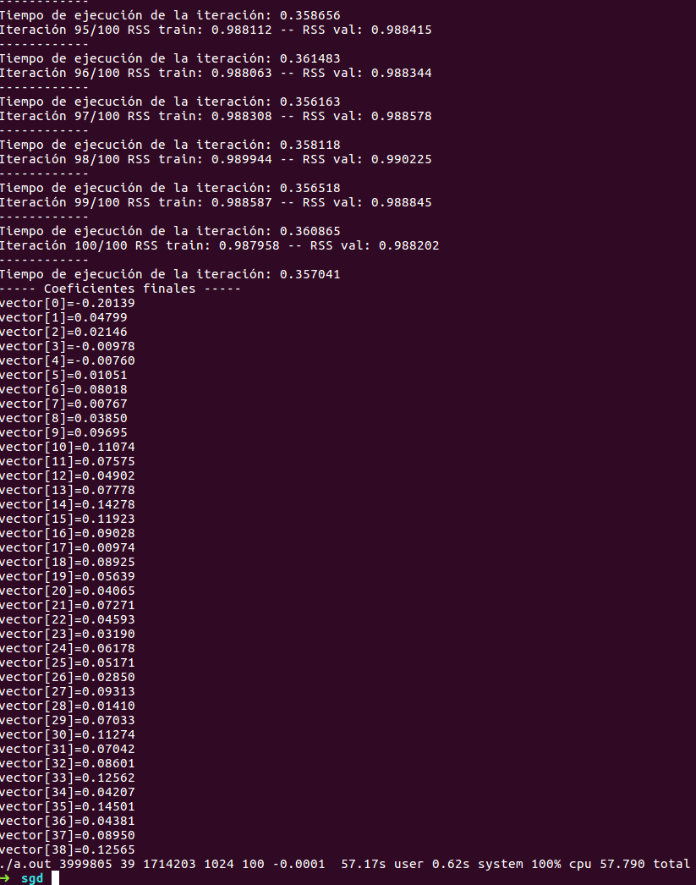
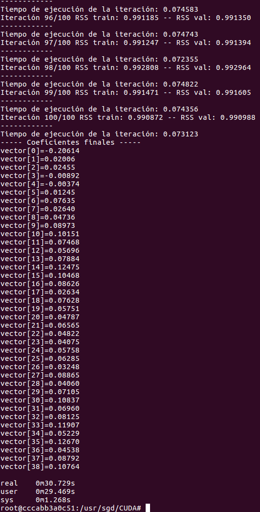

## 1. Implementación del programa de Descenso en Gradiente Estocástico en CUDA

Se implementó el programa de SGD en CUDA, basándonos en el programa que teníamos en secuencial. Se utilizó la librería de cuBLAS.

Para compilar el programa se ejecuta la siguiente instrucción en la consola (necesario tener una máquina con GPU NVIDIA y el CUDA Toolkit instalado):  
  
`nvcc SGD_cuda.c funciones.c -o programa.out -lcublas`

La ejecución del programa se hace de la siguiente forma:  

`./programa.out <renglones_entrenamiento> <columnas_entrenamiento> <renglones_validación> <tamaño_del_batch> <iteraciones> <-tasa_aprendizaje>`
  
Para verificar si la ejecución en CUDA proporcionaba mejoras significativas en el tiempo que toman los cálculos en comparación con el modelo secuencial se ejecutaron ambos programas con las mismas instucciones. A continuación se muestran los resultados:  

**Ejecución en Secuencial**  

  

**Ejecución en CUDA**  

  

Podemos observar que para 100 iteraciones el programa en CUDA tardó 50% menos tiempo que en secuencial (30 segundos vs 57 segundos). Parte de este tiempo consiste en cargar los datos a memoria, que es equivalente para ambos programas. Sin embargo, si comparamos el tiempo de cada iteración, que depende casi exclusivamente del procesamiento en GPU vs CPU vemos que fue casi 80% menor en la GPU que en CPU. Por lo tanto, a mayor número de ejecuciones. El código de la implementación en CUDA encuentra en esta misma carpeta.

Para la siguiente semana se hará la implementación de los otros algorítmos (ADAM, AMSGrad) en CUDA y se ejecutarán los grids para comparar los modelos de forma 'justa'.