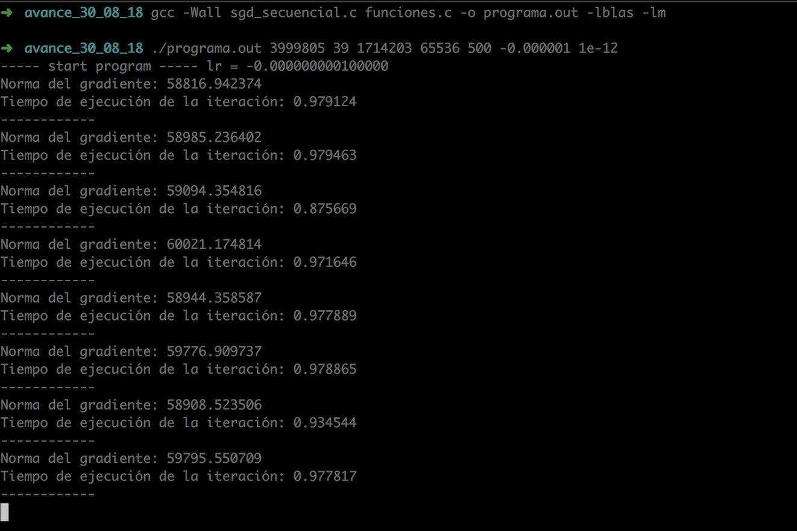

## 1. SGD, ADAM y AMSGrad en CUDA

Se implementó, en un solo código de CUDA C, los tres algorítmos con los que se ha trabajado en este proyecto. Las instrucciones de ejecución son las siguientes:

Es posible cambiar entre estos algorítmos a través de la llamada al programa con el parámetro de optimizador
- SGD - optimizador 1
- ADAM - optimizador 2
- AMSGrad - optimizador 3

El programa se compila con la siguiente instrucción:

  ```nvcc SGD_cuda.c funciones.c -o programa.out -lcublas```

El programa se ejecuta con la siguiente instruccion:

```./programa.out <renglones_entrenamiento> <columnas_entrenamiento> <renglones_validación> <tamaño_del_batch> <iteraciones> <optimizador> <beta1> <beta2> <epsilon>```

Si se elige el optimizador 1 (SGD) los parámetros de beta1, beta2 y epsilon se ignoran, pero si se requieren para su ejecución

En esta misma carpeta se agregan archivos de output del programa, en los que se muestran las diferentes iteraciones con sus respectivas métricas.

* Evidencia de ejecución :
[link](https://drive.google.com/open?id=1Qs45YXiJWy8xHmsCgxcPSdUjdO4hGxD9)


## 2. SGD Secuencial

Dadas las sugerencias de Erick hemos incorporado la impresión de la norma en cada iteración, reemplazamos el *for* por un *while* y finalmente, agregamos la tolerancia (input del programa) como criterio de paro. De manera adicional, imprime el tiempo de ejecución de cada iteración. Está diseñado para ejecutarse como un grid, donde va probando diferentes tasas de aprendizaje con el objetivo de identificar la óptima. Si se desea asignar una sola tasa solo es necesario modificar la línea de los lrs en el main.

+ Compilamos el programa

```
gcc -Wall sgd.c funciones.c -o programa.out -lblas -lm
```

+ La ejecucución del programa requiere de los siguiente parámetros:

    - Número de renglones de entrenamiento
    - Columna de entrenamiento
    - Número de renglones para validación
    - Tamaño del batch
    - Número de iteraciones

```
./programa.out <renglones_entrenamiento> <columnas_entrenamiento> <renglones_validación> <tamano_de_batch> <iteraciones> 
```

Por ejemplo:

```
./programa.out 3999805 39 1714203 65536 500
```


+ Evidencia


