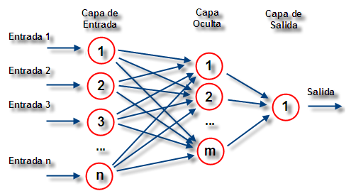
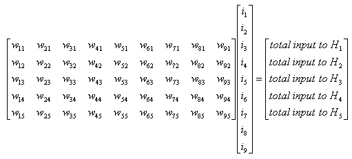
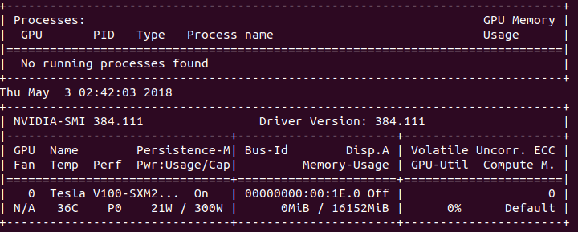

## Avance 4 Proyecto Final

### Equipo 4

### Integrantes
* Arturo González Bencomo - 172906
* Arturo Torre González - 90226

#### Arturo Torre González

503X964

Las redes neurales son una técnica de aprendizaje de máquina que intenta emular la forma en que un cerebro animal, compuesto por neuronas, "aprende". Se utilizan principalmente para clasificación, particularmente en nuestro proyecto se utilizarán como el algoritmo central (implementado en Pytorch) que permitirá a la computadora reconocer los patrones faciales(también se usan masivamente en el reconocimiento del habla) de las distintas imágenes utilizadas en la base de datos.

En nuestro ejemplo en particular tenemos imágenes de rostros que intentaremos clasificar. Como se reportó en el tercer avance las imágenes a color pueden expresarse como una matriz de 503X964 (en el ejemplo del avance 3), que posteriormente mediante una conversión se representa con una matriz de pixeles en blanco y negro. Tomando como base esa matriz, a continuación, se explica la técnica desde el punto de vista matemático y como pytorch nos ayudará a resolver el problema.

¿Cómo funciona una red neural?

El esque básico de una red neural es el siguiente:

Como se menciona anteriormente, el objetivo principal es una clasificación en formato booleano, es decir entre 1 (cuando el atributo está presente) y 0 (cuando el atributo NO está presente). La unidad básica de la red neural es la neurona. La idea principal es generar un clasificación general de un atributo de interés a partir de las neuronas. Una neurona es una "casilla" que contiene un número. En nuestro caso en particular tendremos neuronas que representarán cada uno de los pixeles en las matrices que representan nuestras imágenes en blanco y negro (503X964). El número que contiene cada neurona representará el valor de la escala de grises de cada pixel (0 para pixeles negros y 1 para los blancos, con todo el rango intermedio para la representación de escala de grises). El término activación es un concepto que se asocia a niveles altos del atributo. Siguiendo el simil con el cerebro animal existen ocasiones en las que las neuronas se activan o no, para nuestro caso en particular cuando el atributo está muy presenta y el valor contenido en la nuerona es alto (1 o cercano a 1), la neurona se activa de lo contrario NO se activa

Como se observa en la imágen el algoritmo va construyendo capas (capas ocultas) para ir identificando los atributos en una imagen, en nuestro caso serán el tipo de boca, la nariz, los ojos, etcétera. Al mismo tiempo, la última capa representará la probabilidad (lo que la red piensa) de clasificación de la imagen en las distintas categorías disponibles. Cabe señalar que la activación de un atributo en un capa determinada viene determinada por la activación en la capa inmediata anterior. La idea detrás del algoritmo es ir identificando capa por capa atributos propios de cada una de las imágenes a clasificar para que el final tengamos una clasificación de lo que la imagen representa. Por ejemplo, sabemos que la boca de una persona puede ser más gruesa o más delgada. En ese sentido, tendremos una capa que a través del nivel de activación de esas neuronas, que corresponde al nivel de intensidad de los pixeles en la escala de grises, identificará bocas mas gruesas o más delgadas según sea el caso. Lo mismo para otras características como los ojos o la nariz.

Más a fondo, comentamos que la activación de ciertas neuronas en las capas anteriores influencian la activación de las neuronas posteriores en una capa dada. Como se señala anteriormente, la idea es identificar rasgos generales como bocas, narices, etc. Sin embargo, el algoritmo no sabe qué es una boca o una nariz a priori. En ese sentido, a través de la intensidad de los pixeles, las bocas, las narices o cualquier otro atributo se puede descomponer en pequeñas partes más pequeñas, como por ejemplo la comisura de los labios o la parte central de los labios que todas juntas forman una boca. De esa manera el algoritmo de la red neural va identificando particularidades en las caras. Evidentemente, para un proyecto como el nuestro, entre más capas ocultas tenga nuestro algoritmo mayor precisión tendrá nuestra clasificación en la capa de salida porque más capas significan que estaremos captando mayor detalle. Es decir no sólo estaremos "entrenando" al modelo para identificar caras sino diferencias entre las mismas. A manera de resumen tenemos que:

1.- Tenemos una capa inicial que representa cada pixel de matriz que representan la imagen en blanco y negro.
2.- Tenemos capas ocultas que van reconociendo pedazos de partes de la cara, por ejemplo en los labios la diferencia entre comisura y parte central de los mismos. En este paso cabe recalcar que habrá capas que reconozcan los bordes y demás componentes de otras partes de la cara como los ojos, las cejas o la nariz.
3.- Tenemos otras capas ocultas que van identificando las diferencias entre bocas de distintas caras o cualquier otra parte del rostro.
4.- Tenemos una capa de salida que asocia una probabilidad de estar en una categoría dada una vez que el algoritmo identificó ciertos rasgos en el rostro a través de las capas ocultas para una imagen en particular.
 
A nivel matemático de acuerdo a lo que queramos identificar mediante este algoritmo (como se mencionó no sólo se usa para identificar caras sino otras cosas también) la activación de unas neuronas en una capa y su influencia en la siguiente capa se da mediante la asignación de un peso de una neurona en una capa y su impacto en la siguiente. De esta manera tenemos que:

w1a1 + w2a2 + w3a3 + ... + wnan

donde w representa el peso que le asignamos a la neurona a correspondiente a un atributo dado. Nótese que un peso podría tener un valor negativo o muy negativo. También resulta conveniente que el reultado de la suma ponderada esté entre el rango de valores de 0 y 1. Por lo tanto para poder hacer esa transformación de valores a un rango entre  0 y 1 se utiliza la función sigmoide o también conocida como curva logística:

S(x) = 1/(1+e^(-x))

Entonces:

S(w1a1 + w2a2 + w3a3 + ... + wnan)

El resultado de aplicarle la función sigmoide a la suma ponderada nos dará una idea de que tan positiva resulta la suma. Esto resulta relevante porque es aquí donde se define el nivel de activación de la neurona ya que cuando la suma ponderada resulta muy positiva, la neurona se activa y tiene una incidencia en la siguiente capa capturando el atributo de interés. Cabe destacar que en este paso también podríamos determinar un nivel de activiación discrecional, fijando los parámetros necesarios en el algoritmo para que cumpla con nuestra codición de "sesgo". Podemos representar el sesgo, por ejemplo, restando un número a la suma ponderada antes de introducirla en la función sigmoide, esto reflejara nuestra condición de sesgo ya que hará que el nivel de "positividad" de la suma tenga que se mayor para hacer que una neurona dada se active. Este proceso se realiza para cada una de las neuronas de una capa con respecto a la siguiente. En nuestro ejemplo tendremos que la primera capa que representa todos los pixeles de la matriz de blanco y negro de la imagen tendra 484,892 (503X964) neuronas. De ahí debemos encontrar los pesos de cada una de estas 484,892 neuronas tendrán en las neuronas de la siguiente capa. Sin duda un trabajo colosal. Sin embargo, cada nueva neurona generada a partir de la capa anterior, lo podemos representar de la siguiente manera.

donde w representa los pesos de cada neurona de la capa previa en la siguiente capa e i representa cada neurona de la capa previa. Es decir podemos representar la evolución de las capas como una multiplicación de matrices.

Para concluir, cuando empezamos esta explicación se hablaba de "entrenar" el algoritmo para que clasificara imágenes de rostros. En ese sentido, se podría decir que el problema de clasificación en el contexto de redes neurales consiste en encontrar el conjunto de pesos y sesgos que nos permita una correcta clasificación

#### Arturo González Bencomo
En este avance, estuvimos batallando con la implementación de la conversión de una imagen de color a blanco y negro en paralelo con cuda y c++ por lo que decidimos avanzar hacia pytorch.
Nos enfrentamos a algunos problemas de configuración y compatibilidad de hardware por lo que cambiamos la estrategia.

Llevamos a cabo una búsqueda dentro del catálogo de AMIs de ec2 y encontramos AMIs preconfiguradas para deep learning así como computadoras con GPUs con tarjetas gráficas más nuevas (p3.2xlarge contiene NVIDIA Tesla v100).

Ya teniendo la máquina virtual, procedimos a instalar pytorch, para esto la máquina virtual ya cuenta con lo siguiente instalado:

* Ubuntu 16.04
* python3.6
* conda package manager
* cuda 9.0

Utilizamos el siguiente comando: conda install pytorch torchvision cuda90 -c pytorch

También entendimos como funciona el comando de monitoreo de las tarjetas nvidia desde la terminal que es: nvidia-smi:

Comando que refresca el status de la tarjeta gráfica cada segundo:
    
    nvidia-smi -l 1

Desarrollamos el programa que carga una imagen a color y la convierte a escala de grises utilizando pytorch-cuda (programa load_image.py)

Incluimos el programa del avance anterior que convierte un archivo en formato csv a una imagen para corroborar que la conversión se haga correctamente (programa reconstruct_image.py).

Ya teniendo las imágenes en blanco y negro, procedimos a intentar implementar lo que se conoce como Histogram of Grandients (HOG) para extraer las características más importantes de una imagen, sin embargo aun no completamos este avance.

Posteriormente investigamos sobre el submódulo torchvision de pytorch que contiene muchos recursos para visión por cómputo, entre ellos modelos de redes neuronales convolucionales preconstruidos y preentrenados. 

Ante esto investigamos sobre lo que es transferencia de conocimiento en deep learning: 

Transferencia de conocimiento consiste en la utilización del conocimiento adquirido a lo largo de varios proyectos como base para resolver problemas semejantes.

Esto es muy importante ya que para poder entrenar redes neuronales convolucionales es necesario inmensas cantidades de datos, por lo que redes neuronales pre-entrenadas con ciertos pesos e inicializaciones preconfigurados ayuda mucho en el entrenamiento y ajustes.

En el caso particular de detección de rostros, la transferencia de conocimiento de redes neuronales pre-entrenadas a nuevas redes proporciona habilidades de detección de contornos, formas y clasificadores de alto nivel.

También investigamos sobre los modelos ya pre-entrenados con los que cuenta torchvision.

Modelos de torchvision:

    * Alexnet
    * VGG
    * ResNet
    * SqueezeNet
    * DenseNet
    * Inception v3

AlexNet es una red neural convolucional optimizada para CUDA. Esta red neuronal contiene solamente 8 capas donde las primeras cinco son convolucionales y las últimas tres son completamente conectadas.

### Referencias
https://ccc.inaoep.mx/~pgomez/deep/presentations/2016Loncomilla.pdf
http://neuralnetworksanddeeplearning.com/chap1.html
https://www.youtube.com/watch?v=aircAruvnKk
https://playground.tensorflow.org/#activation=tanh&batchSize=10&dataset=circle&regDataset=reg-plane&learningRate=0.03&regularizationRate=0&noise=0&networkShape=4,2&seed=0.26220&showTestData=false&discretize=false&percTrainData=50&x=true&y=true&xTimesY=false&xSquared=false&ySquared=false&cosX=false&sinX=false&cosY=false&sinY=false&collectStats=false&problem=classification&initZero=false&hideText=false
https://github.com/pytorch/pytorch
https://github.com/pytorch/tnt
https://github.com/mattmacy/vnet.pytorch
https://hammurabi.itam.mx/exlibris/aleph/a23_1/apache_media/ES1E18G9DU8HB4B1T7H3KCFDVCRB7C.pdf

https://pytorch.org/
https://pytorch.org/docs/stable/tensors.html
https://pytorch.org/docs/master/torchvision/
https://en.wikipedia.org/wiki/AlexNet
https://arxiv.org/abs/1404.5997
https://medium.com/@14prakash/almost-any-image-classification-problem-using-pytorch-i-am-in-love-with-pytorch-26c7aa979ec4

Libros
Alpaydin, Ethem.  Introduction to machine learning / Ethem Alpaydin. -- Cambridge, Mass.: MIT Press, c2014. -- xxii, 613 p. . -- (Capítulo 11)
