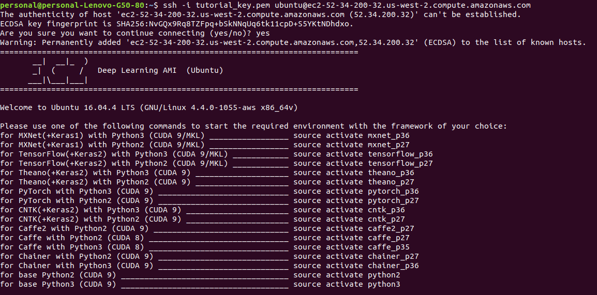
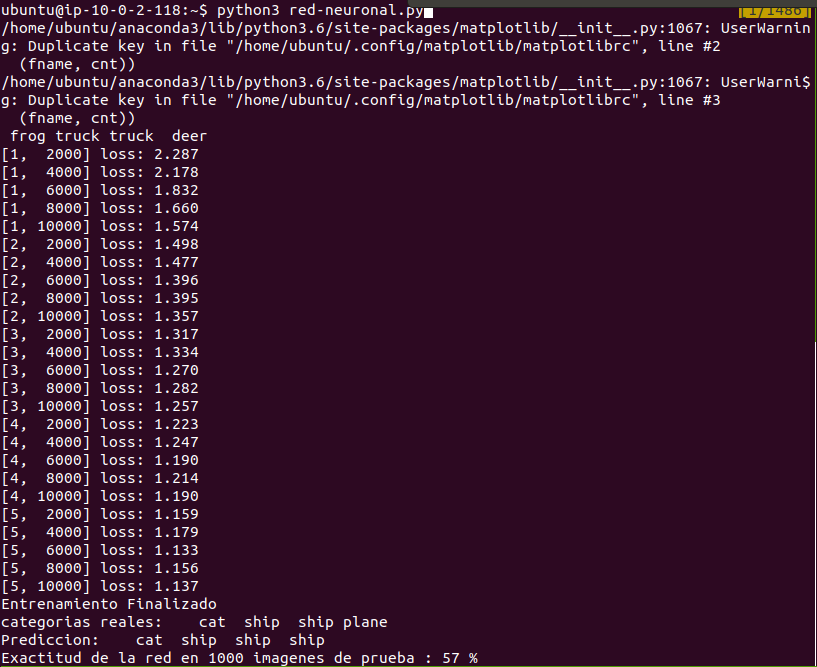
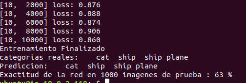
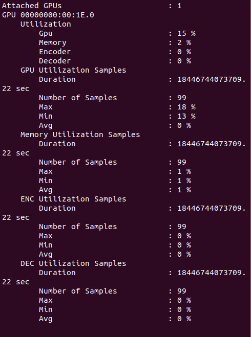

#Equipo 4

Arturo González Bencomo 172906 

Arturo Torre González 90226


Los ejercicios los realizamos sobre una máquina virtual de aws del tipo p3.2xlarge con una imagen optimizada para deep learning. Esta máquina contiene las siguientes herramientas, sin embargo sólo necesitaremos algunas.




#Ejecución de código: 

En este documento explicamos como ejecutar los ejercicios realizados en nuestro proyecto final:

## Ejercicio de cublas: 

Para realizar el ejercicio nos basamos en el siguiente post: Matrix multiplication on GPU using CUDA with CUBLAS, CURAND and Thrust: https://solarianprogrammer.com/2012/05/31/matrix-multiplication-cuda-cublas-curand-thrust/  

Requisitos de hardware:

* nvidia Tesla V100


Requisitos de software: 

* ubuntu 16.04

* Cuda C version 9

* Cublas version **


Multiplicación matricial con CUBLAS;

matmul.cu
```
// Multiplicacion matricial a bajo nivel usando GPU 
// C(m,n) = A(m,k) * B(k,n)
#include <iostream>
#include <cstdlib>
#include <ctime>
#include <cublas_v2.h>
#include <curand.h>


// LLenar el array A(filas, columnas) con valores aleatorios
void GPU_fill_rand(float *A, int nr_rows_A, int nr_cols_A) {	
	// Creamos un generador de numeros pseudo aleatorio utilizando libreria curand
	curandGenerator_t prng;
	curandCreateGenerator(&prng, CURAND_RNG_PSEUDO_DEFAULT);
		
	curandSetPseudoRandomGeneratorSeed(prng, (unsigned long long) clock());

	// Fill the array with random numbers on the device
	// Llenamos el array con numeros aleatorios en el dispositivo GPU
	curandGenerateUniform(prng, A, nr_rows_A * nr_cols_A);
}

// Multiply the arrays A and B on GPU and save the result in C
// C(m,n) = A(m,k) * B(k,n)
void gpu_blas_mmul(const float *A, const float *B, float *C, const int m, const int k, const int n) {
	int lda=m,ldb=k,ldc=m;
	const float alf = 1;
	const float bet = 0;
	const float *alpha = &alf;
	const float *beta = &bet;

	// Create a handle for CUBLAS
	cublasHandle_t handle;
	cublasCreate(&handle);

	// Do the actual multiplication
	cublasSgemm(handle, CUBLAS_OP_N, CUBLAS_OP_N, m, n, k, alpha, A, lda, B, ldb, beta, C, ldc);

	// Destroy the handle
	cublasDestroy(handle);
}


//Print matrix A(nr_rows_A, nr_cols_A) storage in column-major format
void print_matrix(const float *A, int nr_rows_A, int nr_cols_A) {

    for(int i = 0; i < nr_rows_A; ++i){
        for(int j = 0; j < nr_cols_A; ++j){
            std::cout << A[j * nr_rows_A + i] << " ";
        }
        std::cout << std::endl;
    }
    std::cout << std::endl;
}

int main() {
	// Allocate 3 arrays on CPU
	int nr_rows_A, nr_cols_A, nr_rows_B, nr_cols_B, nr_rows_C, nr_cols_C;

	// for simplicity we are going to use square arrays
	nr_rows_A = nr_cols_A = nr_rows_B = nr_cols_B = nr_rows_C = nr_cols_C = 3;
	
	float *h_A = (float *)malloc(nr_rows_A * nr_cols_A * sizeof(float));
	float *h_B = (float *)malloc(nr_rows_B * nr_cols_B * sizeof(float));
	float *h_C = (float *)malloc(nr_rows_C * nr_cols_C * sizeof(float));

	// Allocate 3 arrays on GPU
	float *d_A, *d_B, *d_C;
	cudaMalloc(&d_A,nr_rows_A * nr_cols_A * sizeof(float));
	cudaMalloc(&d_B,nr_rows_B * nr_cols_B * sizeof(float));
	cudaMalloc(&d_C,nr_rows_C * nr_cols_C * sizeof(float));

	// If you already have useful values in A and B you can copy them in GPU:
	// cudaMemcpy(d_A,h_A,nr_rows_A * nr_cols_A * sizeof(float),cudaMemcpyHostToDevice);
	// cudaMemcpy(d_B,h_B,nr_rows_B * nr_cols_B * sizeof(float),cudaMemcpyHostToDevice);

	// Fill the arrays A and B on GPU with random numbers
	GPU_fill_rand(d_A, nr_rows_A, nr_cols_A);
	GPU_fill_rand(d_B, nr_rows_B, nr_cols_B);

	// Optionally we can copy the data back on CPU and print the arrays
	cudaMemcpy(h_A,d_A,nr_rows_A * nr_cols_A * sizeof(float),cudaMemcpyDeviceToHost);
	cudaMemcpy(h_B,d_B,nr_rows_B * nr_cols_B * sizeof(float),cudaMemcpyDeviceToHost);
	std::cout << "A =" << std::endl;
	print_matrix(h_A, nr_rows_A, nr_cols_A);
	std::cout << "B =" << std::endl;
	print_matrix(h_B, nr_rows_B, nr_cols_B);

	// Multiply A and B on GPU
	gpu_blas_mmul(d_A, d_B, d_C, nr_rows_A, nr_cols_A, nr_cols_B);

	// Copy (and print) the result on host memory
	cudaMemcpy(h_C,d_C,nr_rows_C * nr_cols_C * sizeof(float),cudaMemcpyDeviceToHost);
	std::cout << "C =" << std::endl;
	print_matrix(h_C, nr_rows_C, nr_cols_C);

	//Free GPU memory
	cudaFree(d_A);
	cudaFree(d_B);
	cudaFree(d_C);	

	// Free CPU memory
	free(h_A);
	free(h_B);
	free(h_C);

	return 0;
}
```

Corremos el siguiente comando para compilar el programa en la terminal de linux:
nvcc matmul.cu -lcublas -lcurand -o mmul_1


Ejecutamos el programa con el siguiente comando en la terminal de linux:
```
./mmul_1
```

Imagen de la salida:


Ejecución red neuronal en CPU: Para este ejercicio nos basamos en la siguiente referencia: "Training a pytorch classifier": https://pytorch.org/tutorials/beginner/blitz/cifar10_tutorial.html


Requisitos de hardware:

* nvidia Tesla V100


Requisitos de software: 

* Ubuntu 16.04

* Cuda C version 9

* Cublas version **

* Python3

* Pytorch version 0.4

* Torchvision 


Archivo: red-neural-cpu.py
```
#Importamos modulos de pytorch
import torch
import torchvision
import torchvision.transforms as transforms

#Importamos modulo de visualizacion de matplotlib y numpy
import matplotlib.pyplot as plt
import numpy as np


#Importamos el modulo de redes neuronales de pytorch y funciones adicionales
import torch.nn as nn
import torch.nn.functional as F

#Importamos el modulo de optimizacion de pytorch
import torch.optim as optim


#Hacemos un conjunto de trasnformaciones 
#1. Transformamos a tensor
#2. Normalizamos las imagenes
transform = transforms.Compose(
    [transforms.ToTensor(),
     transforms.Normalize((0.5, 0.5, 0.5), (0.5, 0.5, 0.5))])


#Descargamos el dataset de entrenamiento precaragdo de pytorch de CIFAR10 y guardamos en carpeta data
entrenamiento = torchvision.datasets.CIFAR10(root='./data', train=True,
                                        download=False, transform=transform)

#Cargamos en memoria las imagenes de entrenamiento, definimos tamanio del lote = 4 y cantidad de paralelismo = 2
trainloader = torch.utils.data.DataLoader(entrenamiento, batch_size=5,
                                          shuffle=False, num_workers=2)

#Descargamos el dataset de prueba de pytorch de CIFAR10 y lo guardamos en carpeta data
prueba = torchvision.datasets.CIFAR10(root='./data', train=False,
                                       download=False, transform=transform)

#Caragmos en memoria los datos de prueba
testloader = torch.utils.data.DataLoader(prueba, batch_size=5,
                                         shuffle=False, num_workers=2)

#Definimos una tupla con distintas categorias
categorias = ('plane', 'car', 'bird', 'cat',
           'deer', 'dog', 'frog', 'horse', 'ship', 'truck')


#Definimos una funcion que nos muestre un conjunto de imagenes y que tambien la guarde en el directorio local
def mostrar_imagen(img):
    img = img / 2 + 0.5     
    npimg = img.numpy()
    plt.imshow(np.transpose(npimg, (1, 2, 0)))
    plt.savefig('myfig.png')


# get some random training images
#Obtenemos imagenes aleatorias de entrenamiento para hacer una evaluacion
dataiter = iter(trainloader)

#Obtenemos las imagenes y las etiquetas de cada imagen
images, labels = dataiter.next()

#Llamamos la funcion mostrar_imagen para que nos muestre las imagenes selecciondas
mostrar_imagen(torchvision.utils.make_grid(images))

#Imprimimos las etiquetas para verificar que correspondan a las imagenes seleccionadas
print(' '.join('%5s' % categorias[labels[j]] for j in range(4)))


#Construimos la clase Net que hereda de nn.Module que contiene la estructura base de una red neuronal

class Net(nn.Module):
    def __init__(self):
    	#Mandamos llamar al constructor del padre
        super(Net, self).__init__()
        #Asignamos como atributo de la clave una red neuronal convolucional
        #torch.nn.Conv2d(in_channels, out_channels, kernel_size, stride=1, padding=0, dilation=1, groups=1, bias=True)
        #in_channels (int) – Number of channels in the input image
        #out_channels (int) – Number of channels produced by the convolution
		#kernel_size (int or tuple) – Size of the convolving kernel

        self.conv1 = nn.Conv2d(3, 6, 5)
        self.pool = nn.MaxPool2d(2, 2)
        self.conv2 = nn.Conv2d(6, 8, 5)        
        self.fc1 = nn.Linear(8 * 5 * 5, 120)
        self.fc2 = nn.Linear(120, 84)
        self.fc3 = nn.Linear(84, 10)
        #self.fc1 = nn.Linear(8 * 5 * 5, 100)
        #self.fc2 = nn.Linear(100, 84)        
        #self.fc3 = nn.Linear(84, 50)
        #self.fc4 = nn.Linear(50, 40)
        #self.fc5 = nn.Linear(40, 10)


    def forward(self, x):
    	#Definimos funciones de activacion RELU de la red neuronal 
        x = self.pool(F.relu(self.conv1(x)))
        x = self.pool(F.relu(self.conv2(x)))
        #x = self.pool(F.relu(self.conv3(x)))
        x = x.view(-1, 8 * 5 * 5)
        x = F.relu(self.fc1(x))
        x = F.relu(self.fc2(x))
        x = F.relu(self.fc3(x))
        #x = F.relu(self.fc4(x))        
        #x = F.sigmoid(self.fc1(x))
        #x = F.sigmoid(self.fc2(x))
        #x = self.fc5(x)
        return x

#Instanciamos la red neuronal definida previamente

#device = torch.device("cuda:0" if torch.cuda.is_available() else "cpu")

net = Net()
#net.to(device)

#Definimos criterion y optimizer que son muy relevantes para la optimizacion de la red
criterion = nn.CrossEntropyLoss()
optimizer = optim.SGD(net.parameters(), lr=0.001, momentum=0.9)


#Etapa de entrenamiento de la red neuronal
#Definimos cantidad de epochs o pasadas al dataset completo
#Mientras mayor sea la cantidad de epochs mejor sera la prediccion, aunque se requerira mayor capacidad de computo
for epoch in range(5):

    running_loss = 0.0
    for i, data in enumerate(trainloader, 0):

        #Obtenemos la imagen y su categoria
        inputs, labels = data
        inputs, labels = inputs.to(device), labels.to(device)
        #print(type(inputs))
        #print(inputs.size())
        #print(inputs)
        #print(labels)
        #print(inputs)

        #Inicializamos el gradiente
        optimizer.zero_grad()

        # forward + backward + optimize
        outputs = net(inputs)
        loss = criterion(outputs, labels)
        loss.backward()
        optimizer.step()

        #Imprimimos desempenio del modelo en epoch correspondiente
        running_loss += loss.item()
        if i % 2000 == 1999:    # print every 2000 mini-batches
            print('[%d, %5d] loss: %.3f' %
                  (epoch + 1, i + 1, running_loss / 2000))
            running_loss = 0.0

print('Entrenamiento Finalizado')


#Evaluacion de la red neuronal: 

#Seleccionamos una muestra al azar
dataiter = iter(testloader)
images, labels = dataiter.next()


#Mostramos las imagenes y observamos sus categorias
mostrar_imagen(torchvision.utils.make_grid(images))
print('categorias reales: ', ' '.join('%5s' % categorias[labels[j]] for j in range(4)))


#Predecimos las categorias con la red neuronal entrenada
outputs = net(images)


_, predicted = torch.max(outputs, 1)

#Imprimimos las predicciones
print('Prediccion: ', ' '.join('%5s' % categorias[predicted[j]]
                              for j in range(4)))

correct = 0
total = 0
with torch.no_grad():
    for data in testloader:
        images, labels = data
        outputs = net(images)
        _, predicted = torch.max(outputs.data, 1)
        total += labels.size(0)
        correct += (predicted == labels).sum().item()

print('Exactitud de la red en 1000 imagenes de prueba : %d %%' %(
    100 * correct / total))

```

Ejecutamos el código con el siguiente comando en la terminal de linux: 

```
python3 red-neural-cpu.py
```

Salida: 


Ejercicio en GPU fue una modificación ligera al ejercicio previo.

Requisitos: Mismos que el programa anterior.

Para obtener mejores resultados incrementar numero de epochs, cantidad de capas y neuronas, etc.


Archivo: red-neural-gpu.py
```
#Importamos modulos de pytorch
import torch
import torchvision
import torchvision.transforms as transforms

#Importamos modulo de visualizacion de matplotlib y numpy
import matplotlib.pyplot as plt
import numpy as np


#Importamos el modulo de redes neuronales de pytorch y funciones adicionales
import torch.nn as nn
import torch.nn.functional as F

#Importamos el modulo de optimizacion de pytorch
import torch.optim as optim


#Hacemos un conjunto de trasnformaciones 
#1. Transformamos a tensor
#2. Normalizamos las imagenes
transform = transforms.Compose(
    [transforms.ToTensor(),
     transforms.Normalize((0.5, 0.5, 0.5), (0.5, 0.5, 0.5))])


#Descargamos el dataset de entrenamiento precaragdo de pytorch de CIFAR10 y guardamos en carpeta data
entrenamiento = torchvision.datasets.CIFAR10(root='./data', train=True,
                                        download=False, transform=transform)

#Cargamos en memoria las imagenes de entrenamiento, definimos tamanio del lote = 4 y cantidad de paralelismo = 2
trainloader = torch.utils.data.DataLoader(entrenamiento, batch_size=5,
                                          shuffle=False, num_workers=2)

#Descargamos el dataset de prueba de pytorch de CIFAR10 y lo guardamos en carpeta data
prueba = torchvision.datasets.CIFAR10(root='./data', train=False,
                                       download=False, transform=transform)

#Caragmos en memoria los datos de prueba
testloader = torch.utils.data.DataLoader(prueba, batch_size=5,
                                         shuffle=False, num_workers=2)

#Definimos una tupla con distintas categorias
categorias = ('plane', 'car', 'bird', 'cat',
           'deer', 'dog', 'frog', 'horse', 'ship', 'truck')


#Definimos una funcion que nos muestre un conjunto de imagenes y que tambien la guarde en el directorio local
def mostrar_imagen(img):
    img = img / 2 + 0.5     
    npimg = img.numpy()
    plt.imshow(np.transpose(npimg, (1, 2, 0)))
    plt.savefig('myfig.png')


# get some random training images
#Obtenemos imagenes aleatorias de entrenamiento para hacer una evaluacion
dataiter = iter(trainloader)

#Obtenemos las imagenes y las etiquetas de cada imagen
images, labels = dataiter.next()

#Llamamos la funcion mostrar_imagen para que nos muestre las imagenes selecciondas
mostrar_imagen(torchvision.utils.make_grid(images))

#Imprimimos las etiquetas para verificar que correspondan a las imagenes seleccionadas
print(' '.join('%5s' % categorias[labels[j]] for j in range(4)))


#Construimos la clase Net que hereda de nn.Module que contiene la estructura base de una red neuronal

class Net(nn.Module):
    def __init__(self):
    	#Mandamos llamar al constructor del padre
        super(Net, self).__init__()
        #Asignamos como atributo de la clave una red neuronal convolucional
        #torch.nn.Conv2d(in_channels, out_channels, kernel_size, stride=1, padding=0, dilation=1, groups=1, bias=True)
        #in_channels (int) – Number of channels in the input image
        #out_channels (int) – Number of channels produced by the convolution
		#kernel_size (int or tuple) – Size of the convolving kernel

        self.conv1 = nn.Conv2d(3, 6, 5)
        self.pool = nn.MaxPool2d(2, 2)
        self.conv2 = nn.Conv2d(6, 8, 5)        
        self.fc1 = nn.Linear(8 * 5 * 5, 120)
        self.fc2 = nn.Linear(120, 84)
        self.fc3 = nn.Linear(84, 10)
        #self.fc1 = nn.Linear(8 * 5 * 5, 100)
        #self.fc2 = nn.Linear(100, 84)        
        #self.fc3 = nn.Linear(84, 50)
        #self.fc4 = nn.Linear(50, 40)
        #self.fc5 = nn.Linear(40, 10)


    def forward(self, x):
    	#Definimos funciones de activacion RELU de la red neuronal 
        x = self.pool(F.relu(self.conv1(x)))
        x = self.pool(F.relu(self.conv2(x)))
        #x = self.pool(F.relu(self.conv3(x)))
        x = x.view(-1, 8 * 5 * 5)
        x = F.relu(self.fc1(x))
        x = F.relu(self.fc2(x))
        x = F.relu(self.fc3(x))
        #x = F.relu(self.fc4(x))        
        #x = F.sigmoid(self.fc1(x))
        #x = F.sigmoid(self.fc2(x))
        #x = self.fc5(x)
        return x

#Instanciamos la red neuronal definida previamente

device = torch.device("cuda:0" if torch.cuda.is_available() else "cpu")

net = Net()
net.to(device)

#Definimos criterion y optimizer que son muy relevantes para la optimizacion de la red
criterion = nn.CrossEntropyLoss()
optimizer = optim.SGD(net.parameters(), lr=0.001, momentum=0.9)


#Etapa de entrenamiento de la red neuronal
#Definimos cantidad de epochs o pasadas al dataset completo
#Mientras mayor sea la cantidad de epochs mejor sera la prediccion, aunque se requerira mayor capacidad de computo
for epoch in range(10):

    running_loss = 0.0
    for i, data in enumerate(trainloader, 0):

        #Obtenemos la imagen y su categoria
        inputs, labels = data
        inputs, labels = inputs.to(device), labels.to(device)
        #print(type(inputs))
        #print(inputs.size())
        #print(inputs)
        #print(labels)
        #print(inputs)

        #Inicializamos el gradiente
        optimizer.zero_grad()

        # forward + backward + optimize
        outputs = net(inputs)
        loss = criterion(outputs, labels)
        loss.backward()
        optimizer.step()

        #Imprimimos desempenio del modelo en epoch correspondiente
        running_loss += loss.item()
        if i % 2000 == 1999:    # print every 2000 mini-batches
            print('[%d, %5d] loss: %.3f' %
                  (epoch + 1, i + 1, running_loss / 2000))
            running_loss = 0.0

print('Entrenamiento Finalizado')


#Evaluacion de la red neuronal: 

#Seleccionamos una muestra al azar
dataiter = iter(testloader)
images, labels = dataiter.next()


#Mostramos las imagenes y observamos sus categorias
mostrar_imagen(torchvision.utils.make_grid(images))
print('categorias reales: ', ' '.join('%5s' % categorias[labels[j]] for j in range(4)))


#Predecimos las categorias con la red neuronal entrenada
outputs = net(images)


_, predicted = torch.max(outputs, 1)

#Imprimimos las predicciones
print('Prediccion: ', ' '.join('%5s' % categorias[predicted[j]]
                              for j in range(4)))

correct = 0
total = 0
with torch.no_grad():
    for data in testloader:
        images, labels = data
        outputs = net(images)
        _, predicted = torch.max(outputs.data, 1)
        total += labels.size(0)
        correct += (predicted == labels).sum().item()

print('Exactitud de la red en 1000 imagenes de prueba : %d %%' %(
    100 * correct / total))
```
Para nuestro ejercicio entrenamos una red neural con la base de datos CIFAR-10 que contiene 60,000 imágenes distribuidas en 10 categorías. Respecto a las imágenes se puede comentar que son de tamaño 32X32 cada una.

Observamos el resultado de la red neuronal que prácticamente en el mismo tiempo pudo correr el doble de epochs logrando un incremento en el desempenio pasando del 57% al 63% de tasa de clasificación. 



Y mientras se entrena la red podemos visualizar el consumo de recursos del gpu mediante el comando: 

```
nvidia-smi -q -g 0 -d UTILIZATION -l
```

El cuál nos da la siguiente pantala que se esta actualizando continuamente.




