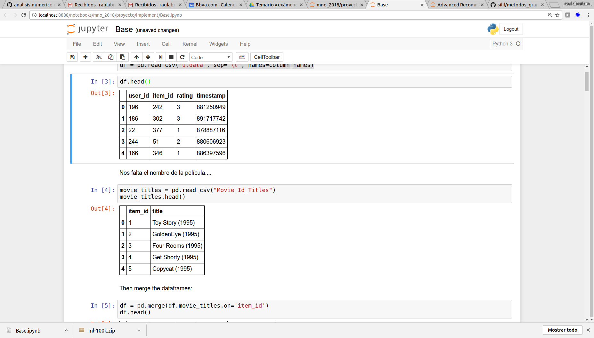
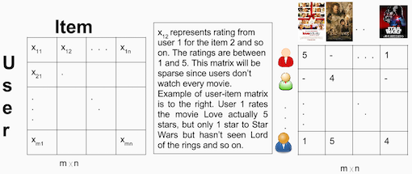
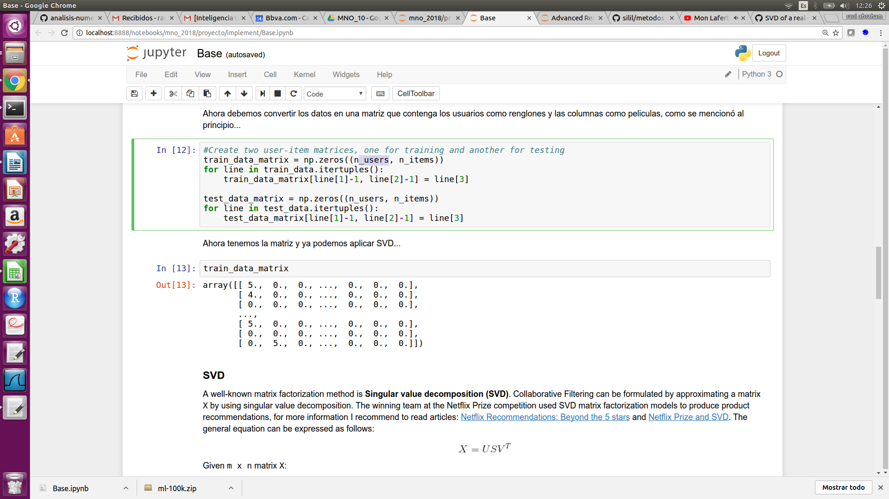
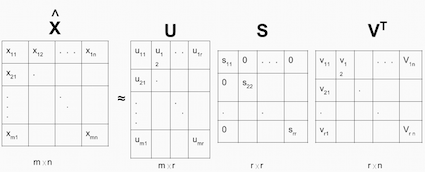

## Base para Pruebas 

De acuerdo con lo que hemos comentado en los avances vamos a utilizar la base MovieLens que contiene 100mil clificaciones de 943 usuarios y 1682 peliculas la base la podemos obtener de esta[ubicacion](http://files.grouplens.org/datasets/movielens/ml-100k.zip).

## 1.Armado de la base 

Toda esta primera implementación esta la carpeta

El objetivo es transformar la información de MovieLens en una matriz donde los renglones sean los usuarios y las columnas las películas, encada celda tendremos la calificación de ese usuario i a la película j si es que existiera. Esta primera parte se procesará en python.

Primero vamos  a leer la información:
La base u.data contiene los ids de usuarios y la calificación que le da a cada película, la base Movie_Id_Titles tiene los nombres e ids de las películas:
`column_names = ['user_id', 'item_id', 'rating', 'timestamp']` 
`df = pd.read_csv('u.data', sep='\t', names=column_names).`
`df.head()`
`movie_titles = pd.read_csv("Movie_Id_Titles")`
`movie_titles.head()`

Después se unen ambas bases  a través de un merge...
`df = pd.merge(df,movie_titles,on='item_id')`

Una vez teniendo la base de acuerdo como se muestra en la figura anterior, entonces haremos una partición de datos,80% entrenamiento, con la finalidad de tener datos de prueba para medir las predicciones que se darán, esto como cualquier método de machine learning.

`train_data, test_data = train_test_split(df, test_size=0.2)`

Ahora debemos convertir los datos en una matriz que contenga los usuarios como renglones y las columnas como películas, como se mencionó al principio...

Para convertir el dataset en matriz hacemos lo siguiente:

`train_data_matrix = np.zeros((n_users, n_items))`
`for line in train_data.itertuples():`
    `train_data_matrix[line[1]-1, line[2]-1] = line[3]`  

`test_data_matrix = np.zeros((n_users, n_items))`
`for line in test_data.itertuples():`
    `test_data_matrix[line[1]-1, line[2]-1] = line[3]`

Con la matriz User-Items ya lista el filtrado colaborativo se puede formular aproximando una matriz X mediante el uso de la descomposición de valores singulares. 

 

Después podemos aplicar SVD con librería scipy de python  a la matriz de entrenamiento, probando con 10 factores y medir el rmse (raíz del error cuadrático medio) de las prediccicones vs. los ratings de los datos de test.

`u, s, vt = svds(train_data_matrix, k =10)` 

Dado lo mostrado en esta parte 1 lo siguiente es obtener la matriz de entrenamiento como input del programa svd.cu y de esta forma hacer el SVD en cuda para optimizar tiempo...

