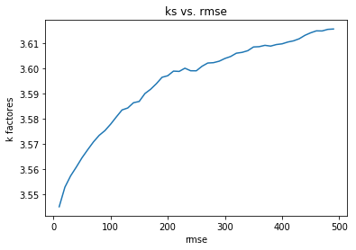

## Base para Pruebas 

De acuerdo con lo que hemos comentado en los avances vamos a utilizar la base MovieLens que contiene 100mil clificaciones de 943 usuarios y 1682 peliculas la base la podemos obtener de esta[ubicacion](http://files.grouplens.org/datasets/movielens/ml-100k.zip).


## 1.Armado de la base 

Toda esta primera fase se puede ver en el notebook [Base.ipynb](Base.ipynb) hecho en python.

El objetivo es transformar la información de MovieLens en una matriz donde los renglones sean los usuarios y las columnas las películas, encada celda tendremos la calificación de ese usuario i a la película j si es que existiera. Esta primera parte se procesará en python.

Primero vamos  a leer la información:
La base u.data contiene los ids de usuarios y la calificación que le da a cada película, la base Movie_Id_Titles tiene los nombres e ids de las películas:
`column_names = ['user_id', 'item_id', 'rating', 'timestamp']` 
`df = pd.read_csv('u.data', sep='\t', names=column_names).`
`df.head()`
`movie_titles = pd.read_csv("Movie_Id_Titles")`
`movie_titles.head()`


Después se unen ambas bases  a través de un merge...
`df = pd.merge(df,movie_titles,on='item_id')`


Una vez teniendo la base de acuerdo como se muestra en la figura anterior, entonces haremos una partición de datos,80% entrenamiento, con la finalidad de tener datos de prueba para medir las predicciones que se darán, esto como cualquier método de machine learning.

`train_data, test_data = train_test_split(df, test_size=0.2)`

Ahora debemos convertir los datos en una matriz que contenga los usuarios como renglones y las columnas como películas, como se mencionó al principio...


Para convertir el dataset en matriz hacemos lo siguiente:

`train_data_matrix = np.zeros((n_users, n_items))`
`for line in train_data.itertuples():`
    `train_data_matrix[line[1]-1, line[2]-1] = line[3]`  

`test_data_matrix = np.zeros((n_users, n_items))`
`for line in test_data.itertuples():`
    `test_data_matrix[line[1]-1, line[2]-1] = line[3]`


Con la matriz User-Items ya lista el filtrado colaborativo se puede formular aproximando una matriz X mediante el uso de la descomposición de valores singulares. 

 

Después podemos aplicar SVD con librería scipy de python  a la matriz de entrenamiento, probando con 10 factores y medir el rmse (raíz del error cuadrático medio) de las prediccicones vs. los ratings de los datos de test.

`u, s, vt = svds(train_data_matrix, k =10)` 


Dado lo mostrado en esta parte 1 lo siguiente es obtener la matriz de entrenamiento como input del programa svd.cu y de esta forma hacer el SVD en cuda para optimizar tiempo...

Revisamos la dimensión de la matriz train_data_matrix:

`np.shape(train_data_matrix)`

y vemos que tenemos una matriz de dimensión 943 X 1682, en este caso m menor que n y de acuerdo al programa [svd.cu](svd.cu) se debe cumplir que m>=n por tanto vamos a guardar la matriz transpuesta.

Guardamos la matriz de entrenamiento en un archivo txt:

`np.savetxt('train_data_matrix_T.txt', train_data_matrix.transpose())` 


## 2.Descomposición SVD

Para Hacer la descomposición de la matriz train_data_matrix_T.txt usamos el siguiente programa de Cuda 
[svd_f.cu](svd_f.cu) el cual está basado en el programa [svd.cu](svd.cu) 

El flujo del programa es el siguiente:


1-Ponemos la Lectura de archivo para la matriz [train_data_matrix_T.txt](train_data_matrix_T.txt):

```

        if (argc<2) {
                cout << "Input file not specified. Please, specify it as a first argument." << endl;
                cout << "example: " << argv[0] << " train_data_matrix_T.txt" << endl;
                return -1;
        }
        ifstream file(argv[1]);
        ofstream S_diag("S_diag.txt");
        ofstream U_rows("U_rows.txt");
	ofstream VT_cols("VT_cols.txt");


```

2-se hace la descomposición SVD usando cusolverDnDgesvd:

``` 

 // --- CUDA SVD execution

    assert(cusolverDnDgesvd (solver_handle,'A','A',m,n,d_A,lda,d_S,d_U,lda,d_VT,lda,d_work,work_size,d_rwork,devInfo));
    assert(cudaDeviceSynchronize());


    // --- Moving the results from device to host

    assert(cudaMemcpy(U.el , d_U , sizeof(double)*lda*m, cudaMemcpyDeviceToHost));
    assert(cudaMemcpy(VT.el, d_VT, sizeof(double)*lda*n, cudaMemcpyDeviceToHost));
    assert(cudaMemcpy(S , d_S , sizeof(double)*n, cudaMemcpyDeviceToHost));
    assert(cudaMemcpy(&info_gpu, devInfo, sizeof(int), cudaMemcpyDeviceToHost)); 

```

3-Obtenemos las matrices  [S](S_diag.txt), [U](U_rows.txt), [VT](VT_cols.txt) 


```
    assert(0 == info_gpu);
    printf("Singular values\n");
    for (int k=0; k<n; k++){
                        S_diag << S[k] << " ";
    }
    
    printf("=====\n");
    printf("\nLeft singular vectors - For y = A * x, the columns of U span the space of y\n");
    for (int k=0; k<m; k++){
                for (int j=0; j<m; j++)
                        U_rows << U.el[k+j*lda] << " ";
                U_rows << endl;
    }
    
    printf("=====\n");
    printf("\nRight singular vectors - For y = A * x, the columns of V span the space of x\n");
    for (int k=0; k<n; k++){
                for (int j=0; j<n; j++)
                        VT_cols << VT.el[k+j*lda] << " ";
                VT_cols << endl;
    }

```

## compilamos

Con esta linea compilamos: 

`nvcc svd_f.cu -o svd_f.out -lcublas -lcusolver`

Ejecutamos: 

`./svd_f.out train_data_matrix_T.txt`


## 3.Uso de la matrices

Esta última fase se puede ver en el notebook [3rafase.ipynb](3ra_fase.ipynb) hecho en python.

Cargamos las matrices U,S,VT resultantes de Cuda en python usando la librería numpy:

```
sigma = np.loadtxt('S_diag.txt')
U = np.loadtxt('U_rows.txt')
V = np.loadtxt('VT_cols.txt')

```

y ahora vemos cual es la mejor k para las predicciones haciendo el producto U sigma V con distintas k's y medimos la precisión con respecto a test_data_matrix
que es nuestra matriz de prueba:

```
k=[] 
rms=[]
for i in range(10,500, 10):
    pred = np.matrix(U[:, :i]) * np.diag(sigma[:i]) * np.matrix(V[:i, :])
    pred=pred.transpose()
    a=rmse(np.array(pred), test_data_matrix)
    k=np.append(i,k)
    rms=np.append(a,rms)
print(k,rms)


```

Recordar que corrimos con la matriz transpuesta por tanto hay que volverla transponer para obtener los resultados:

```
pred=pred.transpose()

```

y finalmente si graficamos el número de factores vs. el rmse vemos que a mayor número de factores el error se incrementa, el mejor k es 10.




