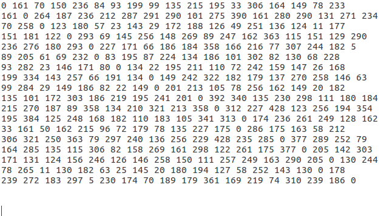
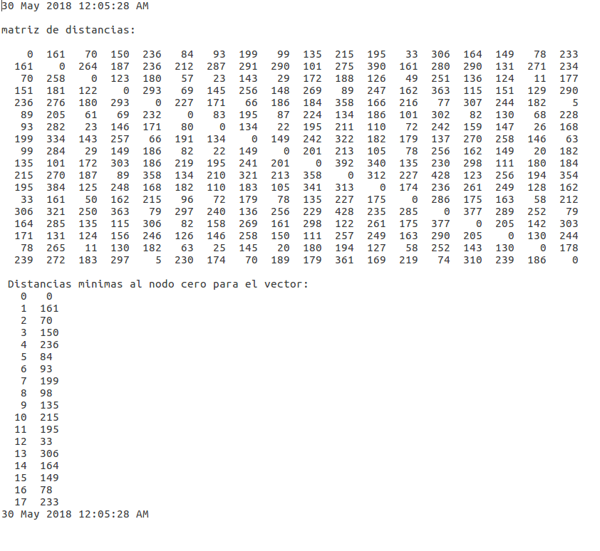
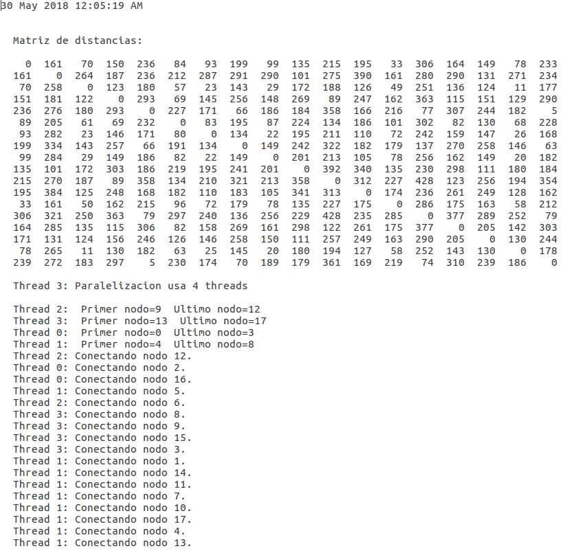
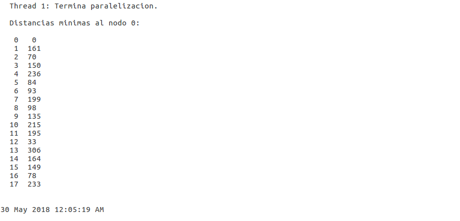

# Equipo 11

## Integrantes:

- Thalía Guerra
- Roberto Sánchez
- Lorena Malpica

# Tema del Proyecto
Implementación de algoritmo Dijkstra

# Objetivo del proyecto
Implementar el algoritmo Dijkstra en C y su versión en paralelo.

### Trabajo escrito y presentación:

 [Trabajo escrito](https://drive.google.com/file/d/1HWgavQvjIV0EGP7VekVUUPRXBjwxV3cI/view)
 
 [Presentación](https://docs.google.com/presentation/d/1jMNw1H-GfnYy81Yj4QRlg7OEpL1cyD7DBYiAL8408Ak/edit?usp=sharing)

### Cómo ejecutar el código:

 [Codigo:Dijkstra secuencial](https://github.com/taguerram/analisis-numerico-computo-cientifico/blob/mno-2018-1/proyecto_final/proyectos/equipos/equipo_11/avance_30_05_18/dijkstra_secuencial.c):

Para ejecutar el código, dentro de la carpeta que contiene tanto el código como el archivo .txt con la matriz de distancias:

$ gcc dijkstra_secuencial.c -o dijkstra_secuencial.out

$ ./dijkstra_secuencial.out > ./dijkstra_secuencial.txt

 [Codigo:Dijkstra en paralelo](https://github.com/taguerram/analisis-numerico-computo-cientifico/blob/mno-2018-1/proyecto_final/proyectos/equipos/equipo_11/avance_30_05_18/dijkstra_paralelo.c):

Para ejecutar el código, dentro de la carpeta que contiene tanto el código como el archivo .txt con la matriz de distancias:

$ gcc -o dijkstra_paraleloc -fopenmp dijkstra_paralelo.c

$ ./dijkstra_paraleloc > ./dijkstra_paralelo.txt

### Datos:

Para esta implememtación se utilizó una [matriz](https://github.com/taguerram/analisis-numerico-computo-cientifico/blob/mno-2018-1/proyecto_final/proyectos/equipos/equipo_11/avance_30_05_18/dist.txt) de 18x18 en la que se muestran las distancias entre 18 municipios aleatorios dentro del estado de Oaxaca. Las disntacias se obtuvieron de la [api de Google](https://developers.google.com/maps/documentation/distance-matrix/intro).

### Output:

El output tanto del [algoritmo secuencial](https://drive.google.com/file/d/1H_ihTpzyNQ8javtgUclu-oJmLXzTxZMk/view?usp=sharing) como del [algoritmo paralelo](https://drive.google.com/file/d/1HrarNScOITL4r0pgy5y37kOIx5S5DX1A/view?usp=sharing) es la distancia mínima de cada uno de los municipios al municipio inicial, que en este caso es Abejones.

Output Dijkstra secuencial:

Output Dijkstra paralelo:

### Resultados:

Como se puede ver en los outputs, el resultado de los algoritmos, en ambos casos, es el vector de distancias mínimas de los municipios incluidos en la muestra al municipio Abejones (nodo 0).

### Bibliografía

Dijkstra, E. W. (1959). "A note on two problems in connexion with graphs". *Numerische Mathematik* 1: 269–271. doi: 10.1007/BF01386390 (http://www-m3.ma.tum.de/foswiki/pub/MN0506/WebHome/dijkstra.pdf).

Misa, Thomas, ed. 2010. "An Interview with Edsger W. Dijkstra". *Communications of the ACM* 53(8): 41-47. Agosto de 2010. (https://cacm.acm.org/magazines/2010/8/96632-an-interview-with-edsger-w-dijkstra/fulltext#PageTop)

Cormen, Thomas H.; Leiserson, Charles E.; Rivest, Ronald L.; Stein, Clifford (2009), “Introduction to algorithms”. Third edition. Chapter 24.(https://drive.google.com/drive/u/0/folders/1W-WJZURh7QZXKTHlkiomsqiasEUOW_jF)

Pacheco, Peter. 2011. An introduction to parallel programming. Massachussetts: Elsevier (http://instructor.sdu.edu.kz/~andrey/CSS%20314%20Parallel%20Computing/An%20Introduction%20to%20Parallel%20Programming.pdf)

A. Crauser, K. Melhorn, U. Meyer, P. Sanders. (1998) *A Parallelization of Dijkstra's Shortest Path Algorithm*. Lecture Notes in Computer Science. https://www.researchgate.net/profile/Kurt_Mehlhorn/publication/47842024_A_Parallelization_of_Dijkstra%27s_Shortest_Path_Algorithm/links/00b4951cbf96929546000000/A-Parallelization-of-Dijkstras-Shortest-Path-Algorithm.pdf

Nadira Jasika, Naida Alispahic, Arslanagic Elma, Kurtovic Ilvana, et al. (2012)*Dijkstra's shortest path algorithm serial and parallel execution performance analysis*. Proceedings of the 35th International Convention MIPRO. https://ieeexplore.ieee.org/document/6240942/ 

Fredman, Michael; Tarjan Robert E.(1984). *Fibonacci heaps and their uses in improved network optimization algorithms*. 25th Annual Symposiums on Foundations of Computer Science. IEEE pp. 338-346.
