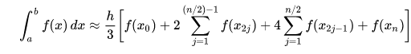
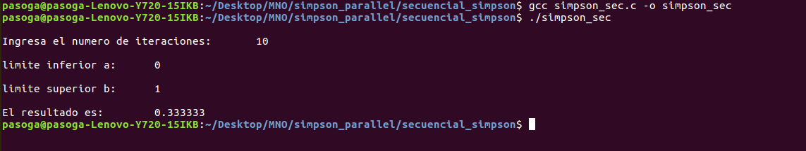

# Avances 02-05-2018

# Integrantes
- Alejandro Hernández 87806
- Federico Riveroll 105898
- Pablo Soria 111969

# Individual


__- Alejandro Hernández__

Realicé un programa en C que calcula el AUC de y=x^2 utilizando Riemann de forma secuencial.

Los argumentos de entrada que tiene que definir el usuario son el rango inicial, el rango final y el número de segmentos para realizar la partición. 

De forma general, primero definí la función a la cual se va a calcular el área bajo la curva, calculamos dx, que se puede ver como la base del rectángulo, se calcula el área para cada segmento y finalmente se suman todas las áreas.

El codigo que utilicé fue el siguiente:

```
#include <stdio.h>
#include <stdlib.h>
#include <string.h>

// Definimos la funcion que calcula el x al cuadrado
long double f(long double *x){
	return (*x)*(*x);
}

int main(int argc, char **argv){
	long long cuenta, segmentos;
	long double x, y, dx, area = 0.0, rango_inicio, rango_fin;

	//Revisamos los argumentos de entrada. Si no son exactamente 3 argumentos salimos del programa:
	if(argc <= 3 || argc > 4) {printf("Numero de argumentos erroneo: %i , se esperaban: 3 \n", argc-1);exit(0);}

  // Almacenamos los 3 argumentos de entrada:
  rango_inicio  = atof(argv[1]);
	rango_fin	= atof(argv[2]);
	segmentos 	= atoi(argv[3]);

  // Revisamos que el rango de inicio sea menor al de fin y que el número de segmentos sea mayor o igual a uno. En caso opuesto salimos del programa:
	if(rango_fin <= rango_inicio || segmentos < 1) {printf("Argumento erroneo, revisar que inicio<fin y segmentos>=1\n");exit(0);}

	// Calculamos de dx:
	dx = (rango_fin-rango_inicio)/(long double)segmentos;

	// Calculamos el area para cada segmento y los sumamos:
	for(cuenta = 0; cuenta < segmentos; cuenta++){
		x = cuenta*dx;
		y = f(&x);
		area += y*dx;
	}

	printf("AUC utilizando Riemann:  %Lf\n", area);

	return(0);
}
```

Con la instruccion para compilar y correr utilizando `rango_inicial=0`, `rango_final=1` y `segmentos=1000`:

```
gcc riemann_secuencial.c -o riemann_secuencial.out

./riemann_secuencial.out 0 1 1000

```

Se obtuvo el siguiente resultado:


El programa en C `riemann_secuencial.c` se encuentra en la carpeta `avance_02_05_2018` para su consulta.

__- Federico Riveroll__

__MCMC secuencial en C__

__¿Qué se va a hacer?__

Como primera implementación, se realizó un programa en C que realiza de manera secuencial el cálculo de AUC.<br>
El siguiente programa calcula el AUC de la función:<br>
<br>
<b>y = x²</b>
<br>

__Implementación__
A continuación el programa:<br>
integra_x2_igual_y.c
<i>

```
#include <stdio.h>
#include <stdlib.h>

// Area bajo 'curva' y = x^2 en un plano 1x1

int main()
{
    float i, n = 99999.0, puntos_bajo_curva = 0.0;
    long double randX, randY;

    srand(time(NULL)+1);

    for (i = 0; i < n; ++i) {
      randX = rand() / (double)RAND_MAX;
      randY = rand() / (double)RAND_MAX;
      if (randX * randX > randY) ++puntos_bajo_curva;
    }


    printf("AREA: puntos_bajo_curva/n:\n");
    printf("%f\n", (puntos_bajo_curva/n));

    return 0;
}
```

</i>
<br>
Con la instrucción para compilar y correr:<br>
cc integra_x2_igual_y.c -o integra_x2_igual_y<br>
./integra_x2_igual_y<br>
<br>
RESULTADO:<br>
<b>
AREA: puntos_bajo_curva/n:<br>
0.335553<br>
</b>


__Siguientes pasos__

El siguiente paso es, en lugar de hacer los 100,000 puntos aleatorios en el mismo programa, dividír la tarea en 5 programas asíncronos de 20,000 puntos que simplemente regresen cada cual su resultado y compararlos. Para ésto se planea utilizar Open MPI.


__- Pablo Soria__


Esta entrega estará basada en dos partes, la primera será el desarrollo del pseudocódigo para el algoritmo secuencial para la regla de 1/3 de Simpson así como el desarrollo formal del algirtmo para correrlo en C.

 Posteriormente probaremos nuestro algoritmo con distintas funciones, para distintos intervalos de integración y con ditintos parámetros de subdivisión para entender el impacto de tener funciones más complejas con un mayor o menor número de subdivisiones por intervalo.


**1) Algirtmo secuencial**

Primero presentaremos la idea del pseudocódigo para posteriormente desarrollar el algoritmo de forma secuencial en C:

*Pseudocódigo de la regla de Simpson:*
```
1) Obtener, a,b,n ;
2) h = (b -a ) / n   ;
3) for 1 to n:  //Diferenciar entre pedazos pares e impares
	3.1) pedazo_x = a + local_idx * h;
	3.2) integral_pedazo = f(pedazo_x);
5) integral_final = h/3 * (f(a) + 4*integral_pedazo + 2* integral_pedazo + f(b)) ;  
6)print integral_final ;
```

El primer punto para calcular la regla de Simposn de 1/3 es que el usuario defina los límites de integración y el número de iteraciones que realizará el algirtmo, recordemos que al hablar de número de iteraciones y número de dubdivisiones estamos hablando de lo mismo ya que es necesario aplicar la regla de simpson una vez por cada intervalo formado al dividir los límites de integración entre el número de subdivisiones.

El siguiente paso es calcular el tamaño de paso h, este es un valor fijo para todo el algirtmo pero es usado como input para definir los límites de cálculo para cada pedazo o límites locales como los hemos llamado a lo largo de este trabajo.

Posteriormente es necesario redefinir los límites de integración locales (por cada pedazo o subintervalo) para poder calcular la regla de Simpson en cada pedazo en función de la x local que varía conforme aumenta el contador que maneja el for. Es necesaria una precisión en este pazo ya que recordando la regla de simpson compuesta:




Es necesario acumular diferenciadamente los contadores impares y los pares ya que se multiplican por un factor de 2 y 4 respectivamente, esto lo podemos resolver facilmente con la función de módulo: **%** en C.

El último paso consiste exclusivamente en calcular el resultado final aplicando directamente la regla expuesta arriba e imprimir el resultado.


*Código Secuencial de la regla de Simpson en C*
```
#include<stdio.h>
#include<math.h>
#define func(x) x*x
int main()
{
      int interval, count;
      float m = 0, n = 0, sum, lower_limit, upper_limit, length,x;
      printf("\nIngresa el numero de iteraciones:\t");
      scanf("%d", &interval);
      interval += (interval % 2);
      printf("\nlimite inferior a:\t");
      scanf("%f", &lower_limit);
      printf("\nlimite superior b:\t");
      scanf("%f", &upper_limit);
      length = (upper_limit - lower_limit) / interval;

            for(count = 1; count <= interval - 1; count++)
            {
             x = lower_limit + count * length;
                  if(count%2 == 0)
                  {  
                        m +=  func(x);
                  }
                  else
                  {
                        n += func(x);
                  }
            }
            sum = length / 3 * (func(lower_limit) + func(upper_limit) + 4 * n + 2 * m);
            printf("\nEl resultado es:\t%f\n", sum);

      return 0;
}
```
Este algirtmo solicita al usuario que especifique el número de iteraciones y los límites de integración (creo que será mejor que para el algirtmo paralelo, los límites e iteraciones se envíen directamente desde el llamado a ejecución) y calcula la integral de y=x² dfinida justo abajo de la invocación de librerías.

Posteriormente hace una pequeña validación en caso de que el número de iteraciones no sea par para ajustarlo, recordemos que para la regla de 1/3 esta condición es necesaria.

El ciclo for permite calcular la sumatoria en cada intervalo y diferencía dependiendo de si el contador es un número par o impar para emular la fórmula compuesta.

**2) Pruebas del algoritmo secuencial**

utilizamos la librería normal gcc para compilar el programa y posteriormente lo llamamos, el resultado teórico de la integral de y=x² entre 0 y 1 es de 1/3:



Vemos que apriori el resultado teórico ya es bastante similar al aproximado por medio de la regla de Simpson para solamente 10 iteraciones lo cual resulta predecible ya que la función es relativamente sencilla y los límites de integración son cercanos relativamente hablando por lo que no esperaríamos que la interpolación de segundo grado que hace esta regla sea muy diferente a la misma parábola de la función a integrar.

Los siguientes pasos serán: Definir y realizar el código en alguna implementacion de MPI para comparar los resultados en términos de precisión del algirtmo secuencial y el paralelo y posteriormente incorporar mediciones de tiempo en ambos algirtmos para tambien obtener una métrica de tiempo de ejecución. Finalmente se utilizará ambos algirtmos en funciones complejas que de verdad reten la capacidad de la computadora y así podamos concluis que tan bueno o malo es el alrogitmo paralelo en situaciones límite.


# Equipo

Realizamos la implementación de forma secuencial utilizando Riemann, MCMC y Simpson. Asimismo, iniciamos el trabajo escrito describiendo los avances realizados hasta el momento.

El trabajo escrito se puede descargar del siguiente vínculo de dropbox:[https://www.dropbox.com/sh/jxjmroy6zvtml4s/AABCbQfoFnscRR2kWVvwy_0oa?dl=0](https://www.dropbox.com/sh/jxjmroy6zvtml4s/AABCbQfoFnscRR2kWVvwy_0oa?dl=0)

Nuestro objetivo para el avance de la siguiente semana es ya contar con la implementación del calculo del AUC en paralelo bajo los 3 métodos.


