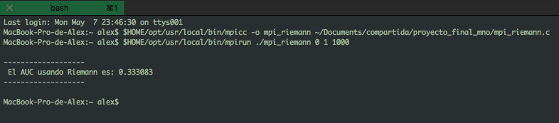
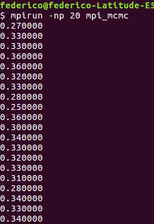
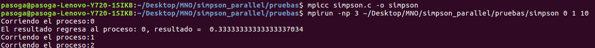

# Avances 08-05-2018

# Integrantes
- Alejandro Hernández 87806
- Federico Riveroll 105898
- Pablo Soria 111969

# Individual


__- Alejandro Hernández__

Realicé un programa en MPI que calcula el AUC de y=x^2 utilizando Riemann segmentando áreas para calcularlas en procesadores distintos y después sumándolas para encontrar el ára bajo la curva global.

Los argumentos de entrada que tiene que definir el usuario son el rango inicial, el rango final y el número de segmentos para realizar la partición.


El codigo que utilicé fue el siguiente:

```
#include <stdio.h>
#include<stdlib.h>
#include <mpi.h>

// Definimos la funcion que calcula el x al cuadrado
long double f(long double *x){
	return (*x)*(*x);
}


int main(int argc, char *argv[])
{
	int i, rank, size;

	// Iniciamos MPI, obtenemos el id del proceso y el numero de procesos
	MPI_Init (&argc, &argv);
	MPI_Comm_rank (MPI_COMM_WORLD, &rank);
	MPI_Comm_size (MPI_COMM_WORLD, &size);

	// Definimos e inicializamos variables:
	long long cuenta, segmentos;
	long double x, y, dx, area = 0.0, area_segmento = 0.0, rango_inicio, rango_fin;

	//Revisamos los argumentos de entrada. Si no son exactamente 3 argumentos salimos del programa:
	if(argc <= 3 || argc > 4)
	{
		if(rank == 0)printf("Numero de argumentos erroneo: %i , se esperaban: 3\n", argc-1);
		MPI_Finalize();
		exit(0);
	}

	// Almacenamos los 3 argumentos de entrada:
	rango_inicio  = atof(argv[1]);
	rango_fin	= atof(argv[2]);
	segmentos 	= atoi(argv[3])*size;

	// Revisamos que el rank de inicio sea menor al de fin y que el número de segmentos sea mayor o igual a uno. En caso opuesto salimos del programa:
	if(rango_fin <= rango_inicio || segmentos < 1)
	{
        if(rank == 0)printf("Argumento erroneo, revisar que inicio<fin y segmentos>=1\n");
        MPI_Finalize();
        exit(0);
    }

		// Calculamos de dx:
	dx = (rango_fin-rango_inicio)/(long double)segmentos;

	// Cada procesador calcula una parte del AUC:
	for (i = rank*(segmentos/size); i<((rank+1)*(segmentos/size)); i++)
	{
	   long double x = i*dx;
	   y = f(&x);
	   area_segmento += (y*dx);
	}

	// Sumamos el area_segmento calculada por cada procesador, reduciendola al area:
	MPI_Reduce(&area_segmento, &area, 1, MPI_LONG_DOUBLE, MPI_SUM, 0, MPI_COMM_WORLD);

	if(rank == 0)printf("\n-------------------\n El AUC usando Riemann es: %Lf\n-------------------\n\n",area);
	MPI_Finalize();
	return 0;
}

```

Con la instruccion para compilar y correr utilizando `rango_inicial=0`, `rango_final=1` y `segmentos=1000`:

```
$HOME/opt/usr/local/bin/mpicc -o mpi_riemann ~/Documents/compartida/proyecto_final_mno/mpi_riemann.c

$HOME/opt/usr/local/bin/mpirun ./mpi_riemann 0 1 1000

```

Se obtuvo el siguiente resultado:



El programa en C `mpi_riemann.c` se encuentra en la carpeta `avance_08_05_2018` para su consulta.


__- Federico Riveroll__


Realicé un programa en MPI que calcula el AUC de y=x^2 utilizando MCMC separando los procesos para hacer diversos cálculos de menores iteraciones y mayor margen de error pero después juntándolos usando open MPI. 

Para iniciar el ambiente MPI local hay que correr comando:
>lamboot
<b>LAM 7.1.4/MPI 2 C++/ROMIO - Indiana University</b>

El programa es el siguiente:

```
#include <stdio.h>
#include <mpi.h>

main(int argc, char **argv)
{
	int ierr, num_procs, my_id;

	ierr = MPI_Init(&argc, &argv);

	ierr = MPI_Comm_rank(MPI_COMM_WORLD, &my_id);
	ierr = MPI_Comm_size(MPI_COMM_WORLD, &num_procs);
	//printf("---------------------------------------");
	//printf("Soy el proceso con id: %i de un total de %i procesos\n", my_id, num_procs);

	// Inicia programa especifico
	float i, throws = 100.0, circleDarts = 0.0;
        long double randX, randY;
    
    	srand(time(NULL)+my_id); 

    	for (i = 0; i < throws; ++i) {
   	   randX = rand() / (double)RAND_MAX;
   	   randY = rand() / (double)RAND_MAX;
   	   if (randX * randX > randY) ++circleDarts;
   	 }

   	 //printf("Area bajo la curva de proceso %i :\n", my_id);
   	 printf("%f\n", (circleDarts/throws));
	ierr = MPI_Finalize();
}
```

Para compilarlo y ejecutar 20 instancias del mismo utilice los siguientes dos comandos:

>mpicc mpi_mcmc.c -o mpi_mcmc
>mpirun -np 20 mpi_mcmc

El output fué el siguiente:


Podemos ver que el promedio es 0.3223 lo cual correspondeal resultado secuencial de la semana pasada, pero ahora se hizo en 20 pedazos de 100 experimentos.

El objetivo del siguiente avance es hacer 200 pedazos de 100 experimentos y hacer un histograma, y después intentar sacar el óptimo de pedazos-num experimentos para obtener el mejor rendimiento en varianza y tiempo.

__- Pablo Soria__


## Paralelizando 

Avance 5 09/05/2018 Pablo Soria Garcia

Esta entrega estará basada en dos partes, la primera será el desarrollo del pseudocódigo con el que conlcuímos la sección pasada, describiendo cada paso especialmente las secciones críticas del mismo, para esto se utilizará MPICH una implementación de MPI bastante conocida debido a que existe mucha documentación que se puede consultar. 

 Posteriormente probaremos nuestro algoritmo con distintas funciones, para distintos intervalos de integración y con ditintos parámetros de subdivisión para entender el impacto de tener funciones más complejas con un mayor o menor número de subdivisiones por intervalo. 


**1) Paralelizando en MPI**


Empecemos por definir la svariables que usaremos a lo largo del algoritmo


-*Parte 1 Código MPI - Simpson (variables)*
```
double a; 
double b; 
int num_of_iter; 
int num_of_procs; 
int my_rank; 
double result = 0.0; 
```
Básicamente declararemos las variables como siguen: 

- **a:** Límite inferior de integración
- **b:** Límite superior de integración
- **num_of_iter:** Cantidad de subdivisiones (iteraciones) de cada intervalo, lo podemos tomar ccomo iteraciones ya que el algoritmo de simsposn se aplica localmante un número igual de veces al de las subidivisiones del lintervalo. 
- **num_of_proc:** Cantidad de procesos que queremos lanzar, idealmente deberíamos de comparar si esto hace alguna diferencia en términos de rapidez (claramente) y precisión. 
- **my_rank:** Con este contador nos ayudaremos para el control de los rangos de los procesos, típico en cualquier programa paralelo. 
- **result:** Aquí almacenaremos nuestro resultado final dentro del proceso principal. 

-*Parte 2 Código MPI - Simpson (inicializar MPI)*
```
  MPI_Init(&argc, &argv);
  MPI_Comm_size(MPI_COMM_WORLD, &num_of_procs); 
  MPI_Comm_rank(MPI_COMM_WORLD, &my_rank);
```

Esta sección de código, se compone de tres sentencias: 
- **MPI_Init:** Nos permite inicializar el el entrono de ejecución de MPI, este comando debe ser llamado por un único thread y es llamado generalmente el *main_thread*, además es necesario que sea el mismo thread que llama al comando **MPI_Finalize()**. el comando cuenta con dos argumentos, **argc** que es un apuntador al número de argumentos y **argv** que consiste en un apuntador al vector de argumentos. 

-**MPI_Comm_size** Nos permite especificar el tamaño del grupo de comunicadores a usarse dentro del programa paralelo. De manera más coloquial nos permite mapear los procesos a los threads en términos de la creación de los canales de comunicación entre ellos. totods los comunicadores contienen un grupo que no es más qu euna lista de procesos ordenados mediante un id que se conoce commo rango y que definimos al inicio del programa  como **my_rank**.

Recordemos que este paso es especialmente importante al momento de diseñar un programa paralelo. los argumentos que componenen este comando son: **MPI_COMM_WORLD** que conciste en el comunicador inicializado por MPI_INIT para un número **num_of_proc** de procesos. 

-**MPI_Comm_rank** Esta sentencia nos permite determinar el rango (identificador) del proceso que lo llama dentro del comunicador seleccionado, en este caso el identificador es **my_rank** definidio inicialmente. 

**Paso del pseudocódigo:**
```
1) Obtener, a,b,n ;
```

-*Parte 3 Código MPI - Simpson (conversión)*
```
  a = atof(argv[1]);
  b = atof(argv[2]);
  num_of_iter = atoi(argv[3]);
  num_of_iter += (num_of_iter % 2);
```
El algirtmo tal cual está diseñado, requiere que el usuario indique el valor del límite inferior, el límite superior y el número de subdivisiones de cada intervalo como argumentos al momento de lanzar la ejecución con el comando **mpirun** dado que no podemos controlas que el usuario indicará un número **foat** para los dos primeros y un número **int** para el tercero es necesario asegurarnos de que esto sucede ya que para el caso de **[a,b]** dividiermos el número y ya conocemos las implicaciones en términos de truncamiento que realiza C si dividimos un double por un int por un double o viceversa por ejemplo. 

Adicionalmente la última línea de código aplica la función módulo para obtener el residuo entero al dividir entre dos y agregar el **num_of_iter** obtenemos siempre un número par, recordemos que ya exploramos las implicaciones de que esto suceda así para el caso de simspon 1/3 en la primer sección de este trabajo. 

**Pasos del pseudocódigo:**
```
2) h = (b -a ) / n   ;  
3) local_iter  = n / comm_size ; 
4) local_idx = my_rank * local_iter //*indice para controlar el número de iteraciones locales en cada subintervalo

```
-*Parte 4 Código MPI - Simpson (controladores locales)*
```
  double h = (b - a) / num_of_iter; /* tamaño del paso */

  int local_iter = num_of_iter / num_of_procs;
  int local_idx = my_rank * local_iter;
  int local_end = my_rank * local_iter + local_iter;

  if ((num_of_iter % num_of_procs) != 0) {
    if (my_rank == (num_of_procs - 1))
      local_end += (num_of_iter % num_of_procs);
  }

  printf("Corriendo el proceso:%d \n", my_rank); /* Con esto probaremos la asicronia del algoritmo */


```
Esta sección del código es particularmente importante debido a que se calcula el tamaño del paso dependiendo del número de subdivisiones o iteraciones con el que el usuario corre el algirtmo, posteriormente se calculan los límites locales a los que se aplicará la regla de simpson. 

veamos que a mayor cantidad de iteraciones menor es el paso y por lo tanto la estimación debería ser más precisa ya que la aproximación de segundo grado que se hace entre los tres puntos usados por simpson, es menor y por lo tanto mientras más pequeña es el área a estimar menor será el error de estimación ya que hay una menor cantidad de puntos que hay que *"inferir"*

Adicionalmente se define la cantidad de iteraciones que correran de forma local es decir, el usuario ya indicó que el número de iteraciones corresponde a **num_of_iter** y mediante **mpirun -np** podemos especificar el número de procesos que deberán de correr, por lo tanto hace sentido calcular el número de iteraciones local **local_iter = num_of_iter / num_procs**.

Del mismo modo es necesario pasarle a cada *"pedazo"* el índice en el que iniciarán y finalizarán de forma local ( esto es necesario para eventualmente pasarle al alvortimo los límites de intergación locales     *("pedazos más pequeños de [a,b]")* 

El último if, es requerido por una razón similar a las correcciones que hicimos en -*Parte 3 Código MPI - Simpson (conversión)* dado que no controlamos ni el número de iteraciones ni el número de procesos que indica el usuario, nos tenemos que asegurar que al momento de calcular los controladores locales no nos quede un pedazo sobrando en caso de que el número de iteraciones no sea divisible entre el número de procesos. 

Adicionalmente dado que nos interesa corroborar algunos aspectos teóricos como el principio de no determinismo introducimos una sentencia de impresión para que nos indique el id (**my_rank**) del proceso que se encuentra corriendo en ese momento, esperaríamos que si sjecutamos exactamente el mismo código varias veces los procesos compitieran por entrar al stdout resultando en una asicnronía en la sentencia de impresión dependiendo de que proceso termine primero su ejecución. 

**Pasos del pseudocódigo:**
```
5) calcular local_a = a + local_idx * h y local_b =  my_rank * local_iter + local_iter;
6) local_integral = f(local_a , local_b , local_n , h);

```
-*Parte 5 Código MPI - Simpson (cálculos locales)*
```
  double x;
  double accum = 0.0;

  for ( ; local_idx < local_end; local_idx++) {
    x = a + local_idx * h;
    if ((local_idx % 2) == 0)
      accum += func(x) * 2;
    else
      accum += func(x) * 4;
  }
```

Esta sección del código se ejecuta de forma local para cada proceso, empezamos por definir el valor de la variable **x** como **double** esta será la evaluación de la función **f(x)** que deseamos integrar. del mismo modo incializamos la variable local **accum** que controlará el resultado acumulado de evaluar la función e ir agregando la estimación mediante la fórmula de simpson. 

El ciclo **for** permite ir a lo largo de los indices locales uno por uno mientras el **local_idx** sea menor estrictamente que el **local_end**, definimos la x en la que será evaluada la función, como el valor del límite de integración izquierdo **a** más el índice local multiplicado por la altura **h** esta altura no cambia ya que sus parámetros seimpre son los mismos y no varían al momento de ser consumidos por la sección local que corre en el proceso. 

finalmente agregamos al acumulado en función de si el índice local es divisible entre 2 ( en cuyo caso multiplicamos por 2 a la función ) o no ( en este caso agregamos multiplicando la función por 4 ) 

Solo por recordar, esta pequeña deiferenciaciósn se produce al calcular la regla de simpson de  1/3 compuesta para un numero de subdivisiones (iteraciones) mayores a 1: 


**Pasos del pseudocódigo:**

```
7) if(my_rank != 0)
    send local_integral to process 0; 
    else 
       result = local_integral;
       for(proc = 1; proc < comm_size ; proc ++){
       Recive local_integral from proc;
       result += local_integral;

8) if(my_rank==0)
print result;

```


-*Parte 5 Código MPI - Simpson (Agregar cálculos locales)*

```
MPI_Reduce(&accum, &result, 1, MPI_DOUBLE, MPI_SUM, 0, MPI_COMM_WORLD);

  if (my_rank == 0) { 

    result += func(b);
    result *= (h/3.0);
    printf("El resultado regresa al proceso: %d, resultado =  %.20f\n", my_rank, result);
  }

MPI_Finalize();
return 0;

```

Finalmente utilizamos el comando **MPI_Reduce** para hacer un paso de reducción y obtener el resultado final de la integral evaluada por medio de simpson compuesta, este comando toma un arreglo de *inputs* locales de cada uno de los procesos *&accum* y retorna un arreglo de *outputs* al **main_process**, **&result,** , por medio de el argumento **MPI_DOUBLE** indicamos que result debe ser de este tipo de variable y el argumento **MPI_SUM** nos permite indicar que lo quedebemos obtener es una suma de los elemntos de cada proceso. El argumento **1** indica la cantidad de elementos enviados por el proceso reduce mientras que el argumento **0** indica el **rank** del proceso main, en este caso el proceso 0, finalmente se le indica el comunicador que debe ir a buscar para encontrar los elementos de los procesos locales y el proceso main. 

Este proceso "reduce" se seguirá ejecutando hasta que los identificadore (ranks) de los proceso locales se acaben, una vez que esto sucenda, se calcula el reusltado final ( se multiplica por h/3 como indica la fórmula compuesta ) y se imprime en el STDOUT. 

El algoritmo completo se presenta a continuación, en él se especifica un función sencilla como x^2 para realizar pruebas:

-**Código MPI - simpson.c**

```
#include <stdio.h>
#include <stdlib.h>
#include <math.h>
#include <mpi.h>

/* función a integrar: x^2 */
#define func(x) x*x


int main (int argc, char * argv[])
{

  double a; /* límite inferior */
  double b; /* límite superior */
  int num_of_iter; /* número de subintervalos, será el mismo número de subintervalos para cada proceso */
  int num_of_procs; /* número de procesos a lanzar ingresado por el usuario*/
  int my_rank; /* Rango para controlar los procesos que se lanzan */
  double result = 0.0; /* Resultado */

/* Iniciamos MPI */

	  MPI_Init(&argc, &argv);
	  MPI_Comm_size(MPI_COMM_WORLD, &num_of_procs); /* límite inferior */
	  MPI_Comm_rank(MPI_COMM_WORLD, &my_rank);

/* convertimos a,b a float, número de subintervalos a entero ya que no podemos controlar lo que el usuario meterá en mpirun*/
  a = atof(argv[1]);
  b = atof(argv[2]);
  num_of_iter = atoi(argv[3]);
  num_of_iter += (num_of_iter % 2);


 /* este es el programa que se debe enviar a todos los procesos (SPMD)*/  

  double h = (b - a) / num_of_iter; /* tamaño del paso */

  int local_iter = num_of_iter / num_of_procs;
  int local_idx = my_rank * local_iter;
  int local_end = my_rank * local_iter + local_iter;

  if ((num_of_iter % num_of_procs) != 0) {
    if (my_rank == (num_of_procs - 1))
      local_end += (num_of_iter % num_of_procs);
  }

  printf("Corriendo el proceso:%d \n", my_rank); /* Con esto probaremos la asicronia del algoritmo */
  double x;
  double accum = 0.0;

  for ( ; local_idx < local_end; local_idx++) {
    x = a + local_idx * h;
    if ((local_idx % 2) == 0)
      accum += func(x) * 2;
    else
      accum += func(x) * 4;
  }


 /* Inicia la sección crítica */ 
  MPI_Reduce(&accum, &result, 1, MPI_DOUBLE, MPI_SUM, 0, MPI_COMM_WORLD);

  if (my_rank == 0) { 

    result += func(b);
    result *= (h/3.0);
    printf("El resultado regresa al proceso: %d, resultado =  %.20f\n", my_rank, result);
  }

  MPI_Finalize();
  return 0;
}

```

**2) Probando nuestro código**

Para realizar las pruebas ya hemos definido que nuestra primera función será x^2: 

```
/* función a integrar: x^2 */
#define func(x) x*x
```
Realizamos la compilación del programa en c por medio del comando: 

```
mpicc simpson.c -o simpson
```

corremos el programa con 3 procesos, límite inferior **a=0**, límite superior **b=1** y **número de iteraciones = 10**: 

```
mpirun -np 3 ~/Desktop/MNO/simpson_parallel/pruebas/simpson 0 1 10
```

Y obtenemos el resultado: 




A priori sabemos que el resultado tórico es de 1/3 por lo que nuestro algirtmo se ve bastante preciso con una función sencilla. El siguiente paso será buscar funciones más complejas y jugar con el número de iteraciones y procesos, sería bueno diseñar una tabla experimental para comparar objetivamente el tiempo de ejecución con cada configuración, para esto será necesario incluir el tiempo de ejecución calculado dentro de nuestro algoritmo simpson.c

Como conclusión interesnte vemos que el proceso es totalmente asíncrono debido al principio de no determinismo que queríamos verificar imprimiendo la secuencia en la que cada proceso arribo al STDOUT.


# Equipo

Realizamos la implementación de forma distribuida utilizando Riemann, MCMC y Simpson.

El avance en el trabajo escrito se puede descargar del siguiente vínculo de dropbox:

https://www.dropbox.com/s/8t30qyb6bvy7lki/all.pdf?dl=0
https://www.dropbox.com/s/8t30qyb6bvy7lki/all.md?dl=0


