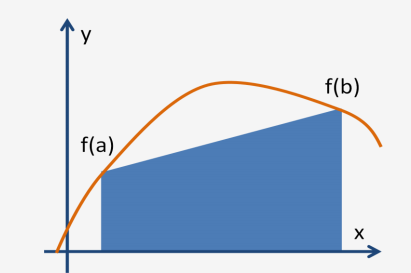
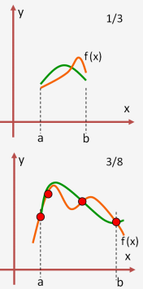
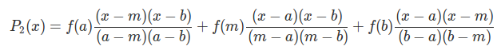
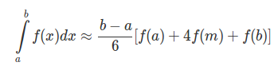
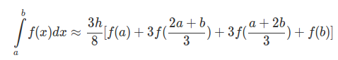

# Avances 17-04-2018

# Integrantes
- Alejandro Hernández 87806
- Federico Riveroll 105898
- Pablo Soria 111969

# Individual


__- Alejandro Hernández__

En primer lugar incluí un contenedor de docker con CUDA para poder empezar a correr algunos ejemplos simples. Para lo anterior, hice un docker pull del siguiente repositorio: [https://hub.docker.com/r/nvidia/cuda/](https://hub.docker.com/r/nvidia/cuda/).

Comencé a leer la documentación de CUDA, para entender mejor sobre kernels, threads y memoria en la siguiente guía que está muy completa: [https://www3.nd.edu/~zxu2/acms60212-40212/CUDA_C_Programming_Guide_V7.5.pdf](https://www3.nd.edu/~zxu2/acms60212-40212/CUDA_C_Programming_Guide_V7.5.pdf).

Con lo anterior realicé algunos ejemplos sencillos como el Hello World! con device code y la suma de dos vectores. Dichos ejemplos, `hello_dc.cu`, `suma_vector.cu` y su output están en la carpeta de este segundo avance para su consulta.

Por otro lado, en cuanto a la paralelización del cálculo del AUC utilizando Riemman, hasta ahora no se ha encontrado alguna implementación en CUDA. Por lo anterior, se implementará el pseudocódigo que se mencionó en el avance pasado siguiendo los siguientes pasos:

- Calcular el ancho del dominio de la función y el ancho del rectángulo.

- Calcular el número de rectángulos de los cuales el proceso es responsable.

- Calcular el límite en x del proceso.

- Para cada rectángulo paralelizado por thread:

	- Calcular el valor x del lado izquierdo del rectángulo.
	- Calcular la altura del rectángulo.
	- Calcular el área del rectángulo.

- Calcular la suma total para el proceso.

- Calcular la suma total global.


__- Federico Riveroll__

[http://users.stat.umn.edu/~galin/UST.pdf](http://users.stat.umn.edu/~galin/UST.pdf)

Estudiando la integración con el método de Markov Chain Monte Carlo, sacamos la siguiente simplificación para entender el concepto de esta técnica que es simple y efectiva;

El algoritmo consiste en acotar una función en un par de límites para calcular el Área bajo la curva entre dichos límites, la técnica es marcar puntos aleatorios distribuidos de manera uniforme en el plano y contar la proporción que estuvieron debajo de la curva, y este número equivale a integrar y sacar el área en dicha región.

A continuación un ejemplo absolutamente simple:

Si queremos calcuar el AUC de x = y en el intervalo (0,1) Integramos la función 'x' y el resultado es x/2, el área en (0,1) es 1/2.

Esto equivale a trazar una línea diagonal en un plano de 1x1 y dibujar puntos aleatoriamente generando las coordenadas de manera uniforme entre 0 y 1. Al final, con suficientes puntos podremos contar la proporción de puntos que caen bajo la recta y = x. Esa proporción va a ser cercana a 0.5. Que es congruente con el resultado de la integral.

Esta técnica aplica no solo para cualquier función lineal o polinomial, sino que con ella se puede aproximar el volumen entre los planos y el hiperespacio entre las funciones multinomiales.

Otra gran ventaja de usar esta técnica es que cada punto simulado es independiente de los demás, por lo tanto se puede paralelizar y al final promediar y es completamente equivalente el resultado.

El plan será enviar diversos hilos que hagan estas simulaciones (todas con el mismo número de iteraciones) y regresen el resultado. Cuando todos los resultados sean devueltos, se promedian y ese número será nuestro resultado.


__- Pablo Soria__

Dentro de lo que se conoce como integración numérica, la regla del trapecio busca calcular el área bajo una curva por realizando una interpolación entre dos puntos por medio de un polinomio de grado 1, es decir una recta, gráficamente:



Una manera más exacta de realizar esta estimación del área bajo una curva es utilizar polinimios de grado superior para intentar ajustar una curva entre los dos puntos, esta regla se conoce como regla de smspon y en ocaciones como regla de Kepler.

Básicamente la regla interpola los puntos por medio de polinomios de Lagrange, cuando estamos hablando de 3 puntos (a, b y un punto medio)  se utilizan polinomios de orden dos reusltando en lo que se conoce como regla de Simpson de 1/3, por otro lado si utilizamos 4 puntos y conectamos por medio de polinomios de 3er orden nos encontramos frente a la conocida como Regla de Simpson de 3/8. Gráficamente estas reglas se ven de la siguiente forma:



Desde el punto de vista teórico, podemos realizar los siguientes cálculos para derivar la regla de simpson: 

consideremos el siguiente polinomio de *Lagrange* que aproxima a la funcion *f(x)* en los puntos *a*, *b*  y  *m = (b-a)/2*

 

de esta forma podemos expresar a la integreal de *f(x)* como: 

 

el principio que subyace detrás de la regla de Simpson de 3/8 es exactamente el mismo pero utilizando 4 puntos en lugar de tres es decir los dos extremos de intervalo y dos puntos intermedios a una equidistancia de *h = (b-a)/3* y utilizando polinomios de *Lagrange* de tercer orden. De este modo la regla de 3/8 de simpson para integración numérica se ve del siguiente modo: 


 


Hasta este punto hemos formulado la regla de Simpson simple utilizando únicamente un punto medio entre el intervalo [a,b] o 2 puntos equidistantes para el caso de Simpson 3/8 sin embargo para poder realizar una paralelización, es necesario obtener las reglas compuestas y subdidvidr el intervalo en *n* pedazos que eventualmente se podrán enviar a los distintos nodos, a esta extesión se le conoce como regla de Simpson compuesta y la lógica es la siguiente:

- Subidividir el intervalo [a,b] en n divisiones, las especificaciones de n dependerán de si se elige la regla de 1/3 o de 3/8, para el caso de 1/3 se requiere que n sea par y para el caso de 3/8 se requeire que n sea multiplo de 3
- Realizar la regla de Simpson (1/3 o 3/8 ) para cada sub-intervalo
-  Sumar todos los resultados obtenidos de cada regla aplicada a cada sub-intervalo.

Un primer enfoque para realizar esta tarea en el caso de la regla de 1/3 compuesta, subdividida en m intervalos es:

Implementación de Simspon de 1/3 en C:
```
double Simpsons1_3(int m, double a, double b, 
		    double (*func)(double)){
  int i; 
  double h = (b-a)/(2.0*m);
  double sum = 0.0, x;

  for(i=1;i<=m;i++){
    x = a + (2*i-1)*h;
    sum += func(x-h) + 4.0*func(x) + func(x+h);
  }
  sum *= (h/3.0);

  return sum;
}

```


```
double Simpsons3_8(int m, double a, double b, 
		    double (*func)(double)){
  int i; 
  double h = (b-a)/(3.0*m);
  double sum = 0.0, x;

  for(i=1;i<=m;i++){
    x = a + (2*i-1)*h;
    if(i%3 == 0){
    sum += 2*func(x);
    }
    else{
    sum += 3*func(x)
    }
  }
  sum *= (3*h/8.0);

  return sum;
}
```
Estos algoritmos reciben los valores de la cantidad de intervalos ( recordemos que debe ser par), el intervalo de integración [a,b] y la función f(x) y devuelve el resultado de la suma. Esta función nos servirá más adelante para paralelizar ya que desde este punto de vista, cada nodo recibirá una sub-división del rango entre [a,b] y dividirá este sub intervalo en m partes. 

**Nota:** Eventualmente será necesario poner una regla al momento de elegir el número de subdivisiones que evite los problemas de poner una m que no sea par en el caso de la regla de 1/3 y que m no sea múltiplo de 3 en el caso de la regla de 3/8.


# Equipo

Sostuvimos una reunión entre todos los miembros del equipo para comentar los avances que se habían logrado. En resumen, ya todos encontramos ejemplos de implementaciones tanto en secuencial como en paralelo y realizamos algunas implementaciones simples.

Coincidimos que el siguiente paso ahora es comenzar a paralelizar los problemas en CUDA e irnos retroalimentando sobre la problemática detectada para hacer más dinámica la implementación.

Asimismo, consideramos que vamos a tener que ahondar más en la teoría relativa a CUDA para poder entender y desarrollar la paralelización, pues todavía persisten algunas dudas concernientes a la plataforma.

Nos percatamos que tenemos que acelerar el paso en la implementación para poder cumplir con el objetivo que habíamos establecido en nuestro cronograma, en el cual señalábamos que para el 20-04-2018 ya deberíamos contar con una primera propuesta de implementación.

Finalmente, esperamos que para el tercer avance ya contemos con implementaciones para el cálculo de AUC de forma puntual.

