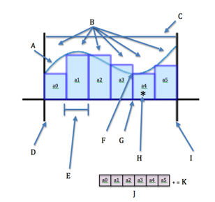
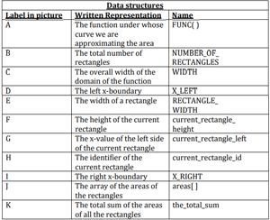
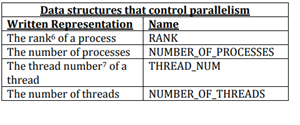
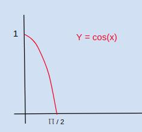
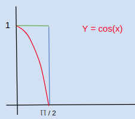
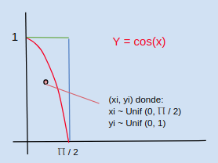
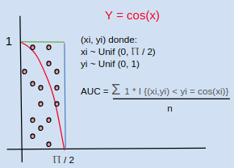

# Avances 24-04-2018

# Integrantes
- Alejandro Hernández 87806
- Federico Riveroll 105898
- Pablo Soria 111969

# Individual

- Alejandro Hernández

En virtud de que no se encontró puntualmente una implementación en CUDA para el cálculo de AUC usando Riemann y siguiendo la recomendación del profesor, opté por buscar otra extensión de C. Encontré que en esta referencia [http://www.shodor.org/media/content/petascale/materials/UPModules/AreaUnderCurve/AUC_Module_Document_pdf.pdf](http://www.shodor.org/media/content/petascale/materials/UPModules/AreaUnderCurve/AUC_Module_Document_pdf.pdf) también se incluye la implementación en MPI y se aprecia bien documentada. Asimismo, dicho articulo explica el proceso de paralelización como sigue:

La siguiente grafica nos permite tener una representación visual clara del problema a resolver:



Posteriormente, identifica la estructura de los datos, lo que son y sus nombres:



También explica de estructuras de datos que controlan el paralelismo:



Una vez definidas las estructuras de datos se tiene que ver su alcance; es decir, si son publicas o privadas a los threads y a los procesos que los usan y las interacciones que existen entre ellas.


Con todo lo anterior, establece el pseudocódigo como sigue:

```
All processes do the following:
0-1) Calculate the overall width of the domain of the
function and the width of a rectangle.
• If MY_THREAD_NUM == 0,
• WIDTH = X_RIGHT – X_LEFT
• RECTANGLE_WIDTH = WIDTH / NUMBER_OF_RECTANGLES
0-1) Calculate the number of rectangles for which the
process is responsible.
• If MY_THREAD_NUM == (1 mod OUR_NUMBER_OF_THREADS),
• OUR_NUMBER_OF_RECTANGLES = NUMBER_OF_RECTANGLES/
NUMBER_OF_PROCESSES
• If OUR_RANK == NUMBER_OF_PROCESSES – 1,
• OUR_NUMBER_OF_RECTANGLES = OUR_NUMBER_OF_RECTANGLES
+ NUMBER_OF_RECTANGLES mod NUMBER_OF_PROCESSES
0) Calculate the left x-boundary of the process.
• If MY_THREAD_NUM == (2 mod OUR_NUMBER_OF_THREADS),
• OUR_X_LEFT = (OUR_RANK * (NUMBER_OF_RECTANGLES/
NUMBER_OF_PROCESSES)) * RECTANGLE_WIDTH + X_LEFT
2-4) For each rectangle, parallelized by thread,
2) Calculate the x-value of the left side of the
rectangle:
• my_current_rectangle_left = OUR_X_LEFT +
my_current_rectangle_id * RECTANGLE_WIDTH
3) Calculate the height of the rectangle:
• my_current_rectangle_height =
FUNC(my_current_rectangle_left)
4) Calculate the area of the rectangle:
• our_areas[my_current_rectangle_id] =
RECTANGLE_WIDTH * my_current_rectangle_height
5) Calculate the total sum for the process.
• If MY_THREAD_NUM == 0,
• for each rectangle,
• our_total_sum = our_total_sum +
our_areas[my_current_rectangle_id]
6) Calculate the overall total sum.
• Each process sends our_total_sum to Rank 0
• Rank 0 adds sums to the_total_sum
```


- Federico Riveroll

__Plan de ejecución de Integración MCMC distribuída__

__¿Cómo funciona el algoritmo?__

El algoritmo de integración MC para calcular el área bajo la curva funciona de la siguiente manera:

1) Dada una función, por ejemplo <b>y = cos(x)</b>;


2) El algoritmo para calcular el Área bajo la curva consiste en formar un rectángulo en el área que queramos obtener la proporción del área, en este caso en <b> y=1</b>, y en <b>x = Ⲡ / 2</b>;


3) Y luego simular un punto aleatorio dentro de ese rectánculo y ver si cae abajo de la curva Y=cos(x) o arriba de ella;


4) Repetir la simulación de los puntos y contar los que están abajo de <b>Y = cos(x)</b> y dividirlos entre el total;



5) Al repetír el proceso muchas veces, la proporción de elementos bajo la curva es el área proporcionada en dicho rectánculo. Para que este proceso funcione en ecuaciones más complicadas se necesita iterar muchísimas veces.

__¿Cómo se planea implementar el algoritmo?__

En C nativo, simplemente haciendo el pseudocódigo:
<br>
<code>
cuenta = 0

loop ( n veces ) {
    xi = rand(0, x_objetivo)
    yi = rand(0, y_objetivo)
    if (yi < funcion_de(xi, yi)){
        cuenta ++
    }
}
return cuenta / n
</code>

__¿Cómo se planea paralelizar?__

Con la librería de OpenMPI para C.

Se planea hacer un programa "molde" que realice n/p simulaciones (sindo p el número de particiones), que envíe desde consola con <b>mpirun -np p programa</b> 'p' instancias del programa que trabajen de manera asíncrona, y que devuelvan cada quien su promedio calculado, cuando los promedios sean regresados que estos mismos se promedien y la distribución de los mismos será <b>Normal con media en el área bajo la curva</b>, después la idea es graficar esos promedios y obtener tanto el AUC como una aplicación (fortuita) del teorema del límite central.

- Pablo Soria


__Paralelizando__

Empecemos por platicar el enfoque para paralelizar el algoritmo de Simpson:

Desde el punto de vista de la forma de paralelizar, en realidad el proceso es bastante sencillo, seguiremos los pasos típicos de la metodología de Foster para lograr un programa paralelo: 

**1) Particionar el problema en tareas:**

Recordemos que la regla de Simpson, realiza una interpolación cuadrática entre tres puntos, a, b y un punto medio en el caso de la regla de 1/3, sin embargo para poder paralelizar utilizaremos la regla compuesta, la idea detrás de esta regla generar "iteraciones" del mismo proceso es decir dividimos el intervalo en **m** divisiones y aplicamos la regla de simpson para cada intervalo, es decir aplicaremos la regla de simpson el mismo número de veces que la cantidad de subdivisiones.

Al calcular la regla de simspon para cada uno d elos subintervalos y sumarlas, se obtiene una mejor aproximación que utilizando solamente tres puntos iniciales y una sola interpolación. Matemáticamente esto significa **sumar** varias aproximaciones:


Cada una de estas sumas será enviada a un proceso distinto, esto tiene dos implicaciones: 

i) Es necesario saber a priori la cantidad de intervalos a utilizar 
ii) Es necesario calcular los límites de integración locales para cada uno de los procesos

La tarea de cálculo de una integral delimitada de forma local es lo suficientemente pequeña como para que sea paralelizada y dado que este es en realidad un programa SPMD en realidad lo único que nos tenemos que preocupar es de **"mandar"** correctamente los datos i.e límites locales de integración de forma correcta a cada intervalo.

En conclusión podemos identificar dos tareas: 

a) Calcular el área de un solo **pedazo** por medio de la regla de simpson simple 

b)Sumar las áreas de todos los **pedazos**


**2) Identificar los canales de comunicación entre las tareas:**


Desde el punto de vista de comunicación, dado que desde un punto de vista simplista nuestro porgrama no es mas que una suma de aproximaciones entre 3 puntos, al final sumaremos todos los datos por lo que nos es irrelevante la propiedad de no determinismo es decir nos da igual si uno de los procesos acaba primero que el otro ya que en el paso de regresar al proceso maestro todo se sumará para dar el resultado. 

En conclusión dada la conmutatividad de la suma en el proceso maestro, no nos tenemos que preocupar de que los procesos se comuniquen entre las tareas **"a) Calcular el área de un solo pedazo por medio de la regla de simpson simple "** , la única vía de comunicación se realizará al momento de reportar los cálculos locales a la tarea b).


**3) Agregar las tareas en tareas compuestas:**

Dado que nuestro proceso en realidad es una suma de sumas, no requerimos la argupación en tareas compuestas esto debido a que cada proceso se ejecuta de manera independiente y eventualmente regresa al proceso maestro para el resultado final por lo que la única tarea que "agrupa" es nuestro cálculo del resultado final ninguna otra tarea compuesta es requerida. 


**4) Mapear las tareas a los procesos/threads:**

Dado que nuestro algoritmo mejora conforme más **"pedazos"** tengamos tengamos subdividiendo la integral realizando el mismo proceso iterativo, por tanto será necesario usar más **"pedazos"** que cores.
 
Una manera sencilla de hacer esto en el contexto de **MPI** es dividir el intervalo *[a,b] en **comm_size** subintervalos, por lo tanto tendremos que aplicar la regla de simpson  a **n / comm_size** pedazos a cada uno de los **comm_size** subintervalos y definir un proceso que realice la suma de todos ellos para obtener el resultado. Veamos como se ve en forma de pesudocódigo en paralelo.

**Pseudocódigo**

```
1) Obtener, a,b,n ;
2) h = (b -a ) / n   ;  
3) local_iter  = n / comm_size ; 
4) local_idx = my_rank * local_iter //*indice para controlar el número de iteraciones locales en cada subintervalo
5) calcular local_a = a + local_idx * h y local_b =  my_rank * local_iter + local_iter;
6) local_integral = f(local_a , local_b , local_n , h);
7) if(my_rank != 0)
    send local_integral to process 0; 
    else 
       result = local_integral;
       for(proc = 1; proc < comm_size ; proc ++){
       Recive local_integral from proc;
       result += local_integral;

8) if(my_rank==0)
print result;

```


# Equipo

Tuvimos una reunión para comentar sobre la implementación y los problemas que estabamos enfrentando. Por lo que pudimos constatar, hay buena documentación de MPI por lo que optaremos por esta implementación.

En este tercer avance, nos dimos a la tarea de hacer el planteamiento de cómo se implementaría a nivel pseudocódigo, para en la siguiente entrega ya comenzar a incluir fragmentos de la implementación.

